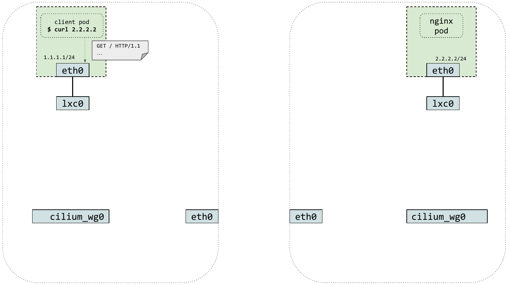

# Cilium Transparent Encryption with IPSec and WireGuard
Encryption is required for many compliance frameworks. Kubernetes doesn’t natively offer pod-to-pod encryption. To offer encryption capabilities, it’s often required to implement it directly into your applications or deploy a Service Mesh. Both options add complexity and operational headaches.

Cilium actually provides two options to encrypt traffic between Cilium-managed endpoints: IPsec and WireGuard. In this lab, you will be installing and testing both features and will get to experience how easy it is to encrypt data in transit with Cilium.

https://isovalent.com/labs/cilium-transparent-encryption-with-ipsec-and-wireguard/


## 🔐 Encryption in Cloud Native Applications
Encryption is required for many compliance frameworks.

Kubernetes doesn't natively offer encryption of data in transit.

To offer encryption capabilities, it's often required to implement it directly into your applications or deploy a Service Mesh.

Both options add complexity and operational headaches.



## ⬢ Encryption in Cilium
Cilium actually provides two options to encrypt traffic between Cilium-managed endpoints: IPsec and WireGuard.

### The Kind Cluster

Let's have a look at this lab's environment.

The cluster has been deployed in the background. Let's have a look at its configuration:

cat cluster.yaml

### Nodes

In the nodes section, you can see that the cluster consists of four nodes:

1 control-plane node running the Kubernetes control plane and etcd
3 worker nodes to deploy the applications

### Networking

In the networking section of the configuration file, the default CNI has been disabled so the cluster won't have any Pod network when it starts. Instead, Cilium will be deployed to the cluster to provide this functionality.

To see if the Kind cluster is installed, verify that the nodes are up and joined:

kubectl get nodes
You should see the four nodes appear, all marked as NotReady. This is normal, since the CNI is disabled, and we will install Cilium later on in this lab. If you don't see all nodes, the worker nodes might still be joining the cluster.

Relaunch the command until you can see all four nodes listed.


### Console:

```bash
root@server:~# cat cluster.yaml
kind: Cluster
apiVersion: kind.x-k8s.io/v1alpha4
nodes:
- role: control-plane
- role: worker
- role: worker
- role: worker
networking:
  disableDefaultCNI: true
root@server:~# kubectl get nodes
NAME                 STATUS     ROLES           AGE     VERSION
kind-control-plane   NotReady   control-plane   2m47s   v1.26.3
kind-worker          NotReady   <none>          2m27s   v1.26.3
kind-worker2         NotReady   <none>          2m27s   v1.26.3
kind-worker3         NotReady   <none>          2m27s   v1.26.3
```

## 🔑 Encrypt Key Management
One of the common challenges with cryptography is the management of keys. Users have to take into consideration aspects such as generation, rotation and distribution of keys.

We'll look at all these aspects in this lab and see the differences between using IPsec and WireGuard as they both have pros and cons. The way it is addressed in Cilium is elegant - the IPsec configuration and associated key are stored as a Kubernetes secret. All secrets are automatically shared across all nodes and therefore all endpoints are aware of the keys.

## 🖥️ The Cilium CLI
The cilium CLI tool can install and update Cilium on a cluster, as well as activate features —such as Transparent Encryption.
```bash
❯ cilium install
🔮 Auto-detected Kubernetes kind: kind
✨ Running "kind" validation checks
✅ Detected kind version "0.12.0"
ℹ️  using Cilium version "v1.11.3"
🔮 Auto-detected cluster name: kind-kind
🔮 Auto-detected IPAM mode: kubernetes
🔮 Auto-detected datapath mode: tunnel
ℹ️  helm template --namespace kube-system cilium cilium/cilium --version 1.11.3 --set cluster.id=0,cluster.name=kind-kind,encryption.nodeEncryption=false,...
...
🚀 Creating Operator Deployment...
⌛ Waiting for Cilium to be installed and ready...
✅ Cilium was successfully installed! Run 'cilium status' to view installation health
```
### Generating the Key

First, let's create a Kubernetes secret for the IPsec configuration to be stored.

The format for such IPsec Configuration and key is the following: key-id encryption-algorithms PSK-in-hex-format key-size.

Let's start by generating a random pre-shared key (PSK). We're going to create a random string of 20 characters (using dd with /dev/urandom as a source), then encode it as a hexdump with the xxd command.

Run the following command:

PSK=($(dd if=/dev/urandom count=20 bs=1 2> /dev/null | xxd -p -c 64))
echo $PSK
The $PSK variable now contains our hexdumped PSK.

In order to configure IPsec, you will need to pass this PSK along with a key ID (we'll choose 3 here), and a specification of the algorithm to be used with IPsec (we'll use GCM-128-AES, so we'll specify rfc4106(gcm(aes))). We'll specify the block size accordingly to 128.

As a result, the Kubernetes secret will contain the value 3 rfc4106(gcm(aes)) $PSK 128.

Create a Kubernetes secret called cilium-ipsec-keys, and use this newly created PSK:

kubectl create -n kube-system secret generic cilium-ipsec-keys \
    --from-literal=keys="3 rfc4106(gcm(aes)) $PSK 128"
This command might look confusing at first, but essentially a Kubernetes secret is a key-value pair, with the key being the name of the file to be mounted as a volume in the cilium-agent Pods while the value is the IPsec configuration in the format described earlier.

Decoding the secret created earlier is simple:

SECRET="$(kubectl get secrets cilium-ipsec-keys -o jsonpath='{.data}' -n kube-system | jq -r ".keys")"
echo $SECRET | base64 --decode
Your secret should be similar to this:

3 rfc4106(gcm(aes)) da630c6acdbef2757ab7f5215b8b1811420e3f61 128
This maps to the following Cilium IPsec configuration :

key-id (an identifier of the key): arbitrarily set to 3
encryption-algorithms: AES-GCM GCM
PSK: da630c6acdbef2757ab7f5215b8b1811420e3f61
key-size: 128
Now that the IPSec configuration has been generated, let's install Cilium and IPsec.

### The Cilium CLI

The cilium CLI tool will be used to install and check the status of Cilium in the cluster.

Let's start by installing Cilium on the Kind cluster, with IPsec enabled.

cilium install --encryption ipsec
The installation usually takes a minute or so.

While it's installing, notice in the installation logs that the Cilium installer found the encryption keys you created earlier.

🔑 Found existing encryption secret cilium-ipsec-keys
Let's verify the status of cilium.

cilium status
The Cilium status should be OK.

Cilium is now functional on our cluster.

Let's verify that IPsec was enabled by checking that the enable-ipsec key is set to true.

cilium config view | grep enable-ipsec
In the next task, we will verify that traffic has been encrypted, and learn how we can rotate keys.

### Console:

```bash
root@server:~# PSK=($(dd if=/dev/urandom count=20 bs=1 2> /dev/null | xxd -p -c 64))
echo $PSK
e90531e1bbf100edb334b9897d84a2e2d5e83aa0
root@server:~# kubectl create -n kube-system secret generic cilium-ipsec-keys \
    --from-literal=keys="3 rfc4106(gcm(aes)) $PSK 128"
secret/cilium-ipsec-keys created
root@server:~# SECRET="$(kubectl get secrets cilium-ipsec-keys -o jsonpath='{.data}' -n kube-system | jq -r ".keys")"
echo $SECRET | base64 --decode
3 rfc4106(gcm(aes)) e90531e1bbf100edb334b9897d84a2e2d5e83aa0 128root@server:~# 
root@server:~# 
root@server:~# cilium install --encryption ipsec
🔮 Auto-detected Kubernetes kind: kind
✨ Running "kind" validation checks
✅ Detected kind version "0.18.0"
ℹ️  Using Cilium version 1.13.3
🔮 Auto-detected cluster name: kind-kind
🔮 Auto-detected datapath mode: tunnel
🔮 Auto-detected kube-proxy has been installed
ℹ️  helm template --namespace kube-system cilium cilium/cilium --version 1.13.3 --set cluster.id=0,cluster.name=kind-kind,encryption.enabled=true,encryption.nodeEncryption=false,encryption.type=ipsec,ipam.mode=kubernetes,kubeProxyReplacement=disabled,operator.replicas=1,serviceAccounts.cilium.name=cilium,serviceAccounts.operator.name=cilium-operator,tunnel=vxlan
ℹ️  Storing helm values file in kube-system/cilium-cli-helm-values Secret
2023/07/26 05:44:26 [INFO] generate received request
2023/07/26 05:44:26 [INFO] received CSR
2023/07/26 05:44:26 [INFO] generating key: ecdsa-256
2023/07/26 05:44:26 [INFO] encoded CSR
2023/07/26 05:44:26 [INFO] signed certificate with serial number 59014323045279038874348544575668492845607366842
🔑 Created CA in secret cilium-ca
🔑 Generating certificates for Hubble...
2023/07/26 05:44:26 [INFO] generate received request
2023/07/26 05:44:26 [INFO] received CSR
2023/07/26 05:44:26 [INFO] generating key: ecdsa-256
2023/07/26 05:44:26 [INFO] encoded CSR
2023/07/26 05:44:26 [INFO] signed certificate with serial number 729028605243916381687498354824493173204037342285
🚀 Creating Service accounts...
🚀 Creating Cluster roles...
🔑 Found existing encryption secret cilium-ipsec-keys
🚀 Creating ConfigMap for Cilium version 1.13.3...
🚀 Creating Agent DaemonSet...
🚀 Creating Operator Deployment...
⌛ Waiting for Cilium to be installed and ready...
✅ Cilium was successfully installed! Run 'cilium status' to view installation health
root@server:~# cilium status
    /¯¯\
 /¯¯\__/¯¯\    Cilium:             OK
 \__/¯¯\__/    Operator:           OK
 /¯¯\__/¯¯\    Envoy DaemonSet:    disabled (using embedded mode)
 \__/¯¯\__/    Hubble Relay:       disabled
    \__/       ClusterMesh:        disabled

Deployment        cilium-operator    Desired: 1, Ready: 1/1, Available: 1/1
DaemonSet         cilium             Desired: 4, Ready: 4/4, Available: 4/4
Containers:       cilium             Running: 4
                  cilium-operator    Running: 1
Cluster Pods:     3/3 managed by Cilium
Image versions    cilium             quay.io/cilium/cilium:v1.13.3@sha256:77176464a1e11ea7e89e984ac7db365e7af39851507e94f137dcf56c87746314: 4
                  cilium-operator    quay.io/cilium/operator-generic:v1.13.3@sha256:fa7003cbfdf8358cb71786afebc711b26e5e44a2ed99bd4944930bba915b8910: 1
root@server:~# cilium config view | grep enable-ipsec
enable-ipsec                               true
```

## ☑️ Verification
IPsec encryption was easy to install but we need to verify that traffic has been encrypted.

We will be using the tcpdump packet capture tool for this purpose.

## ⚙️ Day 2 Operations
Additionally, there will come a point where users will want to rotate keys.

Periodically and automatically rotating keys is a recommended security practice. Cilium currently uses 32-bit keys that can become exhausted depending on the amount of traffic in the cluster. This makes key rotation even more critical.

Some industry standards, such as Payment Card Industry Data Security Standard (PCI DSS), require the regular rotation of keys.

We will see how this can be achieved.

### Capture IPSec traffic with tcpdump

Let's verify the traffic is encrypted and encapsulated in IPsec tunnels.

First, let's run a shell in one of the Cilium agents:

kubectl -n kube-system exec -ti ds/cilium -- bash
Let's then install the packet analyzer tcpdump to inspect some of the traffic (you may not want to run these in production environments 😅).

apt-get update
apt-get -y install tcpdump
Let's now run tcpdump. We are filtering based on traffic on the cilium_vxlan interface.

When using Kind, Cilium is deployed by default in vxlan tunnel mode - meaning we set VXLAN tunnels between our nodes.

In Cilium's IPsec implementation, we use Encapsulating Security Payload (ESP) as the protocol to provide confidentiality and integrity.

Let's now run tcpdump and filter based on this protocol to show IPsec traffic:

tcpdump -n -i cilium_vxlan esp
Just wait a few seconds and you should see output similar to this:

08:57:55.720756 IP 10.244.3.112 > 10.244.0.74: ESP(spi=0x00000003,seq=0xc5), length 80
08:57:55.721022 IP 10.244.0.74 > 10.244.3.112: ESP(spi=0x00000003,seq=0xc5), length 192
08:57:55.721350 IP 10.244.3.112 > 10.244.0.74: ESP(spi=0x00000003,seq=0xc6), length 164
08:57:55.721530 IP 10.244.0.74 > 10.244.3.112: ESP(spi=0x00000003,seq=0xc6), length 88
08:57:56.978819 IP 10.244.1.155 > 10.244.3.112: ESP(spi=0x00000003,seq=0xc4), length 192
08:57:56.979216 IP 10.244.3.112 > 10.244.1.155: ESP(spi=0x00000003,seq=0xc5), length 164
08:57:56.979390 IP 10.244.1.155 > 10.244.3.112: ESP(spi=0x00000003,seq=0xc5), length 88
08:57:56.981314 IP 10.244.1.155 > 10.244.3.112: ESP(spi=0x00000003,seq=0xc6), length 80
08:57:56.981440 IP 10.244.3.112 > 10.244.1.155: ESP(spi=0x00000003,seq=0xc6), length 80
In the example above, there are three IPs (10.244.1.155, 10.244.3.112, 10.244.0.74); yours are likely to be different). These are the IP addresses of Cilium agents and what we are seeing in the logs is a mesh of IPsec tunnels established between our agents. Notice all these tunnels were automatically provisioned by Cilium.

Every 15 seconds or so, you should see some new traffic, corresponding to the heartbeats between the Cilium agents.

Exit the tcpdump stream with Ctrl+c.

### Validate the IPSec configuration

Cilium's IPsec implementation leverages a framework called xfrm, a very efficient kernel implementation of the IPsec protocol.

To delve deeper into IPsec on Cilium, we are therefore going to use xfrm commands.

The following command shows the various security policies. In very simple terms, a security policy is a set of rules that determine which type of IP traffic needs to be secured using IPsec and how to secure that traffic.

ip -s xfrm p | grep -A14 "^src 10.244."
You will output such as:

src 10.244.2.0/24 dst 10.244.1.0/24 uid 0
        tmpl src 10.244.2.100 dst 10.244.1.5
                proto esp spi 0x00000003(3) reqid 1(0x00000001) mode tunnel
This indicates that traffic from 10.244.2.20/24 (the Pod CIDR on the node where the agent is running from) to 10.244.1.0/24 (the Pod CIDR of a different node) will be sent and encapsulated down a tunnel from 10.244.2.100 to 10.244.1.5.

We can use another xfrm command to see the packet counters - run it several times and you'll see the bytes and packets counters increasing:

ip -s xfrm s | grep -A1 current

### Key Rotation

As we have seen earlier, the Cilium IPsec configuration and associated key are stored as a Kubernetes secret.

To rotate the key, you will therefore need to patch the previously created cilium-ipsec-keys Kubernetes secret, with kubectl patch secret. During the transition, the new and old keys will be used.

Let's try this now.

Exit the Cilium agent shell (with a prompt similar to root@kind-worker2:/home/cilium#):

exit
You should be back to the green root@server:~# prompt.

Now, let's extract and print some of the variables from our existing secret.

read KEYID ALGO PSK KEYSIZE < <(kubectl get secret -n kube-system cilium-ipsec-keys -o go-template='{{.data.keys | base64decode}}{{printf "\n"}}')
echo $KEYID
echo $PSK
When you run echo $KEYID, it should return 3. We could have guessed this, since we used 3 as the key ID when we initially generated the Kubernetes secret.

Notice the value of the existing PSK by running echo $PSK.

Let's rotate the key. We'll increment the Key ID by 1 and generate a new PSK. We'll use the same key size and encryption algorithm.

NEW_PSK=($(dd if=/dev/urandom count=20 bs=1 2> /dev/null | xxd -p -c 64))
echo $NEW_PSK
patch='{"stringData":{"keys":"'$((($KEYID+1)))' rfc4106(gcm(aes)) '$NEW_PSK' 128"}}'
kubectl patch secret -n kube-system cilium-ipsec-keys -p="${patch}" -v=1
You should see this response: secret/cilium-ipsec-keys patched.

Check the IPsec configuration again:

read NEWKEYID ALGO NEWPSK KEYSIZE < <(kubectl get secret -n kube-system cilium-ipsec-keys -o go-template='{{.data.keys | base64decode}}{{printf "\n"}}')
echo $NEWKEYID
echo $NEWPSK
You can see that the key ID was incremented to 4 and that the PSK value has changed. This example illustrates simple key management with IPsec with Cilium. Production use would probably be more sophisticated.

### Well done!

You can now see how you can easily encrypt traffic between pods using Cilium's IPsec implementation.

In the next task, we'll see how we can achieve similar outcomes, using a different technology: WireGuard.

### Console:

```bash
root@server:~# kubectl -n kube-system exec -ti ds/cilium -- bash
Defaulted container "cilium-agent" out of: cilium-agent, config (init), mount-cgroup (init), apply-sysctl-overwrites (init), mount-bpf-fs (init), clean-cilium-state (init), install-cni-binaries (init)
root@kind-worker3:/home/cilium# apt-get update
apt-get -y install tcpdump
Get:1 http://security.ubuntu.com/ubuntu jammy-security InRelease [110 kB]
Get:2 http://archive.ubuntu.com/ubuntu jammy InRelease [270 kB]
Get:3 http://archive.ubuntu.com/ubuntu jammy-updates InRelease [119 kB]
Get:4 http://security.ubuntu.com/ubuntu jammy-security/restricted amd64 Packages [842 kB]
Get:5 http://archive.ubuntu.com/ubuntu jammy-backports InRelease [108 kB]
Get:6 http://archive.ubuntu.com/ubuntu jammy/main amd64 Packages [1792 kB]
Get:7 http://security.ubuntu.com/ubuntu jammy-security/main amd64 Packages [799 kB]
Get:8 http://security.ubuntu.com/ubuntu jammy-security/universe amd64 Packages [960 kB]
Get:9 http://archive.ubuntu.com/ubuntu jammy/universe amd64 Packages [17.5 MB]           
Get:10 http://security.ubuntu.com/ubuntu jammy-security/multiverse amd64 Packages [44.0 kB]
Get:11 http://archive.ubuntu.com/ubuntu jammy/restricted amd64 Packages [164 kB]            
Get:12 http://archive.ubuntu.com/ubuntu jammy/multiverse amd64 Packages [266 kB]
Get:13 http://archive.ubuntu.com/ubuntu jammy-updates/universe amd64 Packages [1215 kB]
Get:14 http://archive.ubuntu.com/ubuntu jammy-updates/multiverse amd64 Packages [49.8 kB]
Get:15 http://archive.ubuntu.com/ubuntu jammy-updates/main amd64 Packages [1082 kB]
Get:16 http://archive.ubuntu.com/ubuntu jammy-updates/restricted amd64 Packages [857 kB]
Get:17 http://archive.ubuntu.com/ubuntu jammy-backports/main amd64 Packages [49.4 kB]
Get:18 http://archive.ubuntu.com/ubuntu jammy-backports/universe amd64 Packages [25.6 kB]
Fetched 26.2 MB in 3s (9280 kB/s)                           
Reading package lists... Done
Reading package lists... Done
Building dependency tree... Done
Reading state information... Done
The following additional packages will be installed:
  dbus libapparmor1 libdbus-1-3 libexpat1 libpcap0.8
Suggested packages:
  default-dbus-session-bus | dbus-session-bus apparmor
The following NEW packages will be installed:
  dbus libapparmor1 libdbus-1-3 libexpat1 libpcap0.8 tcpdump
0 upgraded, 6 newly installed, 0 to remove and 11 not upgraded.
Need to get 1123 kB of archives.
After this operation, 3455 kB of additional disk space will be used.
Get:1 http://archive.ubuntu.com/ubuntu jammy-updates/main amd64 libapparmor1 amd64 3.0.4-2ubuntu2.2 [39.2 kB]
Get:2 http://archive.ubuntu.com/ubuntu jammy-updates/main amd64 libdbus-1-3 amd64 1.12.20-2ubuntu4.1 [189 kB]
Get:3 http://archive.ubuntu.com/ubuntu jammy-updates/main amd64 libexpat1 amd64 2.4.7-1ubuntu0.2 [91.0 kB]
Get:4 http://archive.ubuntu.com/ubuntu jammy-updates/main amd64 dbus amd64 1.12.20-2ubuntu4.1 [158 kB]
Get:5 http://archive.ubuntu.com/ubuntu jammy/main amd64 libpcap0.8 amd64 1.10.1-4build1 [145 kB]
Get:6 http://archive.ubuntu.com/ubuntu jammy-updates/main amd64 tcpdump amd64 4.99.1-3ubuntu0.1 [501 kB]
Fetched 1123 kB in 1s (1367 kB/s)
debconf: delaying package configuration, since apt-utils is not installed
Selecting previously unselected package libapparmor1:amd64.
(Reading database ... 5981 files and directories currently installed.)
Preparing to unpack .../0-libapparmor1_3.0.4-2ubuntu2.2_amd64.deb ...
Unpacking libapparmor1:amd64 (3.0.4-2ubuntu2.2) ...
Selecting previously unselected package libdbus-1-3:amd64.
Preparing to unpack .../1-libdbus-1-3_1.12.20-2ubuntu4.1_amd64.deb ...
Unpacking libdbus-1-3:amd64 (1.12.20-2ubuntu4.1) ...
Selecting previously unselected package libexpat1:amd64.
Preparing to unpack .../2-libexpat1_2.4.7-1ubuntu0.2_amd64.deb ...
Unpacking libexpat1:amd64 (2.4.7-1ubuntu0.2) ...
Selecting previously unselected package dbus.
Preparing to unpack .../3-dbus_1.12.20-2ubuntu4.1_amd64.deb ...
Unpacking dbus (1.12.20-2ubuntu4.1) ...
Selecting previously unselected package libpcap0.8:amd64.
Preparing to unpack .../4-libpcap0.8_1.10.1-4build1_amd64.deb ...
Unpacking libpcap0.8:amd64 (1.10.1-4build1) ...
Selecting previously unselected package tcpdump.
Preparing to unpack .../5-tcpdump_4.99.1-3ubuntu0.1_amd64.deb ...
Unpacking tcpdump (4.99.1-3ubuntu0.1) ...
Setting up libexpat1:amd64 (2.4.7-1ubuntu0.2) ...
Setting up libapparmor1:amd64 (3.0.4-2ubuntu2.2) ...
Setting up libdbus-1-3:amd64 (1.12.20-2ubuntu4.1) ...
Setting up dbus (1.12.20-2ubuntu4.1) ...
Setting up libpcap0.8:amd64 (1.10.1-4build1) ...
Setting up tcpdump (4.99.1-3ubuntu0.1) ...
Processing triggers for libc-bin (2.35-0ubuntu3.1) ...
/sbin/ldconfig.real: /lib/libbpf.so.0 is not a symbolic link

root@kind-worker3:/home/cilium# tcpdump -n -i cilium_vxlan esp
tcpdump: verbose output suppressed, use -v[v]... for full protocol decode
listening on cilium_vxlan, link-type EN10MB (Ethernet), snapshot length 262144 bytes
05:51:37.961622 IP 10.244.3.247 > 10.244.0.12: ESP(spi=0x00000003,seq=0x57), length 88
05:51:37.961892 IP 10.244.0.12 > 10.244.3.247: ESP(spi=0x00000003,seq=0x57), length 88
05:51:38.469744 IP 10.244.3.247 > 10.244.1.12: ESP(spi=0x00000003,seq=0x57), length 88
05:51:38.469748 IP 10.244.1.12 > 10.244.3.247: ESP(spi=0x00000003,seq=0x57), length 88
05:51:38.469785 IP 10.244.3.247 > 10.244.2.98: ESP(spi=0x00000003,seq=0x57), length 88
05:51:38.469831 IP 10.244.3.247 > 10.244.1.12: ESP(spi=0x00000003,seq=0x58), length 88
05:51:38.469877 IP 10.244.2.98 > 10.244.3.247: ESP(spi=0x00000003,seq=0x57), length 88
05:51:38.469883 IP 10.244.0.12 > 10.244.3.247: ESP(spi=0x00000003,seq=0x58), length 88
05:51:38.470082 IP 10.244.3.247 > 10.244.2.98: ESP(spi=0x00000003,seq=0x58), length 88
05:51:38.470122 IP 10.244.3.247 > 10.244.0.12: ESP(spi=0x00000003,seq=0x58), length 88
05:51:38.470402 IP 10.244.1.12 > 10.244.3.247: ESP(spi=0x00000003,seq=0x58), length 88
05:51:38.470418 IP 10.244.2.98 > 10.244.3.247: ESP(spi=0x00000003,seq=0x58), length 88
05:51:52.720121 IP 10.244.0.12 > 10.244.3.247: ESP(spi=0x00000003,seq=0x59), length 188
05:51:52.720414 IP 10.244.3.247 > 10.244.0.12: ESP(spi=0x00000003,seq=0x59), length 164
05:51:52.720560 IP 10.244.0.12 > 10.244.3.247: ESP(spi=0x00000003,seq=0x5a), length 88
05:51:52.721955 IP 10.244.0.12 > 10.244.3.247: ESP(spi=0x00000003,seq=0x5b), length 80
05:51:52.722070 IP 10.244.3.247 > 10.244.0.12: ESP(spi=0x00000003,seq=0x5a), length 80
05:51:53.031017 IP 10.244.2.98 > 10.244.3.247: ESP(spi=0x00000003,seq=0x59), length 188
05:51:53.031315 IP 10.244.3.247 > 10.244.2.98: ESP(spi=0x00000003,seq=0x59), length 164
05:51:53.031328 IP 10.244.1.12 > 10.244.3.247: ESP(spi=0x00000003,seq=0x59), length 188
05:51:53.031475 IP 10.244.2.98 > 10.244.3.247: ESP(spi=0x00000003,seq=0x5a), length 88
05:51:53.031552 IP 10.244.3.247 > 10.244.1.12: ESP(spi=0x00000003,seq=0x59), length 164
05:51:53.031710 IP 10.244.1.12 > 10.244.3.247: ESP(spi=0x00000003,seq=0x5a), length 88
05:51:53.033233 IP 10.244.1.12 > 10.244.3.247: ESP(spi=0x00000003,seq=0x5b), length 80
05:51:53.033321 IP 10.244.3.247 > 10.244.1.12: ESP(spi=0x00000003,seq=0x5a), length 80
05:51:53.033806 IP 10.244.2.98 > 10.244.3.247: ESP(spi=0x00000003,seq=0x5b), length 80
05:51:53.033893 IP 10.244.3.247 > 10.244.2.98: ESP(spi=0x00000003,seq=0x5a), length 80
05:51:53.141942 IP 10.244.3.247 > 10.244.2.98: ESP(spi=0x00000003,seq=0x5b), length 192
05:51:53.142386 IP 10.244.2.98 > 10.244.3.247: ESP(spi=0x00000003,seq=0x5c), length 164
05:51:53.142496 IP 10.244.3.247 > 10.244.2.98: ESP(spi=0x00000003,seq=0x5c), length 88
05:51:53.143512 IP 10.244.3.247 > 10.244.1.12: ESP(spi=0x00000003,seq=0x5b), length 192
05:51:53.143970 IP 10.244.1.12 > 10.244.3.247: ESP(spi=0x00000003,seq=0x5c), length 164
05:51:53.144067 IP 10.244.3.247 > 10.244.1.12: ESP(spi=0x00000003,seq=0x5c), length 88
05:51:53.144445 IP 10.244.3.247 > 10.244.0.12: ESP(spi=0x00000003,seq=0x5b), length 80
05:51:53.144583 IP 10.244.0.12 > 10.244.3.247: ESP(spi=0x00000003,seq=0x5c), length 80
05:51:53.144765 IP 10.244.3.247 > 10.244.2.98: ESP(spi=0x00000003,seq=0x5d), length 80
05:51:53.144873 IP 10.244.2.98 > 10.244.3.247: ESP(spi=0x00000003,seq=0x5d), length 80
05:51:53.145017 IP 10.244.3.247 > 10.244.1.12: ESP(spi=0x00000003,seq=0x5d), length 80
05:51:53.145164 IP 10.244.1.12 > 10.244.3.247: ESP(spi=0x00000003,seq=0x5d), length 80
05:51:53.145190 IP 10.244.3.247 > 10.244.0.12: ESP(spi=0x00000003,seq=0x5c), length 192
05:51:53.145557 IP 10.244.0.12 > 10.244.3.247: ESP(spi=0x00000003,seq=0x5d), length 164
05:51:53.145679 IP 10.244.3.247 > 10.244.0.12: ESP(spi=0x00000003,seq=0x5d), length 88
05:52:07.913640 IP 10.244.3.247 > 10.244.0.12: ESP(spi=0x00000003,seq=0x5e), length 88
05:52:07.913882 IP 10.244.0.12 > 10.244.3.247: ESP(spi=0x00000003,seq=0x5e), length 88
05:52:08.165745 IP 10.244.1.12 > 10.244.3.247: ESP(spi=0x00000003,seq=0x5e), length 88
05:52:08.165876 IP 10.244.3.247 > 10.244.1.12: ESP(spi=0x00000003,seq=0x5e), length 88
05:52:08.165870 IP 10.244.2.98 > 10.244.3.247: ESP(spi=0x00000003,seq=0x5e), length 88
05:52:08.165877 IP 10.244.0.12 > 10.244.3.247: ESP(spi=0x00000003,seq=0x5f), length 88
05:52:08.166037 IP 10.244.3.247 > 10.244.2.98: ESP(spi=0x00000003,seq=0x5e), length 88
05:52:08.166068 IP 10.244.3.247 > 10.244.0.12: ESP(spi=0x00000003,seq=0x5f), length 88
05:52:08.169688 IP 10.244.3.247 > 10.244.1.12: ESP(spi=0x00000003,seq=0x5f), length 88
05:52:08.169740 IP 10.244.3.247 > 10.244.2.98: ESP(spi=0x00000003,seq=0x5f), length 88
05:52:08.170349 IP 10.244.1.12 > 10.244.3.247: ESP(spi=0x00000003,seq=0x5f), length 88
05:52:08.170366 IP 10.244.2.98 > 10.244.3.247: ESP(spi=0x00000003,seq=0x5f), length 88
05:52:23.013706 IP 10.244.3.247 > 10.244.0.12: ESP(spi=0x00000003,seq=0x60), length 88
05:52:23.013884 IP 10.244.0.12 > 10.244.3.247: ESP(spi=0x00000003,seq=0x60), length 88
05:52:23.269742 IP 10.244.1.12 > 10.244.3.247: ESP(spi=0x00000003,seq=0x60), length 88
05:52:23.269794 IP 10.244.3.247 > 10.244.2.98: ESP(spi=0x00000003,seq=0x60), length 88
05:52:23.269825 IP 10.244.3.247 > 10.244.1.12: ESP(spi=0x00000003,seq=0x60), length 88
05:52:23.269835 IP 10.244.3.247 > 10.244.1.12: ESP(spi=0x00000003,seq=0x61), length 88
05:52:23.269901 IP 10.244.0.12 > 10.244.3.247: ESP(spi=0x00000003,seq=0x61), length 88
05:52:23.269906 IP 10.244.2.98 > 10.244.3.247: ESP(spi=0x00000003,seq=0x60), length 88
05:52:23.270260 IP 10.244.2.98 > 10.244.3.247: ESP(spi=0x00000003,seq=0x61), length 88
05:52:23.270272 IP 10.244.1.12 > 10.244.3.247: ESP(spi=0x00000003,seq=0x61), length 88
05:52:23.270356 IP 10.244.3.247 > 10.244.0.12: ESP(spi=0x00000003,seq=0x61), length 88
05:52:23.270395 IP 10.244.3.247 > 10.244.2.98: ESP(spi=0x00000003,seq=0x61), length 88
05:52:24.549689 IP 10.244.3.247 > 10.244.2.98: ESP(spi=0x00000003,seq=0x62), length 88
05:52:24.549719 IP 10.244.1.12 > 10.244.3.247: ESP(spi=0x00000003,seq=0x62), length 88
05:52:24.549822 IP 10.244.3.247 > 10.244.1.12: ESP(spi=0x00000003,seq=0x62), length 88
05:52:24.550114 IP 10.244.2.98 > 10.244.3.247: ESP(spi=0x00000003,seq=0x62), length 88
05:52:24.553619 IP 10.244.0.12 > 10.244.3.247: ESP(spi=0x00000003,seq=0x62), length 88
05:52:24.553652 IP 10.244.3.247 > 10.244.1.12: ESP(spi=0x00000003,seq=0x63), length 88
05:52:24.553661 IP 10.244.3.247 > 10.244.0.12: ESP(spi=0x00000003,seq=0x62), length 88
05:52:24.553693 IP 10.244.3.247 > 10.244.0.12: ESP(spi=0x00000003,seq=0x63), length 88
05:52:24.553750 IP 10.244.2.98 > 10.244.3.247: ESP(spi=0x00000003,seq=0x63), length 88
05:52:24.553852 IP 10.244.3.247 > 10.244.2.98: ESP(spi=0x00000003,seq=0x63), length 88
05:52:24.553872 IP 10.244.0.12 > 10.244.3.247: ESP(spi=0x00000003,seq=0x63), length 88
05:52:24.554254 IP 10.244.1.12 > 10.244.3.247: ESP(spi=0x00000003,seq=0x63), length 88
05:52:38.117611 IP 10.244.3.247 > 10.244.0.12: ESP(spi=0x00000003,seq=0x64), length 88
05:52:38.117826 IP 10.244.0.12 > 10.244.3.247: ESP(spi=0x00000003,seq=0x64), length 88
05:52:38.373713 IP 10.244.3.247 > 10.244.1.12: ESP(spi=0x00000003,seq=0x64), length 88
05:52:38.373751 IP 10.244.3.247 > 10.244.2.98: ESP(spi=0x00000003,seq=0x64), length 88
05:52:38.374233 IP 10.244.1.12 > 10.244.3.247: ESP(spi=0x00000003,seq=0x64), length 88
05:52:38.374246 IP 10.244.2.98 > 10.244.3.247: ESP(spi=0x00000003,seq=0x64), length 88
05:52:38.377708 IP 10.244.1.12 > 10.244.3.247: ESP(spi=0x00000003,seq=0x65), length 88
05:52:38.377796 IP 10.244.3.247 > 10.244.1.12: ESP(spi=0x00000003,seq=0x65), length 88
05:52:38.377846 IP 10.244.2.98 > 10.244.3.247: ESP(spi=0x00000003,seq=0x65), length 88
05:52:38.377852 IP 10.244.0.12 > 10.244.3.247: ESP(spi=0x00000003,seq=0x65), length 88
05:52:38.378020 IP 10.244.3.247 > 10.244.2.98: ESP(spi=0x00000003,seq=0x65), length 88
05:52:38.378046 IP 10.244.3.247 > 10.244.0.12: ESP(spi=0x00000003,seq=0x65), length 88
05:52:52.719186 IP 10.244.0.12 > 10.244.3.247: ESP(spi=0x00000003,seq=0x66), length 188
05:52:52.719671 IP 10.244.3.247 > 10.244.0.12: ESP(spi=0x00000003,seq=0x66), length 164
05:52:52.719882 IP 10.244.0.12 > 10.244.3.247: ESP(spi=0x00000003,seq=0x67), length 88
05:52:52.722105 IP 10.244.0.12 > 10.244.3.247: ESP(spi=0x00000003,seq=0x68), length 80
05:52:52.722235 IP 10.244.3.247 > 10.244.0.12: ESP(spi=0x00000003,seq=0x67), length 80
05:52:53.032523 IP 10.244.2.98 > 10.244.3.247: ESP(spi=0x00000003,seq=0x66), length 188
05:52:53.032827 IP 10.244.3.247 > 10.244.2.98: ESP(spi=0x00000003,seq=0x66), length 164
05:52:53.032983 IP 10.244.2.98 > 10.244.3.247: ESP(spi=0x00000003,seq=0x67), length 88
05:52:53.034026 IP 10.244.1.12 > 10.244.3.247: ESP(spi=0x00000003,seq=0x66), length 188
05:52:53.034254 IP 10.244.1.12 > 10.244.3.247: ESP(spi=0x00000003,seq=0x67), length 80
05:52:53.034366 IP 10.244.3.247 > 10.244.1.12: ESP(spi=0x00000003,seq=0x66), length 80
05:52:53.034373 IP 10.244.2.98 > 10.244.3.247: ESP(spi=0x00000003,seq=0x68), length 80
05:52:53.034401 IP 10.244.3.247 > 10.244.1.12: ESP(spi=0x00000003,seq=0x67), length 164
05:52:53.034450 IP 10.244.3.247 > 10.244.2.98: ESP(spi=0x00000003,seq=0x67), length 80
05:52:53.034542 IP 10.244.1.12 > 10.244.3.247: ESP(spi=0x00000003,seq=0x68), length 88
05:52:53.142181 IP 10.244.3.247 > 10.244.1.12: ESP(spi=0x00000003,seq=0x68), length 192
05:52:53.142633 IP 10.244.1.12 > 10.244.3.247: ESP(spi=0x00000003,seq=0x69), length 164
05:52:53.142747 IP 10.244.3.247 > 10.244.1.12: ESP(spi=0x00000003,seq=0x69), length 88
05:52:53.144314 IP 10.244.3.247 > 10.244.2.98: ESP(spi=0x00000003,seq=0x68), length 80
05:52:53.144412 IP 10.244.3.247 > 10.244.0.12: ESP(spi=0x00000003,seq=0x68), length 192
05:52:53.144461 IP 10.244.2.98 > 10.244.3.247: ESP(spi=0x00000003,seq=0x69), length 80
05:52:53.144626 IP 10.244.3.247 > 10.244.0.12: ESP(spi=0x00000003,seq=0x69), length 80
05:52:53.144744 IP 10.244.0.12 > 10.244.3.247: ESP(spi=0x00000003,seq=0x69), length 80
05:52:53.144783 IP 10.244.0.12 > 10.244.3.247: ESP(spi=0x00000003,seq=0x6a), length 164
05:52:53.144890 IP 10.244.3.247 > 10.244.0.12: ESP(spi=0x00000003,seq=0x6a), length 88
05:52:53.145032 IP 10.244.3.247 > 10.244.1.12: ESP(spi=0x00000003,seq=0x6a), length 80
05:52:53.145152 IP 10.244.1.12 > 10.244.3.247: ESP(spi=0x00000003,seq=0x6a), length 80
05:52:53.145344 IP 10.244.3.247 > 10.244.2.98: ESP(spi=0x00000003,seq=0x69), length 192
05:52:53.145699 IP 10.244.2.98 > 10.244.3.247: ESP(spi=0x00000003,seq=0x6a), length 164
05:52:53.145786 IP 10.244.3.247 > 10.244.2.98: ESP(spi=0x00000003,seq=0x6a), length 88
^C
120 packets captured
120 packets received by filter
0 packets dropped by kernel
root@kind-worker3:/home/cilium# ip -s xfrm p | grep -A14 "^src 10.244."
src 10.244.3.0/24 dst 10.244.1.0/24 uid 0
        dir out action allow index 305 priority 0 share any flag  (0x00000000)
        lifetime config:
          limit: soft (INF)(bytes), hard (INF)(bytes)
          limit: soft (INF)(packets), hard (INF)(packets)
          expire add: soft 0(sec), hard 0(sec)
          expire use: soft 0(sec), hard 0(sec)
        lifetime current:
          0(bytes), 0(packets)
          add 2023-07-26 05:53:50 use 2023-07-26 05:54:23
        mark 0x48da3e00/0xffffff00 
        tmpl src 10.244.3.247 dst 10.244.1.12
                proto esp spi 0x00000003(3) reqid 1(0x00000001) mode tunnel
                level required share any 
                enc-mask ffffffff auth-mask ffffffff comp-mask ffffffff
--
src 10.244.3.0/24 dst 10.244.2.0/24 uid 0
        dir out action allow index 289 priority 0 share any flag  (0x00000000)
        lifetime config:
          limit: soft (INF)(bytes), hard (INF)(bytes)
          limit: soft (INF)(packets), hard (INF)(packets)
          expire add: soft 0(sec), hard 0(sec)
          expire use: soft 0(sec), hard 0(sec)
        lifetime current:
          0(bytes), 0(packets)
          add 2023-07-26 05:53:50 use 2023-07-26 05:54:23
        mark 0x44ff3e00/0xffffff00 
        tmpl src 10.244.3.247 dst 10.244.2.98
                proto esp spi 0x00000003(3) reqid 1(0x00000001) mode tunnel
                level required share any 
                enc-mask ffffffff auth-mask ffffffff comp-mask ffffffff
--
src 10.244.3.0/24 dst 10.244.0.0/24 uid 0
        dir out action allow index 273 priority 0 share any flag  (0x00000000)
        lifetime config:
          limit: soft (INF)(bytes), hard (INF)(bytes)
          limit: soft (INF)(packets), hard (INF)(packets)
          expire add: soft 0(sec), hard 0(sec)
          expire use: soft 0(sec), hard 0(sec)
        lifetime current:
          0(bytes), 0(packets)
          add 2023-07-26 05:53:50 use 2023-07-26 05:54:23
        mark 0x5ec13e00/0xffffff00 
        tmpl src 10.244.3.247 dst 10.244.0.12
                proto esp spi 0x00000003(3) reqid 1(0x00000001) mode tunnel
                level required share any 
                enc-mask ffffffff auth-mask ffffffff comp-mask ffffffff
root@kind-worker3:/home/cilium# ip -s xfrm s | grep -A1 current
        lifetime current:
          8984(bytes), 140(packets)
--
        lifetime current:
          8984(bytes), 140(packets)
--
        lifetime current:
          8984(bytes), 140(packets)
--
        lifetime current:
          26922(bytes), 420(packets)
root@kind-worker3:/home/cilium# ip -s xfrm s | grep -A1 current
        lifetime current:
          8984(bytes), 140(packets)
--
        lifetime current:
          8984(bytes), 140(packets)
--
        lifetime current:
          8984(bytes), 140(packets)
--
        lifetime current:
          26922(bytes), 420(packets)
root@kind-worker3:/home/cilium# ip -s xfrm s | grep -A1 current
        lifetime current:
          8984(bytes), 140(packets)
--
        lifetime current:
          8984(bytes), 140(packets)
--
        lifetime current:
          8984(bytes), 140(packets)
--
        lifetime current:
          26922(bytes), 420(packets)
root@kind-worker3:/home/cilium# ip -s xfrm s | grep -A1 current
        lifetime current:
          8984(bytes), 140(packets)
--
        lifetime current:
          8984(bytes), 140(packets)
--
        lifetime current:
          8984(bytes), 140(packets)
--
        lifetime current:
          26922(bytes), 420(packets)
root@kind-worker3:/home/cilium# ip -s xfrm s | grep -A1 current
        lifetime current:
          8984(bytes), 140(packets)
--
        lifetime current:
          8984(bytes), 140(packets)
--
        lifetime current:
          8984(bytes), 140(packets)
--
        lifetime current:
          26922(bytes), 420(packets)
root@kind-worker3:/home/cilium# ip -s xfrm s | grep -A1 current
        lifetime current:
          9406(bytes), 145(packets)
--
        lifetime current:
          9406(bytes), 145(packets)
--
        lifetime current:
          9406(bytes), 145(packets)
--
        lifetime current:
          28185(bytes), 435(packets)

root@kind-worker3:/home/cilium# exit
exit
root@server:~# read KEYID ALGO PSK KEYSIZE < <(kubectl get secret -n kube-system cilium-ipsec-keys -o go-template='{{.data.keys | base64decode}}{{printf "\n"}}')
echo $KEYID
echo $PSK
3
e90531e1bbf100edb334b9897d84a2e2d5e83aa0
root@server:~# NEW_PSK=($(dd if=/dev/urandom count=20 bs=1 2> /dev/null | xxd -p -c 64))
echo $NEW_PSK
patch='{"stringData":{"keys":"'$((($KEYID+1)))' rfc4106(gcm(aes)) '$NEW_PSK' 128"}}'
kubectl patch secret -n kube-system cilium-ipsec-keys -p="${patch}" -v=1
1cdd643f69af2704511cbe465b98107dc160add4
secret/cilium-ipsec-keys patched
root@server:~# read NEWKEYID ALGO NEWPSK KEYSIZE < <(kubectl get secret -n kube-system cilium-ipsec-keys -o go-template='{{.data.keys | base64decode}}{{printf "\n"}}')
echo $NEWKEYID
echo $NEWPSK
4
1cdd643f69af2704511cbe465b98107dc160add4
root@server:~# 
```

## 🚦 WireGuard
As we saw in the previous task, IPsec encryption provided a great method to achieve confidentiality and integrity.

In addition to IPsec support, Cilium 1.10 also introduced an alternative technology to provide pod-to-pod encryption: WireGuard.

## 🐉 Wireguard
WireGuard, as described on its official website, is "an extremely simple yet fast and modern VPN that utilizes state-of-the-art cryptography".

Compared to IPsec, "it aims to be faster, simpler, leaner, and more useful, while avoiding the massive headache."

## 🔏 Encryption Options
Both solutions are well adopted and have their own pros and cons. In this next task, we will explain when and why you might want to choose WireGuard instead of IPsec.

Note that Cilium was uninstalled prior to this new task so that you can install it with WireGuard from scratch.

### WireGuard on Cilium

One of the appeals of WireGuard is that it is very opinionated: it leverages very robust cryptography and does not let the user choose ciphers and protocols, like we did for IPsec. It is also very simple to use.

From a Cilium user perspective, the experience is very similar to the IPsec deployment, albeit operationally even simpler. Indeed, the encryption key pair for each node is automatically generated by Cilium and key rotation is performed transparently by the WireGuard kernel module.

Let's get started.

### Installing Cilium with WireGuard

Again, we are using the cilium CLI tool to install Cilium, with WireGuard this time.

Before we start though, we should check that the kernel we are using has support for WireGuard:

uname -ar
WireGuard was integrated into the Linux kernel from 5.6, so our kernel is recent enough to support it. Note that WireGuard was backported to some older Kernels, such as the currently 5.4-based Ubuntu 20.04 LTS.

Cilium was automatically uninstalled before this challenge, so we can go ahead and install Cilium again, this time with WireGuard:

cilium install --version 1.14.0-snapshot.4 --set encryption.enabled=true --set encryption.type=wireguard
The installation usually takes a minute or so.

Let's verify the Cilium status.

cilium status --wait
Cilium is now functional on our cluster.

### Validate the setup

You might have noticed that, unlike with IPsec, we didn't have to manually create an encryption key.

One advantage of WireGuard over IPsec is the fact that each node automatically creates its own encryption key-pair and distributes its public key via the network.cilium.io/wg-pub-key annotation in the Kubernetes CiliumNode custom resource object.

Each node's public key is then used by other nodes to decrypt and encrypt traffic from and to Cilium-managed endpoints running on that node.

You can verify this by checking the annotation on the Cilium node kind-worker2, which contains its public key:

kubectl get ciliumnode kind-worker2 \
  -o jsonpath='{.metadata.annotations.network\.cilium\.io/wg-pub-key}'
Let's now run a shell in one of the Cilium agents on the kind-worker2 node.

First, let's get the name of the Cilium agent.

CILIUM_POD=$(kubectl -n kube-system get po -l k8s-app=cilium --field-selector spec.nodeName=kind-worker2 -o name)
echo $CILIUM_POD
Let's now run a shell on the agent.

kubectl -n kube-system exec -ti $CILIUM_POD -- bash
The prompt should be root@kind-worker2:/home/cilium#.

Let's verify that WireGuard was installed:

cilium status | grep Encryption
You should see an output like this one:

Encryption:                            Wireguard       [NodeEncryption: Disabled, cilium_wg0 (Pubkey: qCzNE4dZv6MsMgdk0xFlT8q72c3ZIArvtyFDNlly4gA=, Port: 51871, Peers: 3)]
Let's explain this briefly, going backwards from the last entry:

We have 3 peers: the agent running on each cluster node has established a secure WireGuard tunnel between itself and all other known nodes in the cluster. The WireGuard tunnel interface is named cilium_wg0.
The WireGuard tunnel endpoints are exposed on UDP port 51871.
Notice the public key's value is the same one you previously saw in the node's annotation.
NodeEncryption (the ability to encrypt the traffic between Kubernetes nodes) is disabled. We will enable it on the next task.

### Validate Traffic Encryption

Let's now install the packet analyzer tcpdump to inspect some of the traffic (it may already be on the agent, from the previous task).

apt-get update
apt-get -y install tcpdump
Let's now run tcpdump. Instead of capturing traffic on the VXLAN tunnel interface, we are going to capture traffic on the WireGuard tunnel interface itself, cilium_wg0.

tcpdump -n -i cilium_wg0
Note there should be no output as we've not deployed any Pods yet.

Go to the >_ Terminal 2 tab and deploy a couple of Pods:

kubectl apply -f pod1.yaml -f pod2.yaml -o yaml
We will use these two Pods to run some pings between them and verify that traffic is being encrypted and sent through the WireGuard tunnel.

View the manifests for the two Pods, and notice that we are pinning the pods to different nodes (nodeName: kind-worker and nodeName: kind-worker2) for the purpose of the demo (it's not necessarily a good practice in production).

Verify that both pods are running (launch the command until they are):

kubectl get -f pod1.yaml -f pod2.yaml
Let's get the IP address from our Pod on kind-worker2.

POD2=$(kubectl get pod pod-worker2 --template '{{.status.podIP}}')
echo $POD2
Let's now run a simple ping from the Pod on the kind-worker node:

kubectl exec -ti pod-worker -- ping $POD2
Head back to the >_ Terminal 1 tab. You should see output such as:

18:05:12.321179 IP 10.244.2.8 > 10.244.1.163: ICMP echo request, id 24849, seq 1, length 64
18:05:12.321332 IP 10.244.1.163 > 10.244.2.8: ICMP echo reply, id 24849, seq 1, length 64
18:05:13.321980 IP 10.244.2.8 > 10.244.1.163: ICMP echo request, id 24849, seq 2, length 64
18:05:13.322070 IP 10.244.1.163 > 10.244.2.8: ICMP echo reply, id 24849, seq 2, length 64
Traffic between pods on different nodes has been sent across the WireGuard tunnels and is therefore encrypted.

That's how simple Transparent Encryption is, using WireGuard with Cilium.


### Console:

#### Terminal 1
```bash
root@server:~# uname -ar
Linux server 5.19.0-1027-gcp #29~22.04.1-Ubuntu SMP Thu Jun 22 05:13:17 UTC 2023 x86_64 x86_64 x86_64 GNU/Linux
root@server:~# cilium install --version 1.14.0-snapshot.4 --set encryption.enabled=true --set encryption.type=wireguard
🔮 Auto-detected Kubernetes kind: kind
✨ Running "kind" validation checks
✅ Detected kind version "0.18.0"
ℹ️  Using Cilium version 1.14.0-snapshot.4
🔮 Auto-detected cluster name: kind-kind
🔮 Auto-detected datapath mode: tunnel
🔮 Auto-detected kube-proxy has been installed
ℹ️  helm template --namespace kube-system cilium cilium/cilium --version 1.14.0-snapshot.4 --set cluster.id=0,cluster.name=kind-kind,encryption.enabled=true,encryption.nodeEncryption=false,encryption.type=wireguard,ipam.mode=kubernetes,kubeProxyReplacement=disabled,operator.replicas=1,serviceAccounts.cilium.name=cilium,serviceAccounts.operator.name=cilium-operator,tunnel=vxlan
ℹ️  Storing helm values file in kube-system/cilium-cli-helm-values Secret
2023/07/26 06:08:30 [INFO] generate received request
2023/07/26 06:08:30 [INFO] received CSR
2023/07/26 06:08:30 [INFO] generating key: ecdsa-256
2023/07/26 06:08:30 [INFO] encoded CSR
2023/07/26 06:08:30 [INFO] signed certificate with serial number 189257554615684823430065437485299605885849536006
🔑 Created CA in secret cilium-ca
🔑 Generating certificates for Hubble...
2023/07/26 06:08:30 [INFO] generate received request
2023/07/26 06:08:30 [INFO] received CSR
2023/07/26 06:08:30 [INFO] generating key: ecdsa-256
2023/07/26 06:08:30 [INFO] encoded CSR
2023/07/26 06:08:30 [INFO] signed certificate with serial number 460514203386273594773285352723170610060595753016
🚀 Creating Service accounts...
🚀 Creating Cluster roles...
🚀 Creating ConfigMap for Cilium version 1.14.0-snapshot.4...
🚀 Creating Agent DaemonSet...
🚀 Creating Operator Deployment...
⌛ Waiting for Cilium to be installed and ready...
✅ Cilium was successfully installed! Run 'cilium status' to view installation health
root@server:~# cilium status --wait
    /¯¯\
 /¯¯\__/¯¯\    Cilium:             OK
 \__/¯¯\__/    Operator:           OK
 /¯¯\__/¯¯\    Envoy DaemonSet:    disabled (using embedded mode)
 \__/¯¯\__/    Hubble Relay:       disabled
    \__/       ClusterMesh:        disabled

DaemonSet         cilium             Desired: 4, Ready: 4/4, Available: 4/4
Deployment        cilium-operator    Desired: 1, Ready: 1/1, Available: 1/1
Containers:       cilium             Running: 4
                  cilium-operator    Running: 1
Cluster Pods:     3/3 managed by Cilium
Image versions    cilium             quay.io/cilium/cilium:v1.14.0-snapshot.4: 4
                  cilium-operator    quay.io/cilium/operator-generic:v1.14.0-snapshot.4: 1
root@server:~# kubectl get ciliumnode kind-worker2 \
  -o jsonpath='{.metadata.annotations.network\.cilium\.io/wg-pub-key}'
ovQ2q8coB+Tc93CtJ/xoR943b4nyNhGexRUeP9omYl0=root@server:~# 
root@server:~# CILIUM_POD=$(kubectl -n kube-system get po -l k8s-app=cilium --field-selector spec.nodeName=kind-worker2 -o name)
echo $CILIUM_POD
pod/cilium-hmw6p
root@server:~# kubectl -n kube-system exec -ti $CILIUM_POD -- bash
Defaulted container "cilium-agent" out of: cilium-agent, config (init), mount-cgroup (init), apply-sysctl-overwrites (init), mount-bpf-fs (init), clean-cilium-state (init), install-cni-binaries (init)
root@kind-worker2:/home/cilium# cilium status | grep Encryption
Encryption:               Wireguard       [NodeEncryption: Disabled, cilium_wg0 (Pubkey: ovQ2q8coB+Tc93CtJ/xoR943b4nyNhGexRUeP9omYl0=, Port: 51871, Peers: 3)]
root@kind-worker2:/home/cilium# apt-get update
apt-get -y install tcpdump
Get:1 http://security.ubuntu.com/ubuntu jammy-security InRelease [110 kB]
Get:2 http://archive.ubuntu.com/ubuntu jammy InRelease [270 kB]
Get:3 http://archive.ubuntu.com/ubuntu jammy-updates InRelease [119 kB]
Get:4 http://archive.ubuntu.com/ubuntu jammy-backports InRelease [108 kB]
Get:5 http://security.ubuntu.com/ubuntu jammy-security/restricted amd64 Packages [842 kB]
Get:6 http://security.ubuntu.com/ubuntu jammy-security/universe amd64 Packages [960 kB]
Get:7 http://security.ubuntu.com/ubuntu jammy-security/multiverse amd64 Packages [44.0 kB]
Get:8 http://security.ubuntu.com/ubuntu jammy-security/main amd64 Packages [799 kB]
Get:9 http://archive.ubuntu.com/ubuntu jammy/main amd64 Packages [1792 kB]
Get:10 http://archive.ubuntu.com/ubuntu jammy/restricted amd64 Packages [164 kB]
Get:11 http://archive.ubuntu.com/ubuntu jammy/multiverse amd64 Packages [266 kB]
Get:12 http://archive.ubuntu.com/ubuntu jammy/universe amd64 Packages [17.5 MB]
Get:13 http://archive.ubuntu.com/ubuntu jammy-updates/multiverse amd64 Packages [49.8 kB]
Get:14 http://archive.ubuntu.com/ubuntu jammy-updates/universe amd64 Packages [1215 kB]
Get:15 http://archive.ubuntu.com/ubuntu jammy-updates/restricted amd64 Packages [857 kB]
Get:16 http://archive.ubuntu.com/ubuntu jammy-updates/main amd64 Packages [1082 kB]
Get:17 http://archive.ubuntu.com/ubuntu jammy-backports/universe amd64 Packages [25.6 kB]
Get:18 http://archive.ubuntu.com/ubuntu jammy-backports/main amd64 Packages [49.4 kB]
Fetched 26.2 MB in 2s (15.2 MB/s)                          
Reading package lists... Done
Reading package lists... Done
Building dependency tree... Done
Reading state information... Done
The following additional packages will be installed:
  dbus libapparmor1 libdbus-1-3 libexpat1 libpcap0.8
Suggested packages:
  default-dbus-session-bus | dbus-session-bus apparmor
The following NEW packages will be installed:
  dbus libapparmor1 libdbus-1-3 libexpat1 libpcap0.8 tcpdump
0 upgraded, 6 newly installed, 0 to remove and 2 not upgraded.
Need to get 1123 kB of archives.
After this operation, 3455 kB of additional disk space will be used.
Get:1 http://archive.ubuntu.com/ubuntu jammy-updates/main amd64 libapparmor1 amd64 3.0.4-2ubuntu2.2 [39.2 kB]
Get:2 http://archive.ubuntu.com/ubuntu jammy-updates/main amd64 libdbus-1-3 amd64 1.12.20-2ubuntu4.1 [189 kB]
Get:3 http://archive.ubuntu.com/ubuntu jammy-updates/main amd64 libexpat1 amd64 2.4.7-1ubuntu0.2 [91.0 kB]
Get:4 http://archive.ubuntu.com/ubuntu jammy-updates/main amd64 dbus amd64 1.12.20-2ubuntu4.1 [158 kB]
Get:5 http://archive.ubuntu.com/ubuntu jammy/main amd64 libpcap0.8 amd64 1.10.1-4build1 [145 kB]
Get:6 http://archive.ubuntu.com/ubuntu jammy-updates/main amd64 tcpdump amd64 4.99.1-3ubuntu0.1 [501 kB]
Fetched 1123 kB in 0s (9549 kB/s)
debconf: delaying package configuration, since apt-utils is not installed
Selecting previously unselected package libapparmor1:amd64.
(Reading database ... 4862 files and directories currently installed.)
Preparing to unpack .../0-libapparmor1_3.0.4-2ubuntu2.2_amd64.deb ...
Unpacking libapparmor1:amd64 (3.0.4-2ubuntu2.2) ...
Selecting previously unselected package libdbus-1-3:amd64.
Preparing to unpack .../1-libdbus-1-3_1.12.20-2ubuntu4.1_amd64.deb ...
Unpacking libdbus-1-3:amd64 (1.12.20-2ubuntu4.1) ...
Selecting previously unselected package libexpat1:amd64.
Preparing to unpack .../2-libexpat1_2.4.7-1ubuntu0.2_amd64.deb ...
Unpacking libexpat1:amd64 (2.4.7-1ubuntu0.2) ...
Selecting previously unselected package dbus.
Preparing to unpack .../3-dbus_1.12.20-2ubuntu4.1_amd64.deb ...
Unpacking dbus (1.12.20-2ubuntu4.1) ...
Selecting previously unselected package libpcap0.8:amd64.
Preparing to unpack .../4-libpcap0.8_1.10.1-4build1_amd64.deb ...
Unpacking libpcap0.8:amd64 (1.10.1-4build1) ...
Selecting previously unselected package tcpdump.
Preparing to unpack .../5-tcpdump_4.99.1-3ubuntu0.1_amd64.deb ...
Unpacking tcpdump (4.99.1-3ubuntu0.1) ...
Setting up libexpat1:amd64 (2.4.7-1ubuntu0.2) ...
Setting up libapparmor1:amd64 (3.0.4-2ubuntu2.2) ...
Setting up libdbus-1-3:amd64 (1.12.20-2ubuntu4.1) ...
Setting up dbus (1.12.20-2ubuntu4.1) ...
Setting up libpcap0.8:amd64 (1.10.1-4build1) ...
Setting up tcpdump (4.99.1-3ubuntu0.1) ...
Processing triggers for libc-bin (2.35-0ubuntu3.1) ...
root@kind-worker2:/home/cilium# tcpdump -n -i cilium_wg0
tcpdump: verbose output suppressed, use -v[v]... for full protocol decode
listening on cilium_wg0, link-type RAW (Raw IP), snapshot length 262144 bytes
06:12:22.733113 IP 10.244.1.195 > 10.244.2.254: ICMP echo request, id 477, seq 1, length 64
06:12:22.733200 IP 10.244.2.254 > 10.244.1.195: ICMP echo reply, id 477, seq 1, length 64
06:12:23.733765 IP 10.244.1.195 > 10.244.2.254: ICMP echo request, id 477, seq 2, length 64
06:12:23.733831 IP 10.244.2.254 > 10.244.1.195: ICMP echo reply, id 477, seq 2, length 64
06:12:24.741776 IP 10.244.1.195 > 10.244.2.254: ICMP echo request, id 477, seq 3, length 64
06:12:24.741839 IP 10.244.2.254 > 10.244.1.195: ICMP echo reply, id 477, seq 3, length 64
06:12:25.769720 IP 10.244.1.195 > 10.244.2.254: ICMP echo request, id 477, seq 4, length 64
06:12:25.769777 IP 10.244.2.254 > 10.244.1.195: ICMP echo reply, id 477, seq 4, length 64
06:12:26.793788 IP 10.244.1.195 > 10.244.2.254: ICMP echo request, id 477, seq 5, length 64
06:12:26.793833 IP 10.244.2.254 > 10.244.1.195: ICMP echo reply, id 477, seq 5, length 64
06:12:27.813905 IP 10.244.1.195 > 10.244.2.254: ICMP echo request, id 477, seq 6, length 64
06:12:27.813982 IP 10.244.2.254 > 10.244.1.195: ICMP echo reply, id 477, seq 6, length 64
06:12:28.841873 IP 10.244.1.195 > 10.244.2.254: ICMP echo request, id 477, seq 7, length 64
06:12:28.841933 IP 10.244.2.254 > 10.244.1.195: ICMP echo reply, id 477, seq 7, length 64
06:12:29.861756 IP 10.244.1.195 > 10.244.2.254: ICMP echo request, id 477, seq 8, length 64
06:12:29.861810 IP 10.244.2.254 > 10.244.1.195: ICMP echo reply, id 477, seq 8, length 64
06:12:30.889691 IP 10.244.1.195 > 10.244.2.254: ICMP echo request, id 477, seq 9, length 64
06:12:30.889736 IP 10.244.2.254 > 10.244.1.195: ICMP echo reply, id 477, seq 9, length 64
06:12:31.909763 IP 10.244.1.195 > 10.244.2.254: ICMP echo request, id 477, seq 10, length 64
06:12:31.909826 IP 10.244.2.254 > 10.244.1.195: ICMP echo reply, id 477, seq 10, length 64
06:12:32.933748 IP 10.244.1.195 > 10.244.2.254: ICMP echo request, id 477, seq 11, length 64
06:12:32.933820 IP 10.244.2.254 > 10.244.1.195: ICMP echo reply, id 477, seq 11, length 64
06:12:33.961724 IP 10.244.1.195 > 10.244.2.254: ICMP echo request, id 477, seq 12, length 64
06:12:33.961781 IP 10.244.2.254 > 10.244.1.195: ICMP echo reply, id 477, seq 12, length 64
06:12:34.981859 IP 10.244.1.195 > 10.244.2.254: ICMP echo request, id 477, seq 13, length 64
06:12:34.981912 IP 10.244.2.254 > 10.244.1.195: ICMP echo reply, id 477, seq 13, length 64
06:12:36.005756 IP 10.244.1.195 > 10.244.2.254: ICMP echo request, id 477, seq 14, length 64
06:12:36.005821 IP 10.244.2.254 > 10.244.1.195: ICMP echo reply, id 477, seq 14, length 64
06:12:37.029788 IP 10.244.1.195 > 10.244.2.254: ICMP echo request, id 477, seq 15, length 64
06:12:37.029871 IP 10.244.2.254 > 10.244.1.195: ICMP echo reply, id 477, seq 15, length 64

```

#### Terminal 2

```bash
root@server:~# kubectl apply -f pod1.yaml -f pod2.yaml -o yaml
apiVersion: v1
items:
- apiVersion: v1
  kind: Pod
  metadata:
    annotations:
      kubectl.kubernetes.io/last-applied-configuration: |
        {"apiVersion":"v1","kind":"Pod","metadata":{"annotations":{},"name":"pod-worker","namespace":"default"},"spec":{"containers":[{"command":["sleep","infinite"],"image":"nicolaka/netshoot:latest","name":"netshoot"}],"nodeName":"kind-worker"}}
    creationTimestamp: "2023-07-26T06:11:42Z"
    name: pod-worker
    namespace: default
    resourceVersion: "5386"
    uid: 03187c76-5440-4a47-8060-ac0bfeee592d
  spec:
    containers:
    - command:
      - sleep
      - infinite
      image: nicolaka/netshoot:latest
      imagePullPolicy: Always
      name: netshoot
      resources: {}
      terminationMessagePath: /dev/termination-log
      terminationMessagePolicy: File
      volumeMounts:
      - mountPath: /var/run/secrets/kubernetes.io/serviceaccount
        name: kube-api-access-m2kq4
        readOnly: true
    dnsPolicy: ClusterFirst
    enableServiceLinks: true
    nodeName: kind-worker
    preemptionPolicy: PreemptLowerPriority
    priority: 0
    restartPolicy: Always
    schedulerName: default-scheduler
    securityContext: {}
    serviceAccount: default
    serviceAccountName: default
    terminationGracePeriodSeconds: 30
    tolerations:
    - effect: NoExecute
      key: node.kubernetes.io/not-ready
      operator: Exists
      tolerationSeconds: 300
    - effect: NoExecute
      key: node.kubernetes.io/unreachable
      operator: Exists
      tolerationSeconds: 300
    volumes:
    - name: kube-api-access-m2kq4
      projected:
        defaultMode: 420
        sources:
        - serviceAccountToken:
            expirationSeconds: 3607
            path: token
        - configMap:
            items:
            - key: ca.crt
              path: ca.crt
            name: kube-root-ca.crt
        - downwardAPI:
            items:
            - fieldRef:
                apiVersion: v1
                fieldPath: metadata.namespace
              path: namespace
  status:
    phase: Pending
    qosClass: BestEffort
- apiVersion: v1
  kind: Pod
  metadata:
    annotations:
      kubectl.kubernetes.io/last-applied-configuration: |
        {"apiVersion":"v1","kind":"Pod","metadata":{"annotations":{},"name":"pod-worker2","namespace":"default"},"spec":{"containers":[{"command":["sleep","infinite"],"image":"nicolaka/netshoot:latest","name":"netshoot"}],"nodeName":"kind-worker2"}}
    creationTimestamp: "2023-07-26T06:11:42Z"
    name: pod-worker2
    namespace: default
    resourceVersion: "5387"
    uid: 25df4173-1043-46e2-91ec-00adceb0e99d
  spec:
    containers:
    - command:
      - sleep
      - infinite
      image: nicolaka/netshoot:latest
      imagePullPolicy: Always
      name: netshoot
      resources: {}
      terminationMessagePath: /dev/termination-log
      terminationMessagePolicy: File
      volumeMounts:
      - mountPath: /var/run/secrets/kubernetes.io/serviceaccount
        name: kube-api-access-wdn8h
        readOnly: true
    dnsPolicy: ClusterFirst
    enableServiceLinks: true
    nodeName: kind-worker2
    preemptionPolicy: PreemptLowerPriority
    priority: 0
    restartPolicy: Always
    schedulerName: default-scheduler
    securityContext: {}
    serviceAccount: default
    serviceAccountName: default
    terminationGracePeriodSeconds: 30
    tolerations:
    - effect: NoExecute
      key: node.kubernetes.io/not-ready
      operator: Exists
      tolerationSeconds: 300
    - effect: NoExecute
      key: node.kubernetes.io/unreachable
      operator: Exists
      tolerationSeconds: 300
    volumes:
    - name: kube-api-access-wdn8h
      projected:
        defaultMode: 420
        sources:
        - serviceAccountToken:
            expirationSeconds: 3607
            path: token
        - configMap:
            items:
            - key: ca.crt
              path: ca.crt
            name: kube-root-ca.crt
        - downwardAPI:
            items:
            - fieldRef:
                apiVersion: v1
                fieldPath: metadata.namespace
              path: namespace
  status:
    phase: Pending
    qosClass: BestEffort
kind: List
metadata: {}
root@server:~# kubectl get -f pod1.yaml -f pod2.yaml
NAME          READY   STATUS    RESTARTS   AGE
pod-worker    1/1     Running   0          29s
pod-worker2   1/1     Running   0          29s
root@server:~# POD2=$(kubectl get pod pod-worker2 --template '{{.status.podIP}}')
echo $POD2
10.244.2.254
root@server:~# kubectl exec -ti pod-worker -- ping $POD2
PING 10.244.2.254 (10.244.2.254) 56(84) bytes of data.
64 bytes from 10.244.2.254: icmp_seq=1 ttl=62 time=1.56 ms
64 bytes from 10.244.2.254: icmp_seq=2 ttl=62 time=0.403 ms
64 bytes from 10.244.2.254: icmp_seq=3 ttl=62 time=0.532 ms
64 bytes from 10.244.2.254: icmp_seq=4 ttl=62 time=0.380 ms
64 bytes from 10.244.2.254: icmp_seq=5 ttl=62 time=0.378 ms
64 bytes from 10.244.2.254: icmp_seq=6 ttl=62 time=0.514 ms
64 bytes from 10.244.2.254: icmp_seq=7 ttl=62 time=0.535 ms
64 bytes from 10.244.2.254: icmp_seq=8 ttl=62 time=0.416 ms
64 bytes from 10.244.2.254: icmp_seq=9 ttl=62 time=0.323 ms
64 bytes from 10.244.2.254: icmp_seq=10 ttl=62 time=0.479 ms
64 bytes from 10.244.2.254: icmp_seq=11 ttl=62 time=0.368 ms
64 bytes from 10.244.2.254: icmp_seq=12 ttl=62 time=0.439 ms
64 bytes from 10.244.2.254: icmp_seq=13 ttl=62 time=0.402 ms
64 bytes from 10.244.2.254: icmp_seq=14 ttl=62 time=0.501 ms
64 bytes from 10.244.2.254: icmp_seq=15 ttl=62 time=0.514 ms
^C
--- 10.244.2.254 ping statistics ---
15 packets transmitted, 15 received, 0% packet loss, time 14296ms
rtt min/avg/max/mdev = 0.323/0.516/1.563/0.287 ms
root@server:~# 
```

## 🚦 WireGuard Improvements
Cilium 1.14 introduces two major improvements in WireGuard:

Layer 7 Network Policies are now supported (it wasn't the case in 1.13).
Node-to-node Encryption is now possible (in 1.13, only Pod-to-Pod traffic was encrypted).

### Installing Cilium with WireGuard and Node-to-Node Encryption

Cilium was automatically uninstalled before this challenge (alongside the test Pods), so we can go ahead and install Cilium again, this time with Node-to-Node Encryption:

cilium install --version 1.14.0-snapshot.4 \
  --set encryption.enabled=true \
  --set encryption.type=wireguard \
  --set encryption.nodeEncryption=true
The installation usually takes a minute or so.

Let's verify the Cilium status.

cilium status --wait
Cilium is now functional on our cluster.

Let's now run a shell in one of the Cilium agents on the kind-worker2 node.

First, let's get the name of the Cilium agent.

CILIUM_POD=$(kubectl -n kube-system get po -l k8s-app=cilium --field-selector spec.nodeName=kind-worker2 -o name)
echo $CILIUM_POD
Let's now run a shell on the agent.

kubectl -n kube-system exec -ti $CILIUM_POD -- bash
The prompt should be root@kind-worker2:/home/cilium#.

Let's verify that WireGuard was installed:

cilium status | grep Encryption
You should see an output like this one:

Encryption:                            Wireguard       [NodeEncryption: Enabled, cilium_wg0 (Pubkey: qCzNE4dZv6MsMgdk0xFlT8q72c3ZIArvtyFDNlly4gA=, Port: 51871, Peers: 3)]
Traffic between Nodes should be encrypted by WireGuard.

Let's verify.

### Validate Traffic Encryption

First, move to >_ Terminal 2 and check the IP addresses of the nodes:

kubectl get nodes -o wide
The nodes should have IP addresses such as 172.18.0.2, 172.18.0.3, 172.18.0.4 and 172.18.0.5.

In >_ Terminal 1, let's install and run tcpdump on the WireGuard interface cilium_wg0 once more.

Let's now install the packet analyzer tcpdump to inspect some of the traffic (it may already be on the agent, from the previous task).

apt-get update
apt-get -y install tcpdump
Find one of the node's IP address, for example for interface eth0:

ETH0_IP=$(ip a show eth0 | sed -ne '/inet 172\.18\.0/ s/.*inet \(172\.18\.0\.[0-9]\+\).*/\1/p')
echo $ETH0_IP
Run tcpdump on the WireGuard interface, focusing on the traffic coming from this IP:

tcpdump -n -i cilium_wg0 src $ETH0_IP
You should see traffic from this IP (in the form 172.0.18.X) to other nodes.

For example, you should see logs such as this one:

13:25:46.932578 IP 172.18.0.2.37422 > 172.18.0.3.4240: Flags [P.], seq 1:102, ack 1, win 502, options [nop,nop,TS val 577444696 ecr 2757624425], length 101
This is traffic from a node to another node over port 4240, which is the port used for Healthchecks.

Traffic between nodes has been sent across the WireGuard tunnels and is therefore encrypted.

Well done for completing this task! Before we conclude, let's verify the knowledge learned with a short quiz.


### Console:

#### Terminal 1: 
```bash
root@server:~# cilium install --version 1.14.0-snapshot.4 \
  --set encryption.enabled=true \
  --set encryption.type=wireguard \
  --set encryption.nodeEncryption=true'
> ^C
root@server:~# cilium install --version 1.14.0-snapshot.4 \
  --set encryption.enabled=true \
  --set encryption.type=wireguard \
  --set encryption.nodeEncryption=true
🔮 Auto-detected Kubernetes kind: kind
✨ Running "kind" validation checks
✅ Detected kind version "0.18.0"
ℹ️  Using Cilium version 1.14.0-snapshot.4
🔮 Auto-detected cluster name: kind-kind
🔮 Auto-detected datapath mode: tunnel
🔮 Auto-detected kube-proxy has been installed
ℹ️  helm template --namespace kube-system cilium cilium/cilium --version 1.14.0-snapshot.4 --set cluster.id=0,cluster.name=kind-kind,encryption.enabled=true,encryption.nodeEncryption=true,encryption.type=wireguard,ipam.mode=kubernetes,kubeProxyReplacement=disabled,operator.replicas=1,serviceAccounts.cilium.name=cilium,serviceAccounts.operator.name=cilium-operator,tunnel=vxlan
ℹ️  Storing helm values file in kube-system/cilium-cli-helm-values Secret
2023/07/26 06:15:45 [INFO] generate received request
2023/07/26 06:15:45 [INFO] received CSR
2023/07/26 06:15:45 [INFO] generating key: ecdsa-256
2023/07/26 06:15:45 [INFO] encoded CSR
2023/07/26 06:15:45 [INFO] signed certificate with serial number 574748628689715044760549657377728075314361364673
🔑 Created CA in secret cilium-ca
🔑 Generating certificates for Hubble...
2023/07/26 06:15:45 [INFO] generate received request
2023/07/26 06:15:45 [INFO] received CSR
2023/07/26 06:15:45 [INFO] generating key: ecdsa-256
2023/07/26 06:15:45 [INFO] encoded CSR
2023/07/26 06:15:45 [INFO] signed certificate with serial number 33150628483833473571782228013165311933322258230
🚀 Creating Service accounts...
🚀 Creating Cluster roles...
🚀 Creating ConfigMap for Cilium version 1.14.0-snapshot.4...
🚀 Creating Agent DaemonSet...
🚀 Creating Operator Deployment...
⌛ Waiting for Cilium to be installed and ready...
✅ Cilium was successfully installed! Run 'cilium status' to view installation health
root@server:~# cilium status --wait
    /¯¯\
 /¯¯\__/¯¯\    Cilium:             OK
 \__/¯¯\__/    Operator:           OK
 /¯¯\__/¯¯\    Envoy DaemonSet:    disabled (using embedded mode)
 \__/¯¯\__/    Hubble Relay:       disabled
    \__/       ClusterMesh:        disabled

Deployment        cilium-operator    Desired: 1, Ready: 1/1, Available: 1/1
DaemonSet         cilium             Desired: 4, Ready: 4/4, Available: 4/4
Containers:       cilium             Running: 4
                  cilium-operator    Running: 1
Cluster Pods:     5/5 managed by Cilium
Image versions    cilium             quay.io/cilium/cilium:v1.14.0-snapshot.4: 4
                  cilium-operator    quay.io/cilium/operator-generic:v1.14.0-snapshot.4: 1
root@server:~# CILIUM_POD=$(kubectl -n kube-system get po -l k8s-app=cilium --field-selector spec.nodeName=kind-worker2 -o name)
echo $CILIUM_POD
pod/cilium-nfzq7
root@server:~# kubectl -n kube-system exec -ti $CILIUM_POD -- bash
Defaulted container "cilium-agent" out of: cilium-agent, config (init), mount-cgroup (init), apply-sysctl-overwrites (init), mount-bpf-fs (init), clean-cilium-state (init), install-cni-binaries (init)
root@kind-worker2:/home/cilium# cilium status | grep Encryption
Encryption:                            Wireguard       [NodeEncryption: Enabled, cilium_wg0 (Pubkey: ovQ2q8coB+Tc93CtJ/xoR943b4nyNhGexRUeP9omYl0=, Port: 51871, Peers: 3)]
root@kind-worker2:/home/cilium# apt-get update
apt-get -y install tcpdump
Get:1 http://security.ubuntu.com/ubuntu jammy-security InRelease [110 kB]
Get:2 http://archive.ubuntu.com/ubuntu jammy InRelease [270 kB]                      
Get:3 http://security.ubuntu.com/ubuntu jammy-security/restricted amd64 Packages [842 kB]
Get:4 http://security.ubuntu.com/ubuntu jammy-security/multiverse amd64 Packages [44.0 kB]
Get:5 http://security.ubuntu.com/ubuntu jammy-security/main amd64 Packages [799 kB]       
Get:6 http://security.ubuntu.com/ubuntu jammy-security/universe amd64 Packages [960 kB] 
Get:7 http://archive.ubuntu.com/ubuntu jammy-updates InRelease [119 kB]                 
Get:8 http://archive.ubuntu.com/ubuntu jammy-backports InRelease [108 kB]
Get:9 http://archive.ubuntu.com/ubuntu jammy/universe amd64 Packages [17.5 MB]
Get:10 http://archive.ubuntu.com/ubuntu jammy/restricted amd64 Packages [164 kB]
Get:11 http://archive.ubuntu.com/ubuntu jammy/multiverse amd64 Packages [266 kB]
Get:12 http://archive.ubuntu.com/ubuntu jammy/main amd64 Packages [1792 kB]
Get:13 http://archive.ubuntu.com/ubuntu jammy-updates/multiverse amd64 Packages [49.8 kB]
Get:14 http://archive.ubuntu.com/ubuntu jammy-updates/restricted amd64 Packages [857 kB]
Get:15 http://archive.ubuntu.com/ubuntu jammy-updates/main amd64 Packages [1082 kB]
Get:16 http://archive.ubuntu.com/ubuntu jammy-updates/universe amd64 Packages [1215 kB]
Get:17 http://archive.ubuntu.com/ubuntu jammy-backports/main amd64 Packages [49.4 kB]
Get:18 http://archive.ubuntu.com/ubuntu jammy-backports/universe amd64 Packages [25.6 kB]
Fetched 26.2 MB in 3s (8967 kB/s)                           
Reading package lists... Done
Reading package lists... Done
Building dependency tree... Done
Reading state information... Done
The following additional packages will be installed:
  dbus libapparmor1 libdbus-1-3 libexpat1 libpcap0.8
Suggested packages:
  default-dbus-session-bus | dbus-session-bus apparmor
The following NEW packages will be installed:
  dbus libapparmor1 libdbus-1-3 libexpat1 libpcap0.8 tcpdump
0 upgraded, 6 newly installed, 0 to remove and 2 not upgraded.
Need to get 1123 kB of archives.
After this operation, 3455 kB of additional disk space will be used.
Get:1 http://archive.ubuntu.com/ubuntu jammy-updates/main amd64 libapparmor1 amd64 3.0.4-2ubuntu2.2 [39.2 kB]
Get:2 http://archive.ubuntu.com/ubuntu jammy-updates/main amd64 libdbus-1-3 amd64 1.12.20-2ubuntu4.1 [189 kB]
Get:3 http://archive.ubuntu.com/ubuntu jammy-updates/main amd64 libexpat1 amd64 2.4.7-1ubuntu0.2 [91.0 kB]
Get:4 http://archive.ubuntu.com/ubuntu jammy-updates/main amd64 dbus amd64 1.12.20-2ubuntu4.1 [158 kB]
Get:5 http://archive.ubuntu.com/ubuntu jammy/main amd64 libpcap0.8 amd64 1.10.1-4build1 [145 kB]
Get:6 http://archive.ubuntu.com/ubuntu jammy-updates/main amd64 tcpdump amd64 4.99.1-3ubuntu0.1 [501 kB]
Fetched 1123 kB in 0s (8238 kB/s)
debconf: delaying package configuration, since apt-utils is not installed
Selecting previously unselected package libapparmor1:amd64.
(Reading database ... 4862 files and directories currently installed.)
Preparing to unpack .../0-libapparmor1_3.0.4-2ubuntu2.2_amd64.deb ...
Unpacking libapparmor1:amd64 (3.0.4-2ubuntu2.2) ...
Selecting previously unselected package libdbus-1-3:amd64.
Preparing to unpack .../1-libdbus-1-3_1.12.20-2ubuntu4.1_amd64.deb ...
Unpacking libdbus-1-3:amd64 (1.12.20-2ubuntu4.1) ...
Selecting previously unselected package libexpat1:amd64.
Preparing to unpack .../2-libexpat1_2.4.7-1ubuntu0.2_amd64.deb ...
Unpacking libexpat1:amd64 (2.4.7-1ubuntu0.2) ...
Selecting previously unselected package dbus.
Preparing to unpack .../3-dbus_1.12.20-2ubuntu4.1_amd64.deb ...
Unpacking dbus (1.12.20-2ubuntu4.1) ...
Selecting previously unselected package libpcap0.8:amd64.
Preparing to unpack .../4-libpcap0.8_1.10.1-4build1_amd64.deb ...
Unpacking libpcap0.8:amd64 (1.10.1-4build1) ...
Selecting previously unselected package tcpdump.
Preparing to unpack .../5-tcpdump_4.99.1-3ubuntu0.1_amd64.deb ...
Unpacking tcpdump (4.99.1-3ubuntu0.1) ...
Setting up libexpat1:amd64 (2.4.7-1ubuntu0.2) ...
Setting up libapparmor1:amd64 (3.0.4-2ubuntu2.2) ...
Setting up libdbus-1-3:amd64 (1.12.20-2ubuntu4.1) ...
Setting up dbus (1.12.20-2ubuntu4.1) ...
Setting up libpcap0.8:amd64 (1.10.1-4build1) ...
Setting up tcpdump (4.99.1-3ubuntu0.1) ...
Processing triggers for libc-bin (2.35-0ubuntu3.1) ...
root@kind-worker2:/home/cilium# ETH0_IP=$(ip a show eth0 | sed -ne '/inet 172\.18\.0/ s/.*inet \(172\.18\.0\.[0-9]\+\).*/\1/p')
echo $ETH0_IP
172.18.0.4
root@kind-worker2:/home/cilium# tcpdump -n -i cilium_wg0 src $ETH0_IP
tcpdump: verbose output suppressed, use -v[v]... for full protocol decode
listening on cilium_wg0, link-type RAW (Raw IP), snapshot length 262144 bytes
06:17:44.933817 IP 172.18.0.4.46072 > 172.18.0.2.4240: Flags [.], ack 3821346787, win 502, options [nop,nop,TS val 1354130775 ecr 3425671463], length 0
06:17:44.937852 IP 172.18.0.4.56454 > 172.18.0.3.4240: Flags [.], ack 1115102586, win 502, options [nop,nop,TS val 1971093325 ecr 2161202915], length 0
06:17:45.701569 IP 172.18.0.4.4240 > 172.18.0.2.33866: Flags [.], ack 2886903498, win 509, options [nop,nop,TS val 1354131543 ecr 3425672231], length 0
06:17:45.957610 IP 172.18.0.4.4240 > 172.18.0.3.42916: Flags [.], ack 3622264052, win 509, options [nop,nop,TS val 1971094345 ecr 2161203938], length 0
06:17:59.555914 IP 172.18.0.4 > 172.18.0.2: ICMP echo request, id 13227, seq 16271, length 24
06:17:59.555914 IP 172.18.0.4.46072 > 172.18.0.2.4240: Flags [P.], seq 0:101, ack 1, win 502, options [nop,nop,TS val 1354145398 ecr 3425671463], length 101
06:17:59.556453 IP 172.18.0.4 > 172.18.0.3: ICMP echo request, id 13227, seq 16271, length 24
06:17:59.556498 IP 172.18.0.4.46072 > 172.18.0.2.4240: Flags [.], ack 76, win 502, options [nop,nop,TS val 1354145398 ecr 3425701189], length 0
06:17:59.557838 IP 172.18.0.4.56454 > 172.18.0.3.4240: Flags [P.], seq 0:101, ack 1, win 502, options [nop,nop,TS val 1971107945 ecr 2161202915], length 101
06:17:59.558220 IP 172.18.0.4.56454 > 172.18.0.3.4240: Flags [.], ack 76, win 502, options [nop,nop,TS val 1971107946 ecr 2161232643], length 0
06:18:00.299782 IP 172.18.0.4 > 172.18.0.2: ICMP echo reply, id 23392, seq 34998, length 24
06:18:00.300752 IP 172.18.0.4.4240 > 172.18.0.2.33866: Flags [P.], seq 1:76, ack 102, win 509, options [nop,nop,TS val 1354146142 ecr 3425701933], length 75
06:18:00.610203 IP 172.18.0.4.4240 > 172.18.0.3.42916: Flags [P.], seq 1:76, ack 102, win 509, options [nop,nop,TS val 1971108998 ecr 2161233694], length 75
06:18:00.611214 IP 172.18.0.4 > 172.18.0.3: ICMP echo reply, id 63959, seq 1550, length 24
06:18:14.629719 IP 172.18.0.4.46072 > 172.18.0.2.4240: Flags [.], ack 76, win 502, options [nop,nop,TS val 1354160471 ecr 3425701189], length 0
06:18:14.629773 IP 172.18.0.4.56454 > 172.18.0.3.4240: Flags [.], ack 76, win 502, options [nop,nop,TS val 1971123017 ecr 2161232643], length 0
06:18:15.397563 IP 172.18.0.4.4240 > 172.18.0.2.33866: Flags [.], ack 102, win 509, options [nop,nop,TS val 1354161239 ecr 3425701934], length 0
06:18:15.653555 IP 172.18.0.4.4240 > 172.18.0.3.42916: Flags [.], ack 102, win 509, options [nop,nop,TS val 1971124041 ecr 2161233695], length 0

```

#### Terminal 2: 
```bash
root@server:~# kubectl get nodes -o wide
NAME                 STATUS   ROLES           AGE   VERSION   INTERNAL-IP   EXTERNAL-IP   OS-IMAGE             KERNEL-VERSION    CONTAINER-RUNTIME
kind-control-plane   Ready    control-plane   43m   v1.26.3   172.18.0.5    <none>        Ubuntu 22.04.2 LTS   5.19.0-1027-gcp   containerd://1.6.19-46-g941215f49
kind-worker          Ready    <none>          43m   v1.26.3   172.18.0.2    <none>        Ubuntu 22.04.2 LTS   5.19.0-1027-gcp   containerd://1.6.19-46-g941215f49
kind-worker2         Ready    <none>          43m   v1.26.3   172.18.0.4    <none>        Ubuntu 22.04.2 LTS   5.19.0-1027-gcp   containerd://1.6.19-46-g941215f49
kind-worker3         Ready    <none>          43m   v1.26.3   172.18.0.3    <none>        Ubuntu 22.04.2 LTS   5.19.0-1027-gcp   containerd://1.6.19-46-g941215f49
root@server:~# 

```

## 🏆 Final Exam Challenge
This last challenge is an exam that will allow you to win a badge.

Make sure to finish the lab in order to get your badge!


### 🥋 Exam
In this exam, Cilium has been reinstalled and configured to use IPsec.

You task is to rotate the IPsec key.

Remember to:

increment the key ID (be sure to check the current value)
generate a new PSK (you have access to shell history)
update the Kubernetes secret (you can either use the kubectl patch command, or manually base64 the value and edit the secret with kubectl edit) You can click on the top button to go back to the earlier "Managing Transparent Encryption with IPsec on Cilium" task or you can simply consult your CLI history with history 50 to remind yourselves of the commands to execute. Good luck!


#### Console:

```bash
root@server:~# read KEYID ALGO PSK KEYSIZE < <(kubectl get secret -n kube-system cilium-ipsec-keys -o go-template='{{.data.keys | base64decode}}{{printf "\n"}}')
echo $KEYID
echo $PSK
7
a3a5f114284280e2ffa8bc19c1e1934407190d15
root@server:~# NEW_PSK=($(dd if=/dev/urandom count=20 bs=1 2> /dev/null | xxd -p -c 64))
echo $NEW_PSK
693168604bb3dbffe8b66094cddec65f1be235fe
root@server:~# patch='{"stringData":{"keys":"'$((($KEYID+1)))' rfc4106(gcm(aes)) '$NEW_PSK' 128"}}'
root@server:~# kubectl patch secret -n kube-system cilium-ipsec-keys -p="${patch}" -v=1
secret/cilium-ipsec-keys patched
root@server:~# read NEWKEYID ALGO NEWPSK KEYSIZE < <(kubectl get secret -n kube-system cilium-ipsec-keys -o go-template='{{.data.keys | base64decode}}{{printf "\n"}}')
echo $NEWKEYID
echo $NEWPSK
8
693168604bb3dbffe8b66094cddec65f1be235fe
root@server:~# 


```
