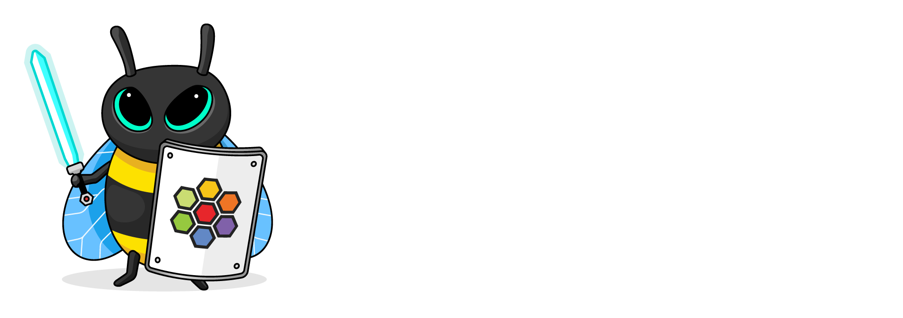
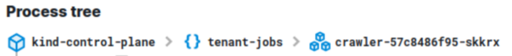
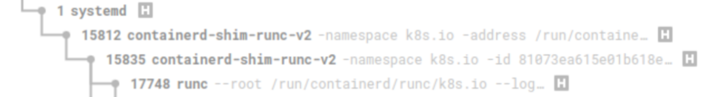
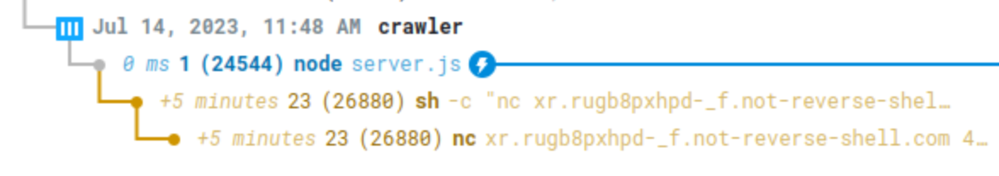
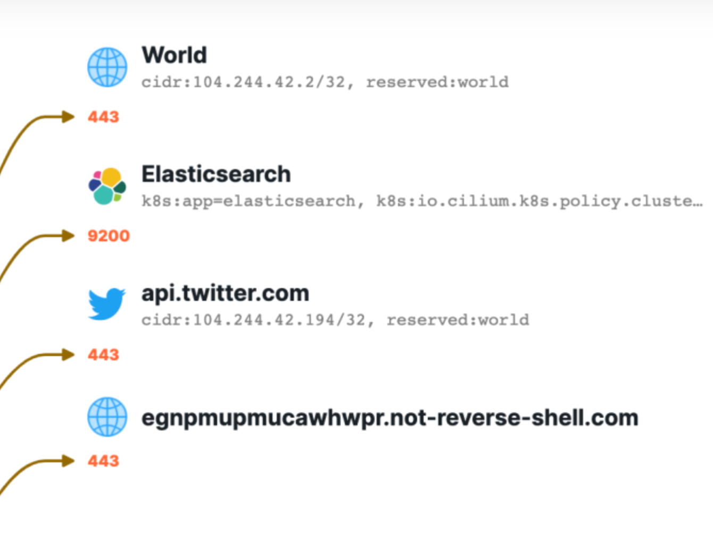
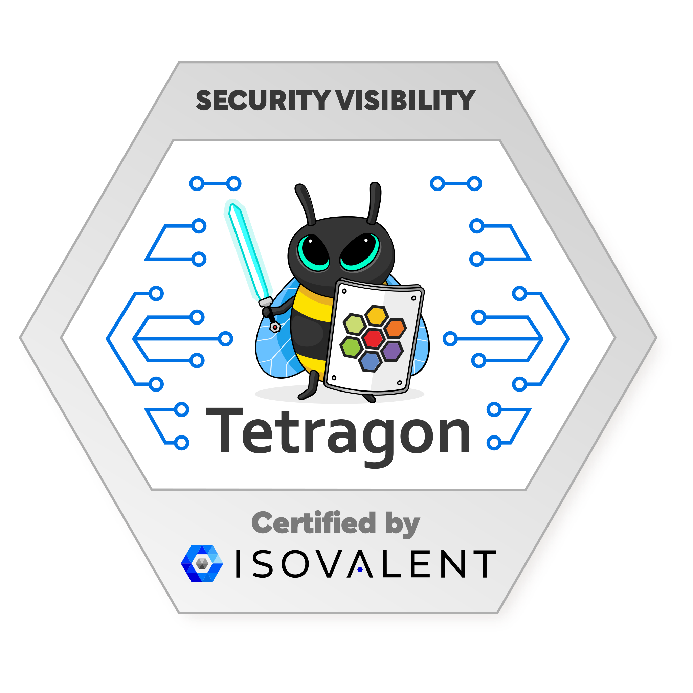

# Isovalent Cilium Enterprise: Security Visibility

https://isovalent.com/labs/isovalent-cilium-enterprise-security-visibility/


In this scenario, we are going to simulate the exploitation of a nodejs application, with the attacker spawning a reverse shell inside of a container and moving laterally within the Kubernetes environment.

 

We will demonstrate how the combined Process and Network Event Data:

identify the suspicious Late Process Execution
tie the suspicious processes to a randomly generated External Domain Name
trace the Lateral Movement and Data Exfiltration of the attacker post-exploit

## 🛡️ A Security Visibility Challenge
Imagine your applications are running in a Kubernetes cluster, but something has gone wrong: your NodeJS application has been hacked.

Now your operations and security teams need to find out which microservice was targeted and how the attacker was able to move laterally in the Kubernetes cluster!

## 📅 Security-related Events in Isovalent Cilium Enterprise
Isovalent Cilium Enterprise generates security visibility data including Identity-Aware Network Flows and Identity-Aware Process Events to see what binaries were executing within the Kubernetes workload and making network connections.

## 🧪 Lab Scenario
To showcase how this all works together, in this lab we create a simple Kubernetes environment with a demo application.

Next we use Hubble UI's process ancestry tree to identify the suspicious application, tie the suspicious processes to a randomly generated External Domain Name, and trace the Lateral Movement and Data Exfiltration of the attacker post-exploit.

### The Kind Cluster

Let's have a look at this lab's environment.

We are running a Kind Kubernetes cluster, and on top of that Cilium.

While the Kind cluster is finishing to start, let's have a look at its configuration:

cat /etc/kind/${KIND_CONFIG}.yaml

### Nodes

In the nodes section, you can see that the cluster consists of a single control-plane node running the Kubernetes control plane, etcd, and all the applications

We are exposing ports on the control plane node so we can access them from the work machine:

port 31234, used to access Hubble Relay (from the CLI)
port 31235, used to access the Hubble UI
Note that since the standard port for Hubble Relay is 4245, we have exported the HUBBLE_SERVER variable in the current shell to use the 31234 port instead. Verify its value with the following command:

echo $HUBBLE_SERVER

### Networking

In the networking section of the configuration file, the default CNI has been disabled so the cluster won't have any Pod network when it starts. Instead, Cilium is being deployed to the cluster to provide this functionality.

To see if the Kind cluster is ready, verify that the cluster is properly running by listing its nodes:

kubectl get nodes
You should see the one node appear.

Now that we have a working Kind cluster, let's move on to deploy a sample application on it!


### Console:

```bash
root@server:~# cat /etc/kind/${KIND_CONFIG}.yaml
---
kind: Cluster
apiVersion: kind.x-k8s.io/v1alpha4
nodes:
- role: control-plane
  extraPortMappings:
  # localhost.run proxy
  - containerPort: 32042
    hostPort: 32042
  # Hubble relay
  - containerPort: 31234
    hostPort: 31234
  # Hubble UI
  - containerPort: 31235
    hostPort: 31235
  extraMounts:
  - hostPath: /opt/images
    containerPath: /opt/images
networking:
  disableDefaultCNI: true
root@server:~# pwd
/root
root@server:~# ll
total 72
drwx------  8 root root  4096 Jul 26 06:56 ./
drwxr-xr-x 20 root root  4096 Jul 26 06:56 ../
-rw-r--r--  1 root root    16 Jul 17 15:13 .bash_aliases
-rw-r--r--  1 root root    38 Jul 26 06:57 .bash_history
-rw-r--r--  1 root root  1708 Jul 26 06:56 .bashrc
drwx------  3 root root  4096 Jul 17 15:13 .cache/
drwxr-xr-x  3 root root  4096 Jul 17 15:13 .config/
-rw-r--r--  1 root root   337 Jul 17 15:18 .gitconfig
drwxr-xr-x  2 root root  4096 Jul 26 06:56 .kube/
-rw-r--r--  1 root root   161 Jul  9  2019 .profile
drwx------  2 root root  4096 Jul 26 06:56 .ssh/
-rw-------  1 root root 14583 Jul 26 06:56 .vimrc
-rw-r--r--  1 root root   215 Jul 17 15:19 .wget-hsts
drwxr-xr-x  2 root root  4096 Jul 26 06:56 helm/
drwx------  3 root root  4096 Jul 17 15:11 snap/
root@server:~# echo $HUBBLE_SERVER
localhost:31234
root@server:~# kubectl get nodes
NAME                 STATUS   ROLES           AGE    VERSION
kind-control-plane   Ready    control-plane   3m7s   v1.26.3
root@server:~# k get node -o wide
NAME                 STATUS   ROLES           AGE     VERSION   INTERNAL-IP   EXTERNAL-IP   OS-IMAGE             KERNEL-VERSION    CONTAINER-RUNTIME
kind-control-plane   Ready    control-plane   3m22s   v1.26.3   172.18.0.2    <none>        Ubuntu 22.04.2 LTS   5.19.0-1027-gcp   containerd://1.6.19-46-g941215f49
root@server:~# k get pod -o wide
No resources found in default namespace.
root@server:~# k config get-contexts
CURRENT   NAME        CLUSTER     AUTHINFO    NAMESPACE
*         kind-kind   kind-kind   kind-kind   
root@server:~# 

```

## Progress
🚀 A Demo Application
In the following challenge, we will deploy a demo application for the lab.

This application has been modified in order to trigger a surprise attack after a few minutes. Stay tuned to see how to detect and visualize this attack!

https://youtu.be/EDGnwLnP9Do

### Cilium & Hubble Status

First, let's check if all Cilium components have been properly deployed with the following command. Note that it might take about a minute until all Cilium components are ready!

cilium status --wait
Hubble Enterprise (which provides Tetragon) might not be ready yet. Let's wait for it to be deployed:

kubectl -n kube-system rollout status daemonset/hubble-enterprise
And then check Hubble status:

You can also verify that you can properly connect to Hubble relay (using port 31234 in our lab) with:

hubble status
and that all nodes are properly managed in Hubble:

hubble list nodes
This should list one node (kind-control-plane), with status Connected.

### Deploy a DNS Visibility Policy

By default, Tetragon will not resolve DNS names for services when watching for events. In order to see the destination names, we need to deploy a TracingPolicy resource to enable DNS.

Look at this policy:

cat tracingpolicy_visibility.yaml
And deploy this tracing policy:

kubectl apply -f tracingpolicy_visibility.yaml

### Deploy the demo
Now that Cilium and Tetragon are ready to work, let's deploy a simple demo application to explore the Isovalent Cilium Enterprise security visibility capabilities. We will create a namespace and eight micro-services in it:

helm install -n tenant-jobs --create-namespace \
  jobs-app /root/helm/jobs-app.tgz \
  --set crawler.revshell.enabled=true \
  --set crawler.revshell.delay=120

### Timescape Deployment
Timescape is the component responsible for keeping historical data for Hubble and Tetragon logs, and making them available in the Hubble UI.

Logs are first sent to an S3-compatible storage, then parsed and injected into Timescape. In this lab, we're using MinIO for the intermediate storage.

Let's verify that the MinIO stack is ready:

kubectl rollout status -n minio deployment/minio-operator
Finally, we need to wait for the Hubble Timescape Ingester, which will store the events from our sample application and provide a backend of Hubble Enteprise's Process Tree view:

while ! kubectl -n hubble-timescape rollout status deployment/hubble-timescape-ingester; do \
  sleep 1;
done

### Verify the application deployment
Before we continue, let's see if all pods have been deployed:

kubectl get pods -n tenant-jobs
Most likely, they are still starting up, as the demo application is rather complex.

Let's move on to visualize all the events this application generates in the kernel using the Tetragon with the Hubble Enterprise CLI!

### Console:

```bash
root@server:~# cilium status --wait
    /¯¯\
 /¯¯\__/¯¯\    Cilium:             OK
 \__/¯¯\__/    Operator:           OK
 /¯¯\__/¯¯\    Envoy DaemonSet:    disabled (using embedded mode)
 \__/¯¯\__/    Hubble Relay:       OK
    \__/       ClusterMesh:        disabled

Deployment             cilium-operator    Desired: 1, Ready: 1/1, Available: 1/1
Deployment             hubble-ui          Desired: 1, Ready: 1/1, Available: 1/1
Deployment             hubble-relay       Desired: 1, Ready: 1/1, Available: 1/1
DaemonSet              cilium             Desired: 1, Ready: 1/1, Available: 1/1
Containers:            cilium-operator    Running: 1
                       hubble-ui          Running: 1
                       hubble-relay       Running: 1
                       cilium             Running: 1
Cluster Pods:          13/13 managed by Cilium
Helm chart version:    
Image versions         cilium-operator    quay.io/isovalent/operator-generic:v1.13.4-cee.1: 1
                       hubble-ui          quay.io/isovalent/hubble-ui-enterprise:v0.22.2: 1
                       hubble-ui          quay.io/isovalent/hubble-ui-enterprise-backend:v0.22.2: 1
                       hubble-relay       quay.io/isovalent/hubble-relay:v1.13.4-cee.1: 1
                       cilium             quay.io/isovalent/cilium:v1.13.4-cee.1: 1
root@server:~# kubectl -n kube-system rollout status daemonset/hubble-enterprise
daemon set "hubble-enterprise" successfully rolled out
root@server:~# hubble status
Healthcheck (via localhost:31234): Ok
Current/Max Flows: 4,095/4,095 (100.00%)
Flows/s: 13.22
Connected Nodes: 1/1
root@server:~# hubble list nodes
NAME                 STATUS      AGE    FLOWS/S   CURRENT/MAX-FLOWS
kind-control-plane   Connected   7m6s   13.24     4095/4095 (100.00%)
root@server:~# cat tracingpolicy_visibility.yaml
---
apiVersion: cilium.io/v1alpha1
kind: TracingPolicy
metadata:
  name: trace-all
spec:
  parser:
    interface:
      enable: true
    tcp:
      enable: true
    udp:
      enable: true
    dns:
      enable: true
root@server:~# ll
total 76
drwx------  8 root root  4096 Jul 26 07:01 ./
drwxr-xr-x 20 root root  4096 Jul 26 06:56 ../
-rw-r--r--  1 root root    16 Jul 17 15:13 .bash_aliases
-rw-r--r--  1 root root   291 Jul 26 07:05 .bash_history
-rw-r--r--  1 root root  1708 Jul 26 06:56 .bashrc
drwx------  3 root root  4096 Jul 17 15:13 .cache/
drwxr-xr-x  3 root root  4096 Jul 17 15:13 .config/
-rw-r--r--  1 root root   337 Jul 17 15:18 .gitconfig
drwxr-xr-x  3 root root  4096 Jul 26 07:01 .kube/
-rw-r--r--  1 root root   161 Jul  9  2019 .profile
drwx------  2 root root  4096 Jul 26 06:56 .ssh/
-rw-------  1 root root 14583 Jul 26 06:56 .vimrc
-rw-r--r--  1 root root   215 Jul 17 15:19 .wget-hsts
drwxr-xr-x  2 root root  4096 Jul 26 06:56 helm/
drwx------  3 root root  4096 Jul 17 15:11 snap/
-rw-r--r--  1 root root   217 Jul 26 07:01 tracingpolicy_visibility.yaml
root@server:~# kubectl apply -f tracingpolicy_visibility.yaml
tracingpolicy.cilium.io/trace-all created
root@server:~# helm install -n tenant-jobs --create-namespace \
  jobs-app /root/helm/jobs-app.tgz \
  --set crawler.revshell.enabled=true \
  --set crawler.revshell.delay=120
NAME: jobs-app
LAST DEPLOYED: Wed Jul 26 07:05:24 2023
NAMESPACE: tenant-jobs
STATUS: deployed
REVISION: 1
root@server:~# kubectl rollout status -n minio deployment/minio-operator
deployment "minio-operator" successfully rolled out
root@server:~# while ! kubectl -n hubble-timescape rollout status deployment/hubble-timescape-ingester; do \
  sleep 1;
done
deployment "hubble-timescape-ingester" successfully rolled out
root@server:~# kubectl get pods -n tenant-jobs
NAME                                        READY   STATUS              RESTARTS      AGE
coreapi-cd8c6d9b4-h9llr                     1/1     Running             0             108s
crawler-556db57cd7-tkvfd                    1/1     Running             0             108s
elasticsearch-master-0                      0/1     PodInitializing     0             108s
jobposting-655bf8ff6d-hkrhk                 1/1     Running             0             108s
jobs-app-kafka-0                            0/1     ContainerCreating   0             6s
jobs-app-zookeeper-0                        1/1     Running             0             36s
loader-764db4f5b7-n6qgw                     0/1     CrashLoopBackOff    2 (23s ago)   108s
recruiter-79b8dbdd56-6clw2                  1/1     Running             0             108s
resumes-86bbf46b88-78wql                    0/1     CrashLoopBackOff    3 (17s ago)   108s
strimzi-cluster-operator-644cbdfbcf-j4nfl   1/1     Running             0             108s
root@server:~# 
```
## 👮 Viewing Security Events
With the demo application in place now, how can we view security events?

## ⚔️ Tetragon
Tetragon is Cilium’s new component that enables powerful realtime, eBPF-based Security Observability and Runtime Enforcement.


Tetragon


In Isovalent Cilium Enterprise, Tetragon is used as the base layer for the Security Observability facet of the solution.

## 👩🏽‍💻 CLI vs Web UI
There are two ways to view Process and Networking Events using Cilium Enterprise:

using the hubble-enterprise CLI
using the Hubble Web UI
Let's start with the CLI approach in this next challenge!

## ⏳ Waiting for the Demo App
While we wait for the demo application to be ready, here's a video extract about Tetragon so you understand what the tool does in terms of observability.


###  Introduction
The hubble-enterprise pod running in the kube-system namespace gathers logs for both Hubble (flows) and FGS (Tetragon logs) events. This service is deployed as a daemonset, but we only have one pod in this lab because we're running on a cluster with a single node (the control-plane node) for simplicity.

In order to visualize the events for the node, execute the following command:

kubectl exec -it -n kube-system daemonsets/hubble-enterprise -c enterprise -- \
  hubble-enterprise getevents -o compact
You will see a mix of events of different kinds:

🚀 process related events (🚀 process & 💥 exit)
network related events (e.g. 🔌 connect, 💡 accept & 🧹 close)
Tetragon can be tuned to capture more events, but for this lab these events are sufficient.

ⓘ Note:

This compact view is equivalent to using the tetra command line utility in the Open Source Tetragon.
### Filter by namespace
Stop the process with Ctrl+C, and relaunch it, filtering on the tenant-jobs namespace:

kubectl exec -it -n kube-system daemonsets/hubble-enterprise -c enterprise -- \
  hubble-enterprise getevents -o compact -n tenant-jobs
Observe the various components of the application communicating. You can see the application threads being started, as well as the network flows between the components.
### Filter by pod
Stop the process with Ctrl+C again. Let's now filter the output by pod name.

List the pods for the jobs-app namespace:

kubectl -n tenant-jobs get po
Let's look at the events for the coreapi pod. You don't need to specify the full pod name, you can instead using the name of the workload resource (Deployment, Daemonset, etc.) that controls it:

kubectl exec -it -n kube-system daemonsets/hubble-enterprise -c enterprise -- \
  hubble-enterprise getevents -o compact -n tenant-jobs --pod coreapi
Observe the events linked to this pod as TCP sessions get opened and closed. You will see events similar to this:

📖 dns     tenant-jobs/coreapi-cd8c6d9b4-7kl4x /usr/local/bin/gunicorn [api.github.com.tenant-jobs.svc.cluster.local.] [AAAA]
📖 dns     tenant-jobs/coreapi-cd8c6d9b4-7kl4x /usr/local/bin/gunicorn NXDOMAIN [api.github.com.tenant-jobs.svc.cluster.local.] [] []
🎧 listen  tenant-jobs/coreapi-cd8c6d9b4-7kl4x /usr/local/bin/gunicorn TCP 0.0.0.0:9080
🧮 socket  tenant-jobs/coreapi-cd8c6d9b4-7kl4x /usr/local/bin/gunicorn UDP 10.0.0.244:44439 => 10.96.0.10:53 tx 164 B rx 350 B
In the next challenge, we will explore how these logs can be exported.

### Console:

```bash
root@server:~# kubectl exec -it -n kube-system daemonsets/hubble-enterprise -c enterprise --   hubble-enterprise getevents -o compact
💥 exit    kind-control-plane /usr/local/sbin/runc --root /run/containerd/runc/k8s.io --log /run/containerd/io.containerd.runtime.v2.task/k8s.io/c7e778fdcd5f338b38d778466d08dd7241aaba211b4fe0cf7ca2b7c99fe6a407/log.json --log-format json --systemd-cgroup exec --process /tmp/runc-process2004136536 --console-socket /tmp/pty1228718558/pty.sock --detach --pid-file /run/containerd/io.containerd.runtime.v2.task/k8s.io/c7e778fdcd5f338b38d778466d08dd7241aaba211b4fe0cf7ca2b7c99fe6a407/35be1f31f9b1e2656bfe98a1408c82c8b6e2c95288586203b0a5ca71157f3a10.pid c7e778fdcd5f338b38d778466d08dd7241aaba211b4fe0cf7ca2b7c99fe6a407 0 
🧹 close   tenant-jobs/loader-764db4f5b7-n6qgw /usr/local/bin/node TCP 10.0.0.253:50051 => 10.0.0.111:34318 tx 290 B rx 373 B 
🧮 socket  tenant-jobs/loader-764db4f5b7-n6qgw /usr/local/bin/node TCP 10.0.0.253:50051 => 10.0.0.111:34318 tx 290 B rx 373 B
🚀 process kind-control-plane /usr/local/sbin/runc --root /run/containerd/runc/k8s.io --log /run/containerd/io.containerd.runtime.v2.task/k8s.io/c7e778fdcd5f338b38d778466d08dd7241aaba211b4fe0cf7ca2b7c99fe6a407/log.json --log-format json --systemd-cgroup exec --process /tmp/runc-process449860200 --detach --pid-file /run/containerd/io.containerd.runtime.v2.task/k8s.io/c7e778fdcd5f338b38d778466d08dd7241aaba211b4fe0cf7ca2b7c99fe6a407/4f73470dbfdfb875d2824db7ce4824008afb8067574f85a461716bf2a59a4c73.pid c7e778fdcd5f338b38d778466d08dd7241aaba211b4fe0cf7ca2b7c99fe6a407 
🚀 process kind-control-plane /proc/self/exe init                         
🚀 process kind-control-plane /dev/fd/5 init                              
💥 exit    kind-control-plane /dev/fd/5 init 0                   
💥 exit    kind-control-plane /usr/local/sbin/runc --root /run/containerd/runc/k8s.io --log /run/containerd/io.containerd.runtime.v2.task/k8s.io/c7e778fdcd5f338b38d778466d08dd7241aaba211b4fe0cf7ca2b7c99fe6a407/log.json --log-format json --systemd-cgroup exec --process /tmp/runc-process449860200 --detach --pid-file /run/containerd/io.containerd.runtime.v2.task/k8s.io/c7e778fdcd5f338b38d778466d08dd7241aaba211b4fe0cf7ca2b7c99fe6a407/4f73470dbfdfb875d2824db7ce4824008afb8067574f85a461716bf2a59a4c73.pid c7e778fdcd5f338b38d778466d08dd7241aaba211b4fe0cf7ca2b7c99fe6a407 0 
🚀 process kube-system/hubble-enterprise-jqwcp /usr/bin/hubble-enterprise status --server-address localhost:54321 
🔌 connect kube-system/hubble-enterprise-jqwcp /usr/bin/hubble-enterprise TCP ::1:56206 => ::1:54321 
🧹 close   kube-system/hubble-enterprise-jqwcp /usr/bin/hubble-enterprise TCP ::1:56206 => ::1:54321 tx 0 B rx 0 B 
🧮 socket  kube-system/hubble-enterprise-jqwcp /usr/bin/hubble-enterprise TCP ::1:56206 => ::1:54321 tx 0 B rx 0 B
🔌 connect kube-system/hubble-enterprise-jqwcp /usr/bin/hubble-enterprise TCP 127.0.0.1:60794 => 127.0.0.1:54321 
💡 accept  kind-control-plane /usr/lib/systemd/systemd TCP 127.0.0.1:60794 => 127.0.0.1:54321 
🧹 close   kube-system/hubble-enterprise-jqwcp /usr/bin/hubble-enterprise TCP 127.0.0.1:60794 => 127.0.0.1:54321 tx 193 B rx 156 B 
🧮 socket  kube-system/hubble-enterprise-jqwcp /usr/bin/hubble-enterprise TCP 127.0.0.1:60794 => 127.0.0.1:54321 tx 193 B rx 156 B
🧹 close   kind-control-plane /usr/lib/systemd/systemd TCP 127.0.0.1:54321 => 127.0.0.1:60794 tx 156 B rx 193 B 
🧮 socket  kind-control-plane /usr/lib/systemd/systemd TCP 127.0.0.1:54321 => 127.0.0.1:60794 tx 156 B rx 193 B


root@server:~kubectl exec -it -n kube-system daemonsets/hubble-enterprise -c enterprise -- \ \
  hubble-enterprise getevents -o compact -n tenant-jobs
🧮 socket  tenant-jobs/loader-764db4f5b7-n6qgw /usr/local/bin/node TCP 10.0.0.253:56456 => 10.0.0.121:9092 [jobs-app-kafka-0.jobs-app-kafka-brokers.tenant-jobs.svc.cluster.local.] tx 0 B rx 0 B
🔌 connect tenant-jobs/resumes-86bbf46b88-78wql /usr/local/bin/node UDP 10.0.0.111:8945 => 10.0.0.33:53 
📖 dns     tenant-jobs/resumes-86bbf46b88-78wql /usr/local/bin/node [minio.minio.svc.cluster.local.kube-system.svc.cluster.local.] [AAAA] 
📖 dns     tenant-jobs/resumes-86bbf46b88-78wql /usr/local/bin/node NXDOMAIN [minio.minio.svc.cluster.local.kube-system.svc.cluster.local.] [] [] 
📖 dns     tenant-jobs/resumes-86bbf46b88-78wql /usr/local/bin/node NXDOMAIN [minio.minio.svc.cluster.local.kube-system.svc.cluster.local.] [] [] 
🧮 socket  tenant-jobs/resumes-86bbf46b88-78wql /usr/local/bin/node UDP 10.0.0.111:8945 => 10.0.0.33:53 tx 77 B rx 0 B
🧹 close   tenant-jobs/resumes-86bbf46b88-78wql /usr/local/bin/node UDP 10.0.0.111:8945 => 10.0.0.33:53 tx 77 B rx 0 B 
📖 dns     tenant-jobs/crawler-556db57cd7-tkvfd /usr/local/bin/node NXDOMAIN [minio.minio.svc.cluster.local.svc.cluster.local.] [] [] 
🔌 connect tenant-jobs/crawler-556db57cd7-tkvfd /usr/local/bin/node UDP 10.0.0.111:13174 => 10.0.0.33:53 
📖 dns     tenant-jobs/crawler-556db57cd7-tkvfd /usr/local/bin/node [minio.minio.svc.cluster.local.svc.cluster.local.] [AAAA] 
📖 dns     tenant-jobs/crawler-556db57cd7-tkvfd /usr/local/bin/node NXDOMAIN [minio.minio.svc.cluster.local.svc.cluster.local.] [] [] 
🧮 socket  tenant-jobs/crawler-556db57cd7-tkvfd /usr/local/bin/node UDP 10.0.0.111:13174 => 10.0.0.33:53 tx 65 B rx 0 B
🧹 close   tenant-jobs/crawler-556db57cd7-tkvfd /usr/local/bin/node UDP 10.0.0.111:13174 => 10.0.0.33:53 tx 65 B rx 0 B 
📖 dns     tenant-jobs/crawler-556db57cd7-tkvfd /usr/local/bin/node NXDOMAIN [minio.minio.svc.cluster.local.cluster.local.] [] [] 
🔌 connect tenant-jobs/crawler-556db57cd7-tkvfd /usr/local/bin/node UDP 10.0.0.111:40107 => 10.0.0.142:53 
📖 dns     tenant-jobs/crawler-556db57cd7-tkvfd /usr/local/bin/node [minio.minio.svc.cluster.local.cluster.local.] [AAAA] 
🧮 socket  tenant-jobs/crawler-556db57cd7-tkvfd /usr/local/bin/node UDP 10.0.0.111:40107 => 10.0.0.142:53 tx 61 B rx 0 B
🧹 close   tenant-jobs/crawler-556db57cd7-tkvfd /usr/local/bin/node UDP 10.0.0.111:40107 => 10.0.0.142:53 tx 61 B rx 0 B 
📖 dns     tenant-jobs/crawler-556db57cd7-tkvfd /usr/local/bin/node NXDOMAIN [minio.minio.svc.cluster.local.cluster.local.] [] [] 
📖 dns     tenant-jobs/coreapi-cd8c6d9b4-h9llr /usr/local/bin/gunicorn NXDOMAIN [minio.minio.svc.cluster.local.12qyiuyuudsj.svc.cluster.local.] [] [] 
🔌 connect tenant-jobs/coreapi-cd8c6d9b4-h9llr /usr/local/bin/gunicorn UDP 10.0.0.111:51695 => 10.0.0.142:53 
📖 dns     tenant-jobs/coreapi-cd8c6d9b4-h9llr /usr/local/bin/gunicorn [minio.minio.svc.cluster.local.12qyiuyuudsj.svc.cluster.local.] [AAAA] 
📖 dns     tenant-jobs/coreapi-cd8c6d9b4-h9llr /usr/local/bin/gunicorn NXDOMAIN [minio.minio.svc.cluster.local.12qyiuyuudsj.svc.cluster.local.] [] [] 
🧮 socket  tenant-jobs/coreapi-cd8c6d9b4-h9llr /usr/local/bin/gunicorn UDP 10.0.0.111:51695 => 10.0.0.142:53 tx 78 B rx 0 B
🧹 close   tenant-jobs/coreapi-cd8c6d9b4-h9llr /usr/local/bin/gunicorn UDP 10.0.0.111:51695 => 10.0.0.142:53 tx 78 B rx 0 B 
📖 dns     tenant-jobs/crawler-556db57cd7-tkvfd /usr/local/bin/node NXDOMAIN [minio.minio.svc.cluster.local.c.instruqt-prod.internal.] [] []

root@server:~kubectl -n tenant-jobs get popo
NAME                                        READY   STATUS    RESTARTS       AGE
coreapi-cd8c6d9b4-h9llr                     1/1     Running   0              11m
crawler-556db57cd7-tkvfd                    1/1     Running   0              11m
elasticsearch-master-0                      1/1     Running   0              11m
jobposting-655bf8ff6d-hkrhk                 1/1     Running   0              11m
jobs-app-entity-operator-7c945ccfcf-4wpb2   3/3     Running   0              9m16s
jobs-app-kafka-0                            1/1     Running   0              9m44s
jobs-app-zookeeper-0                        1/1     Running   0              10m
loader-764db4f5b7-n6qgw                     1/1     Running   3 (10m ago)    11m
recruiter-79b8dbdd56-6clw2                  1/1     Running   0              11m
resumes-86bbf46b88-78wql                    1/1     Running   5 (9m3s ago)   11m
strimzi-cluster-operator-644cbdfbcf-j4nfl   1/1     Running   0              11m
root@server:~# kubectl exec -it -n kube-system daemonsets/hubble-enterprise -c enterprise -- \
  hubble-enterprise getevents -o compact -n tenant-jobs --pod coreapi
🧮 socket  tenant-jobs/coreapi-cd8c6d9b4-h9llr /usr/local/bin/gunicorn UDP 10.0.0.111:51695 => 10.0.0.142:53 tx 189 B rx 375 B
🧮 socket  tenant-jobs/coreapi-cd8c6d9b4-h9llr /usr/local/bin/gunicorn UDP 10.0.0.58:55601 => 10.96.0.10:53 tx 196 B rx 382 B
🧮 socket  tenant-jobs/coreapi-cd8c6d9b4-h9llr /usr/local/bin/gunicorn UDP 10.0.0.111:23305 => 10.0.0.33:53 tx 46 B rx 139 B
🧮 socket  tenant-jobs/coreapi-cd8c6d9b4-h9llr /usr/local/bin/gunicorn UDP 10.0.0.111:55908 => 10.0.0.142:53 tx 84 B rx 177 B
🧮 socket  tenant-jobs/coreapi-cd8c6d9b4-h9llr /usr/local/bin/gunicorn UDP 10.0.0.111:18083 => 10.0.0.33:53 tx 87 B rx 180 B
🧮 socket  tenant-jobs/coreapi-cd8c6d9b4-h9llr /usr/local/bin/gunicorn UDP 10.0.0.111:42525 => 10.0.0.142:53 tx 91 B rx 184 B
🧮 socket  tenant-jobs/coreapi-cd8c6d9b4-h9llr /usr/local/bin/gunicorn UDP 10.0.0.58:56061 => 10.96.0.10:53 tx 168 B rx 378 B
🧮 socket  tenant-jobs/coreapi-cd8c6d9b4-h9llr /usr/local/bin/gunicorn UDP 10.0.0.111:59501 => 10.0.0.33:53 tx 46 B rx 139 B
🧮 socket  tenant-jobs/coreapi-cd8c6d9b4-h9llr /usr/local/bin/gunicorn UDP 10.0.0.111:49366 => 10.0.0.33:53 tx 46 B rx 139 B
🧮 socket  tenant-jobs/coreapi-cd8c6d9b4-h9llr /usr/local/bin/gunicorn UDP 10.0.0.111:10468 => 10.0.0.142:53 tx 57 B rx 162 B
🧮 socket  tenant-jobs/coreapi-cd8c6d9b4-h9llr /usr/local/bin/gunicorn UDP 10.0.0.111:13862 => 10.0.0.33:53 tx 87 B rx 180 B
🧮 socket  tenant-jobs/coreapi-cd8c6d9b4-h9llr /usr/local/bin/gunicorn UDP 10.0.0.58:34094 => 10.96.0.10:53 tx 70 B rx 70 B
🧮 socket  tenant-jobs/coreapi-cd8c6d9b4-h9llr /usr/local/bin/gunicorn UDP 10.0.0.58:42040 => 10.96.0.10:53 tx 164 B rx 350 B
🧮 socket  tenant-jobs/coreapi-cd8c6d9b4-h9llr /usr/local/bin/gunicorn UDP 10.0.0.111:41061 => 10.0.0.142:53 tx 99 B rx 192 B
🧮 socket  tenant-jobs/coreapi-cd8c6d9b4-h9llr /usr/local/bin/gunicorn UDP 10.0.0.58:58418 => 10.96.0.10:53 tx 16 B rx 16 B
🧮 socket  tenant-jobs/coreapi-cd8c6d9b4-h9llr /usr/local/bin/gunicorn UDP 10.0.0.111:23305 => 10.0.0.33:53 tx 55 B rx 108 B
🧮 socket  tenant-jobs/coreapi-cd8c6d9b4-h9llr /usr/local/bin/gunicorn UDP 10.0.0.58:48367 => 10.96.0.10:53 tx 136 B rx 295 B
🧮 socket  tenant-jobs/coreapi-cd8c6d9b4-h9llr /usr/local/bin/gunicorn UDP 10.0.0.58:43349 => 10.96.0.10:53 tx 198 B rx 384 B
🧮 socket  tenant-jobs/coreapi-cd8c6d9b4-h9llr /usr/local/bin/gunicorn UDP 10.0.0.58:51900 => 10.96.0.10:53 tx 0 B rx 0 B
```

## ➡️ Exporting Events
Being able to view and search in events with the CLI is very useful, but you might also want to export them to other systems, for storage or analytics purposes.

In this challenge, we will see how to export security events as raw JSON. This is helpful when exporting these events to a SIEM.

### Introduction
So far, we've visualized events in the compact format, which provides colors and emojis to make it easy for human operators to parse.

It is also possible to view events in JSON form in order to access more advanced information and filter, using tools such as jq.

Lets list the events for the loader pod again, this time in JSON, and colorize the output with jq:

kubectl exec -n kube-system daemonsets/hubble-enterprise -c enterprise -- \
  hubble-enterprise getevents -o json -n tenant-jobs --pod coreapi | jq -c
You will see each event as a JSON document. Depending on the type of events, field names will vary. For example, the top field names might be:

process_exec
process_connect
process_listen
process_accept
process_close
etc.
Adding new Tracing Policies to Tetragon will add the types of events recognized and listed.
### Log File
It is actually possible to view the raw log file for Tetragon in Hubble Enterprise, located in /var/run/cilium/hubble/fgs.log.

Type Ctrl+C to cancel the current run, and view the last events in the file with:

kubectl exec -n kube-system daemonsets/hubble-enterprise -c enterprise -- \
  tail /var/run/cilium/hubble/fgs.log
### Explore a process events
Let's extract process_connect events for the coreapi pod, keep the first one, and explore it in details with jq:

kubectl exec -n kube-system daemonsets/hubble-enterprise -c enterprise -- \
  cat /var/run/cilium/hubble/fgs.log | \
  jq -c 'select(.process_connect.process.pod.pod_labels.app == "coreapi")' | \
  head -n 1 | \
  jq
Observe that this JSON event contains a lot of information (you might have to scroll up to see it entirely). Let's start by looking at the process_connect.process field only:

kubectl exec -n kube-system daemonsets/hubble-enterprise -c enterprise -- \
  cat /var/run/cilium/hubble/fgs.log | \
  jq -c '.process_connect.process | select(.pod.pod_labels.app == "coreapi")' | \
  head -n 1 | \
  jq
The .process sub-field of events contains information such as:

the internal exec ID for Tetragon (.process_exec.process.exec_id)
PID (.process_exec.process.pid)
current working directory (.process_exec.process.cwd)
binary path (.process_exec.process.binary)
exec flags (.process_exec.process.flags)
pod namespace, name & labels, as well as images (.process_exec.process.pod and subfields)
the exec_id of the parent exec (.process_exec.process.parent_exec_id)
etc.
The raw JSON event stream can easily be sent to an external system such as SIEM.

In Isovalent Enterprise, a Fluentd component is provided for this. In this lab, it is configured to send the event flow to an S3-compatible bucket (MinIO in this case), so that Timescape can parse it and feed it to the Hubble UI.
### Building a Process Tree

As we have just seen, each process event contains the ID of the parent process (.process.parent_exec_id).

Thanks to this, it is possible to rebuild the process tree of each process based on the flow of events. The Hubble Enterprise Web UI does this automatically for you.

Do you remember when we introduced the jobs-app in the previous challenge? We told you this is a special application that will trigger a surprise attack. Well, we're about to visualize and analyze this attack in the Hubble Enterprise Web UI now!


### Console:

```bash
root@server:~# kubectl exec -n kube-system daemonsets/hubble-enterprise -c enterprise -- \
  hubble-enterprise getevents -o json -n tenant-jobs --pod coreapi | jq -c
{"process_sock_stats":{"process":{"exec_id":"a2luZC1jb250cm9sLXBsYW5lOjY4NzkyODY2NTI5MToyNzAxNQ==","pid":27015,"uid":0,"cwd":"/opt/app","binary":"/usr/local/bin/gunicorn","arguments":"/usr/local/bin/gunicorn --preload -w 4 -b 0.0.0.0:9080 app:gunicorn_start()","flags":"execve","start_time":"2023-07-26T07:07:39.443592985Z","auid":4294967295,"pod":{"namespace":"tenant-jobs","name":"coreapi-cd8c6d9b4-h9llr","labels":["k8s:app=coreapi","k8s:io.cilium.k8s.namespace.labels.kubernetes.io/metadata.name=tenant-jobs","k8s:io.cilium.k8s.namespace.labels.name=tenant-jobs","k8s:io.cilium.k8s.policy.cluster=default","k8s:io.cilium.k8s.policy.serviceaccount=default","k8s:io.kubernetes.pod.namespace=tenant-jobs"],"container":{"id":"containerd://62c56f1f798e45de3effa7511e05009e292607f5cd80e28213f37aedc8f4cde7","name":"coreapi","image":{"id":"quay.io/isovalent/jobs-app-coreapi@sha256:baaf3d36728ade37bca6d2368abe5a850baccf0d2614680757352aa762fc3c62","name":"quay.io/isovalent/jobs-app-coreapi:v0.8.0"},"start_time":"2023-07-26T07:06:18Z","pid":13},"pod_labels":{"app":"coreapi","pod-template-hash":"cd8c6d9b4"}},"docker":"62c56f1f798e45de3effa7511e05009","parent_exec_id":"a2luZC1jb250cm9sLXBsYW5lOjYwNjU5NTc4NTc2MjoyMjkzMQ==","refcnt":14},"parent":{"exec_id":"a2luZC1jb250cm9sLXBsYW5lOjYwNjU5NTc4NTc2MjoyMjkzMQ==","pid":22931,"uid":0,"cwd":"/opt/app","binary":"/usr/local/bin/gunicorn","arguments":"/usr/local/bin/gunicorn --preload -w 4 -b 0.0.0.0:9080 app:gunicorn_start()","flags":"execve clone","start_time":"2023-07-26T07:06:18.110713332Z","auid":4294967295,"pod":{"namespace":"tenant-jobs","name":"coreapi-cd8c6d9b4-h9llr","labels":["k8s:app=coreapi","k8s:io.cilium.k8s.namespace.labels.kubernetes.io/metadata.name=tenant-jobs","k8s:io.cilium.k8s.namespace.labels.name=tenant-jobs","k8s:io.cilium.k8s.policy.cluster=default","k8s:io.cilium.k8s.policy.serviceaccount=default","k8s:io.kubernetes.pod.namespace=tenant-jobs"],"container":{"id":"containerd://62c56f1f798e45de3effa7511e05009e292607f5cd80e28213f37aedc8f4cde7","name":"coreapi","image":{"id":"quay.io/isovalent/jobs-app-coreapi@sha256:baaf3d36728ade37bca6d2368abe5a850baccf0d2614680757352aa762fc3c62","name":"quay.io/isovalent/jobs-app-coreapi:v0.8.0"},"start_time":"2023-07-26T07:06:18Z","pid":13},"pod_labels":{"app":"coreapi","pod-template-hash":"cd8c6d9b4"}},"docker":"62c56f1f798e45de3effa7511e05009","parent_exec_id":"a2luZC1jb250cm9sLXBsYW5lOjYwNjU5Mzg4MTg3NzoyMjkxMg==","refcnt":38},"socket":{"source_ip":"10.0.0.111","source_port":51951,"destination_ip":"10.0.0.142","destination_port":53,"sock_cookie":"18446635882140893184","protocol":"UDP","destination_pod":{"namespace":"kube-system","name":"coredns-787d4945fb-2626j"}},"stats":{"bytes_sent":"57","bytes_received":"162","segs_in":1,"segs_out":1,"bytes_consumed":"162","bytes_submitted":"57","segs_consumed":1,"segs_submitted":1,"rtt":{},"udp_latency":{}}},"node_name":"kind-control-plane","time":"2023-07-26T07:25:08.698378211Z"}
{"process_sock_stats":{"process":{"exec_id":"a2luZC1jb250cm9sLXBsYW5lOjY4ODAxMjkyNjIyNDoyNzAxNw==","pid":27017,"uid":0,"cwd":"/opt/app","binary":"/usr/local/bin/gunicorn","arguments":"/usr/local/bin/gunicorn --preload -w 4 -b 0.0.0.0:9080 app:gunicorn_start()","flags":"execve","start_time":"2023-07-26T07:07:39.527853720Z","auid":4294967295,"pod":{"namespace":"tenant-jobs","name":"coreapi-cd8c6d9b4-h9llr","labels":["k8s:app=coreapi","k8s:io.cilium.k8s.namespace.labels.kubernetes.io/metadata.name=tenant-jobs","k8s:io.cilium.k8s.namespace.labels.name=tenant-jobs","k8s:io.cilium.k8s.policy.cluster=default","k8s:io.cilium.k8s.policy.serviceaccount=default","k8s:io.kubernetes.pod.namespace=tenant-jobs"],"container":{"id":"containerd://62c56f1f798e45de3effa7511e05009e292607f5cd80e28213f37aedc8f4cde7","name":"coreapi","image":{"id":"quay.io/isovalent/jobs-app-coreapi@sha256:baaf3d36728ade37bca6d2368abe5a850baccf0d2614680757352aa762fc3c62","name":"quay.io/isovalent/jobs-app-coreapi:v0.8.0"},"start_time":"2023-07-26T07:06:18Z","pid":13},"pod_labels":{"app":"coreapi","pod-template-hash":"cd8c6d9b4"}},"docker":"62c56f1f798e45de3effa7511e05009","parent_exec_id":"a2luZC1jb250cm9sLXBsYW5lOjYwNjU5NTc4NTc2MjoyMjkzMQ==","refcnt":7},"parent":{"exec_id":"a2luZC1jb250cm9sLXBsYW5lOjYwNjU5NTc4NTc2MjoyMjkzMQ==","pid":22931,"uid":0,"cwd":"/opt/app","binary":"/usr/local/bin/gunicorn","arguments":"/usr/local/bin/gunicorn --preload -w 4 -b 0.0.0.0:9080 app:gunicorn_start()","flags":"execve clone","start_time":"2023-07-26T07:06:18.110713332Z","auid":4294967295,"pod":{"namespace":"tenant-jobs","name":"coreapi-cd8c6d9b4-h9llr","labels":["k8s:app=coreapi","k8s:io.cilium.k8s.namespace.labels.kubernetes.io/metadata.name=tenant-jobs","k8s:io.cilium.k8s.namespace.labels.name=tenant-jobs","k8s:io.cilium.k8s.policy.cluster=default","k8s:io.cilium.k8s.policy.serviceaccount=default","k8s:io.kubernetes.pod.namespace=tenant-jobs"],"container":{"id":"containerd://62c56f1f798e45de3effa7511e05009e292607f5cd80e28213f37aedc8f4cde7","name":"coreapi","image":{"id":"quay.io/isovalent/jobs-app-coreapi@sha256:baaf3d36728ade37bca6d2368abe5a850baccf0d2614680757352aa762fc3c62","name":"quay.io/isovalent/jobs-app-coreapi:v0.8.0"},"start_time":"2023-07-26T07:06:18Z","pid":13},"pod_labels":{"app":"coreapi","pod-template-hash":"cd8c6d9b4"}},"docker":"62c56f1f798e45de3effa7511e05009","parent_exec_id":"a2luZC1jb250cm9sLXBsYW5lOjYwNjU5Mzg4MTg3NzoyMjkxMg==","refcnt":38},"socket":{"source_ip":"10.0.0.111","source_port":18083,"destination_ip":"10.0.0.33","destination_port":53,"sock_cookie":"18446635882140908160","protocol":"UDP","destination_pod":{"namespace":"kube-system","name":"coredns-787d4945fb-xmr4s"}},"stats":{"bytes_sent":"48","bytes_received":"153","segs_in":1,"segs_out":1,"bytes_consumed":"153","bytes_submitted":"48","segs_consumed":1,"segs_submitted":1,"rtt":{},"udp_latency":{}}},"node_name":"kind-control-plane","time":"2023-07-26T07:25:08.700082823Z"}

root@server:~# kubectl exec -n kube-system daemonsets/hubble-enterprise -c enterprise -- \
  tail /var/run/cilium/hubble/fgs.log
{"process_connect":{"process":{"exec_id":"a2luZC1jb250cm9sLXBsYW5lOjU3NjIyNDQ1MzcyMjoyMjI1OA==","pid":22258,"uid":0,"cwd":"/usr/src/app","binary":"/usr/local/bin/node","arguments":"crawler.js","flags":"execve","start_time":"2023-07-26T07:05:47.739381321Z","auid":4294967295,"pod":{"namespace":"tenant-jobs","name":"crawler-556db57cd7-tkvfd","labels":["k8s:app=crawler","k8s:io.cilium.k8s.namespace.labels.kubernetes.io/metadata.name=tenant-jobs","k8s:io.cilium.k8s.namespace.labels.name=tenant-jobs","k8s:io.cilium.k8s.policy.cluster=default","k8s:io.cilium.k8s.policy.serviceaccount=default","k8s:io.kubernetes.pod.namespace=tenant-jobs"],"container":{"id":"containerd://dd91a86d3cd51cf701ff271c264c7407b2e1e79e706b9d9e53e2e259d2989cf8","name":"crawler","image":{"id":"quay.io/isovalent/jobs-app-crawler@sha256:253fa9567c3108ae2b7c5a35bb56386ac1c1569f7f5784ebb87d709cf30b2072","name":"quay.io/isovalent/jobs-app-crawler:v0.8.0"},"start_time":"2023-07-26T07:05:47Z","pid":1},"pod_labels":{"app":"crawler","pod-template-hash":"556db57cd7"}},"docker":"dd91a86d3cd51cf701ff271c264c740","parent_exec_id":"a2luZC1jb250cm9sLXBsYW5lOjU3NjIyMzEyMjQ1MToyMjI1OA==","refcnt":4294967282},"parent":{"exec_id":"a2luZC1jb250cm9sLXBsYW5lOjU3NjIyMzEyMjQ1MToyMjI1OA==","pid":22258,"uid":0,"cwd":"/usr/src/app","binary":"/usr/local/bin/docker-entrypoint.sh","arguments":"/usr/local/bin/docker-entrypoint.sh node crawler.js","flags":"execve clone","start_time":"2023-07-26T07:05:47.738050590Z","auid":4294967295,"pod":{"namespace":"tenant-jobs","name":"crawler-556db57cd7-tkvfd","labels":["k8s:app=crawler","k8s:io.cilium.k8s.namespace.labels.kubernetes.io/metadata.name=tenant-jobs","k8s:io.cilium.k8s.namespace.labels.name=tenant-jobs","k8s:io.cilium.k8s.policy.cluster=default","k8s:io.cilium.k8s.policy.serviceaccount=default","k8s:io.kubernetes.pod.namespace=tenant-jobs"],"container":{"id":"containerd://dd91a86d3cd51cf701ff271c264c7407b2e1e79e706b9d9e53e2e259d2989cf8","name":"crawler","image":{"id":"quay.io/isovalent/jobs-app-crawler@sha256:253fa9567c3108ae2b7c5a35bb56386ac1c1569f7f5784ebb87d709cf30b2072","name":"quay.io/isovalent/jobs-app-crawler:v0.8.0"},"start_time":"2023-07-26T07:05:47Z","pid":1},"pod_labels":{"app":"crawler","pod-template-hash":"556db57cd7"}},"docker":"dd91a86d3cd51cf701ff271c264c740","parent_exec_id":"a2luZC1jb250cm9sLXBsYW5lOjU1NjQxNzcwMjk2NToyMTM4Ng==","refcnt":4294967282},"source_ip":"10.0.0.164","source_port":49998,"destination_ip":"10.96.0.10","destination_port":53,"sock_cookie":"18446635877108472320","protocol":"UDP"},"node_name":"kind-control-plane","time":"2023-07-26T07:19:15.395111138Z"}
{"process_connect":{"process":{"exec_id":"a2luZC1jb250cm9sLXBsYW5lOjU3NjIyNDQ1MzcyMjoyMjI1OA==","pid":22258,"uid":0,"cwd":"/usr/src/app","binary":"/usr/local/bin/node","arguments":"crawler.js","flags":"execve","start_time":"2023-07-26T07:05:47.739381321Z","auid":4294967295,"pod":{"namespace":"tenant-jobs","name":"crawler-556db57cd7-tkvfd","labels":["k8s:app=crawler","k8s:io.cilium.k8s.namespace.labels.kubernetes.io/metadata.name=tenant-jobs","k8s:io.cilium.k8s.namespace.labels.name=tenant-jobs","k8s:io.cilium.k8s.policy.cluster=default","k8s:io.cilium.k8s.policy.serviceaccount=default","k8s:io.kubernetes.pod.namespace=tenant-jobs"],"container":{"id":"containerd://dd91a86d3cd51cf701ff271c264c7407b2e1e79e706b9d9e53e2e259d2989cf8","name":"crawler","image":{"id":"quay.io/isovalent/jobs-app-crawler@sha256:253fa9567c3108ae2b7c5a35bb56386ac1c1569f7f5784ebb87d709cf30b2072","name":"quay.io/isovalent/jobs-app-crawler:v0.8.0"},"start_time":"2023-07-26T07:05:47Z","pid":1},"pod_labels":{"app":"crawler","pod-template-hash":"556db57cd7"}},"docker":"dd91a86d3cd51cf701ff271c264c740","parent_exec_id":"a2luZC1jb250cm9sLXBsYW5lOjU3NjIyMzEyMjQ1MToyMjI1OA==","refcnt":4294967282},"parent":{"exec_id":"a2luZC1jb250cm9sLXBsYW5lOjU3NjIyMzEyMjQ1MToyMjI1OA==","pid":22258,"uid":0,"cwd":"/usr/src/app","binary":"/usr/local/bin/docker-entrypoint.sh","arguments":"/usr/local/bin/docker-entrypoint.sh node crawler.js","flags":"execve clone","start_time":"2023-07-26T07:05:47.738050590Z","auid":4294967295,"pod":{"namespace":"tenant-jobs","name":"crawler-556db57cd7-tkvfd","labels":["k8s:app=crawler","k8s:io.cilium.k8s.namespace.labels.kubernetes.io/metadata.name=tenant-jobs","k8s:io.cilium.k8s.namespace.labels.name=tenant-jobs","k8s:io.cilium.k8s.policy.cluster=default","k8s:io.cilium.k8s.policy.serviceaccount=default","k8s:io.kubernetes.pod.namespace=tenant-jobs"],"container":{"id":"containerd://dd91a86d3cd51cf701ff271c264c7407b2e1e79e706b9d9e53e2e259d2989cf8","name":"crawler","image":{"id":"quay.io/isovalent/jobs-app-crawler@sha256:253fa9567c3108ae2b7c5a35bb56386ac1c1569f7f5784ebb87d709cf30b2072","name":"quay.io/isovalent/jobs-app-crawler:v0.8.0"},"start_time":"2023-07-26T07:05:47Z","pid":1},"pod_labels":{"app":"crawler","pod-template-hash":"556db57cd7"}},"docker":"dd91a86d3cd51cf701ff271c264c740","parent_exec_id":"a2luZC1jb250cm9sLXBsYW5lOjU1NjQxNzcwMjk2NToyMTM4Ng==","refcnt":4294967282},"source_ip":"10.0.0.164","source_port":59150,"destination_ip":"10.96.0.10","destination_port":53,"sock_cookie":"18446635881397672448","protocol":"UDP"},"node_name":"kind-control-plane","time":"2023-07-26T07:19:15.396329343Z"}

root@server:~# kubectl exec -n kube-system daemonsets/hubble-enterprise -c enterprise -- \
  cat /var/run/cilium/hubble/fgs.log | \
  jq -c 'select(.process_connect.process.pod.pod_labels.app == "coreapi")' | \
  head -n 1 | \
  jq
{
  "process_connect": {
    "process": {
      "exec_id": "a2luZC1jb250cm9sLXBsYW5lOjY4NzkxMTcwMDEzOToyNzAxNA==",
      "pid": 27014,
      "uid": 0,
      "cwd": "/opt/app",
      "binary": "/usr/local/bin/gunicorn",
      "arguments": "/usr/local/bin/gunicorn --preload -w 4 -b 0.0.0.0:9080 app:gunicorn_start()",
      "flags": "execve",
      "start_time": "2023-07-26T07:07:39.426626770Z",
      "auid": 4294967295,
      "pod": {
        "namespace": "tenant-jobs",
        "name": "coreapi-cd8c6d9b4-h9llr",
        "labels": [
          "k8s:app=coreapi",
          "k8s:io.cilium.k8s.namespace.labels.kubernetes.io/metadata.name=tenant-jobs",
          "k8s:io.cilium.k8s.namespace.labels.name=tenant-jobs",
          "k8s:io.cilium.k8s.policy.cluster=default",
          "k8s:io.cilium.k8s.policy.serviceaccount=default",
          "k8s:io.kubernetes.pod.namespace=tenant-jobs"
        ],
        "container": {
          "id": "containerd://62c56f1f798e45de3effa7511e05009e292607f5cd80e28213f37aedc8f4cde7",
          "name": "coreapi",
          "image": {
            "id": "quay.io/isovalent/jobs-app-coreapi@sha256:baaf3d36728ade37bca6d2368abe5a850baccf0d2614680757352aa762fc3c62",
            "name": "quay.io/isovalent/jobs-app-coreapi:v0.8.0"
          },
          "start_time": "2023-07-26T07:06:18Z",
          "pid": 13
        },
        "pod_labels": {
          "app": "coreapi",
          "pod-template-hash": "cd8c6d9b4"
        }
      },
      "docker": "62c56f1f798e45de3effa7511e05009",
      "parent_exec_id": "a2luZC1jb250cm9sLXBsYW5lOjYwNjU5NTc4NTc2MjoyMjkzMQ==",
      "refcnt": 9
    },
    "parent": {
      "exec_id": "a2luZC1jb250cm9sLXBsYW5lOjYwNjU5NTc4NTc2MjoyMjkzMQ==",
      "pid": 22931,
      "uid": 0,
      "cwd": "/opt/app",
      "binary": "/usr/local/bin/gunicorn",
      "arguments": "/usr/local/bin/gunicorn --preload -w 4 -b 0.0.0.0:9080 app:gunicorn_start()",
      "flags": "execve clone",
      "start_time": "2023-07-26T07:06:18.110713332Z",
      "auid": 4294967295,
      "pod": {
        "namespace": "tenant-jobs",
        "name": "coreapi-cd8c6d9b4-h9llr",
        "labels": [
          "k8s:app=coreapi",
          "k8s:io.cilium.k8s.namespace.labels.kubernetes.io/metadata.name=tenant-jobs",
          "k8s:io.cilium.k8s.namespace.labels.name=tenant-jobs",
          "k8s:io.cilium.k8s.policy.cluster=default",
          "k8s:io.cilium.k8s.policy.serviceaccount=default",
          "k8s:io.kubernetes.pod.namespace=tenant-jobs"
        ],
        "container": {
          "id": "containerd://62c56f1f798e45de3effa7511e05009e292607f5cd80e28213f37aedc8f4cde7",
          "name": "coreapi",
          "image": {
            "id": "quay.io/isovalent/jobs-app-coreapi@sha256:baaf3d36728ade37bca6d2368abe5a850baccf0d2614680757352aa762fc3c62",
            "name": "quay.io/isovalent/jobs-app-coreapi:v0.8.0"
          },
          "start_time": "2023-07-26T07:06:18Z",
          "pid": 13
        },
        "pod_labels": {
          "app": "coreapi",
          "pod-template-hash": "cd8c6d9b4"
        }
      },
      "docker": "62c56f1f798e45de3effa7511e05009",
      "parent_exec_id": "a2luZC1jb250cm9sLXBsYW5lOjYwNjU5Mzg4MTg3NzoyMjkxMg==",
      "refcnt": 40
    },
    "source_ip": "10.0.0.58",
    "source_port": 52802,
    "destination_ip": "10.96.0.10",
    "destination_port": 53,
    "sock_cookie": "18446635881466003456",
    "protocol": "UDP"
  },
  "node_name": "kind-control-plane",
  "time": "2023-07-26T07:15:49.209208794Z"
}

root@server:~# kubectl exec -n kube-system daemonsets/hubble-enterprise -c enterprise -- \
  cat /var/run/cilium/hubble/fgs.log | \
  jq -c '.process_connect.process | select(.pod.pod_labels.app == "coreapi")' | \
  head -n 1 | \
  jq
{
  "exec_id": "a2luZC1jb250cm9sLXBsYW5lOjY4NzkxMTcwMDEzOToyNzAxNA==",
  "pid": 27014,
  "uid": 0,
  "cwd": "/opt/app",
  "binary": "/usr/local/bin/gunicorn",
  "arguments": "/usr/local/bin/gunicorn --preload -w 4 -b 0.0.0.0:9080 app:gunicorn_start()",
  "flags": "execve",
  "start_time": "2023-07-26T07:07:39.426626770Z",
  "auid": 4294967295,
  "pod": {
    "namespace": "tenant-jobs",
    "name": "coreapi-cd8c6d9b4-h9llr",
    "labels": [
      "k8s:app=coreapi",
      "k8s:io.cilium.k8s.namespace.labels.kubernetes.io/metadata.name=tenant-jobs",
      "k8s:io.cilium.k8s.namespace.labels.name=tenant-jobs",
      "k8s:io.cilium.k8s.policy.cluster=default",
      "k8s:io.cilium.k8s.policy.serviceaccount=default",
      "k8s:io.kubernetes.pod.namespace=tenant-jobs"
    ],
    "container": {
      "id": "containerd://62c56f1f798e45de3effa7511e05009e292607f5cd80e28213f37aedc8f4cde7",
      "name": "coreapi",
      "image": {
        "id": "quay.io/isovalent/jobs-app-coreapi@sha256:baaf3d36728ade37bca6d2368abe5a850baccf0d2614680757352aa762fc3c62",
        "name": "quay.io/isovalent/jobs-app-coreapi:v0.8.0"
      },
      "start_time": "2023-07-26T07:06:18Z",
      "pid": 13
    },
    "pod_labels": {
      "app": "coreapi",
      "pod-template-hash": "cd8c6d9b4"
    }
  },
  "docker": "62c56f1f798e45de3effa7511e05009",
  "parent_exec_id": "a2luZC1jb250cm9sLXBsYW5lOjYwNjU5NTc4NTc2MjoyMjkzMQ==",
  "refcnt": 9
}
```

## 🌳 The Process Tree View
The second way to visualize the processes running on a certain workload is to use Isovalent Cilium Enterprise's Process Tree view. This tree gives you rich Kubernetes API and Identity Aware Metadata and OS level Process Visibility about the executed binary, its parents and the execution time up until dockerd has started the container.

It is possible to use this view by uploading logs to the UI. In a real-world deployment however, the Hubble Event data should be exported to a SIEM or other logging datastore.

## ⏳ Timescape
In this lab, we are setting a specific feature from Isovalent Cilium Enterprise: Timescape.

Timescape keeps historical Hubble events in a local database. These events can be used in the Hubble UI to display historical flows, service map over a period of time, as well as security events in the Process Tree view.

In this lab's setup, Timescape uses Hubble's Fluentd exporter and an S3 bucket (using a local Minio server) for storage.

## 🌩 Process & Network Events
Cilium Enterprise is able to observe several Process and Network Related Events.

In this lab, you will get a brief overview on a Security Use Case that can be easily detected and interesting to visualize.

By using the Hubble UI and visualizing the Process Tree, you will be able to detect a shell execution in a crawler pod that occurred more than 5 minutes after the container was started.

## 👓 The Process Tree gives us
⎈ Rich Kubernetes Identity Aware Metadata
🐧 OS level Process Visibility
🚀 Late Process Execution
🪪 DNS Aware Metadata

## ⎈ Rich Kubernetes Identity Aware Metadata
You will be able to see the name of the team or namespace (e.g. tenant-jobs) and the specific application service to be inspected (e.g. crawler-yyyyyyyy-zzzzz) in the first row of the tree.



## 🐧 OS level Process Visibility
You can see all the processes that have been executed in the inspected pod or were related to the pod's lifecycle on the following rows.



## Progress
🚀 Late Process Execution
Processes are colour coded to make them easier to identify:

the main process in blue
later processes in yellow, with the time difference between the main process and the later Execution



## 🪪 DNS Aware Metadata
All the external connections can be viewed with exact DNS name as an endpoint that was made from specific processes of the inspected service.



### The Hubble Web UI

### Accessing the Process Tree View


### Analyzing the diagram


### Analyzing the logs

## 🏆 Final Exam Challenge
This last challenge is an exam that will allow you to win a badge.

Make sure to finish the lab in order to get your badge!



### 🥋 Exam
For this exam, you will need to determine the Docker container, PID and binary that initiated the call to the Elasticsearch service in the tenant-jobs namespace.

The Hubble UI (Flows and Processes) is all you need to gather this information.

Once you found it, write your answers into the answers.yaml file (you can use the </> Editor tab for that (don't forget to save the file).

⚠️ The PID field must not be quoted!

Good luck!


```bash
Process event details
General
Cluster
kind-control-plane
Event kind
Exec
Time
2023-07-26T07:06:18.000Z
Process
PID
22931
UID
0
CWD
/opt/app
Binary
/usr/local/bin/gunicorn
Arguments
/usr/local/bin/gunicorn --preload -w 4 -b 0.0.0.0:9080 app:gunicorn_start()
Flags
execve clone
Start time
2023-07-26T07:06:18.000Z
Docker
62c56f1f798e45de3effa7511e05009
AUID
4294967295
Pod
Namespace
tenant-jobs
Name
coreapi-cd8c6d9b4-h9llr
Labels
k8s:app=coreapi k8s:io.cilium.k8s.namespace.labels.kubernetes.io/metadata.name=tenant-jobs k8s:io.cilium.k8s.namespace.labels.name=tenant-jobs k8s:io.cilium.k8s.policy.cluster=default k8s:io.cilium.k8s.policy.serviceaccount=default k8s:io.kubernetes.pod.namespace=tenant-jobs
Container
ID
containerd://62c56f1f798e45de3effa7511e05009e292607f5cd80e28213f37aedc8f4cde7
Name
coreapi
Image ID
quay.io/isovalent/jobs-app-coreapi@sha256:baaf3d36728ade37bca6d2368abe5a850baccf0d2614680757352aa762fc3c62
Image name
quay.io/isovalent/jobs-app-coreapi:v0.8.0
Start time
2023-07-26T07:06:18.000Z
PID inside
13
```