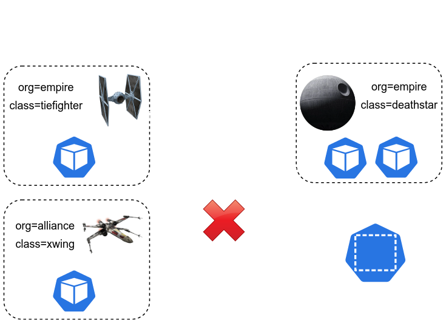

# Mutual Authentication with Cilium

https://isovalent.com/labs/mutual-authentication-with-cilium/

https://docs.cilium.io/en/latest/network/servicemesh/mutual-authentication/mutual-authentication/#mutual-authentication-in-cilium


Introduced in Cilium 1.14 is support for a much-requested feature: mutual authentication.

From its inception, we looked at delivering an optimal effortless user experience to achieve mutual authentication.

The result is simple: add 2 lines of YAML to your Cilium Network Policy, and that’s it – your workload communication is now secured with a mutual TLS handshake.

Try it in this new Star Wars-inspired lab!

### Verify Cilium installation

Cilium was installed during the lab bootup and was deployed with the following Helm flags:

authentication:
  mutual:
    port: 4250
    spire:
      enabled: true
      install:
        enabled: true
        namespace: cilium-spireauth
This enabled the mutual authentication feature and automatically deployed a SPIRE server.

ℹ️ Note

If you're not familiar with SPIFFE and SPIRE, don't worry: we will explain the concepts behind SPIFFE and SPIRE (and how they integrate with Cilium) - in a later task.

Just know that SPIFFE is an identity framework for identifying and securing communications between microservices while SPIRE is a production-ready implementation of SPIFFE.

Verify that Mutual Authentication was enabled:

cilium config view | grep mesh-auth
Expect to see this output:

mesh-auth-enabled                              true
mesh-auth-expired-gc-interval                  15m0s
mesh-auth-mutual-enabled                       true
mesh-auth-mutual-listener-port                 4250
mesh-auth-queue-size                           1024
mesh-auth-rotated-identities-queue-size        1024
mesh-auth-spiffe-trust-domain                  spiffe.cilium
mesh-auth-spire-admin-socket                   /run/spire/sockets/admin.sock
mesh-auth-spire-agent-socket                   /run/spire/sockets/agent/agent.sock
mesh-auth-spire-server-address                 spire-server.cilium-spire.svc:8081
mesh-auth-spire-server-connection-timeout      30s
You can see above that:

Mutual Authentication is enabled.
the port where mutual handshakes between agents will be performed is by default set to 4250.
the SPIFFE Trust Domain is set to spiffe.cilium by default.
the SPIRE connection timeout is set to 30s by default.
Note that the default SPIRE settings can be customized at deployment.

ℹ️ Note

Note that, while Mutual Authentication has been enabled globally, it won't apply to workloads until a network policy applicable to these workloads has the authentication.mode:required setting. You will learn more about this in the upcomign tasks.

Let's also debug log level, as this will be useful to show the actual mutual authentication later on:

cilium config set debug true
In the next task, we will deploy a demo application.


### console:

```bash
root@server:~# cilium config view | grep mesh-auth
mesh-auth-enabled                              true
mesh-auth-expired-gc-interval                  15m0s
mesh-auth-mutual-enabled                       true
mesh-auth-mutual-listener-port                 4250
mesh-auth-queue-size                           1024
mesh-auth-rotated-identities-queue-size        1024
mesh-auth-spiffe-trust-domain                  spiffe.cilium
mesh-auth-spire-admin-socket                   /run/spire/sockets/admin.sock
mesh-auth-spire-agent-socket                   /run/spire/sockets/agent/agent.sock
mesh-auth-spire-server-address                 spire-server.cilium-spire.svc:8081
mesh-auth-spire-server-connection-timeout      30s
root@server:~# cilium config set debug true
✨ Patching ConfigMap cilium-config with debug=true...
♻️  Restarted Cilium pods
root@server:~# 

```

## 🌐 Deploy The Demo App

Let's deploy the Star Wars demo app used in the Getting Started with Cilium lab.

We will build upon this demo app and improve our security posture by enabling mutual authentication.

### Deploy the demo

In this example, we will look at adding mutual authentication to the Star Wars demo deployed in the Getting Started with the Star Wars Demo docs and available in the Getting Started with Cilium lab.

We will assume you are familiar with this demo. If not, check the links above.

Deploy the Star Wars environment and the L3/L4 network policy used in the demo (there's no mutual authentication in the network policy yet).

kubectl apply -f https://raw.githubusercontent.com/cilium/cilium/HEAD/examples/minikube/http-sw-app.yaml
kubectl apply -f https://raw.githubusercontent.com/cilium/cilium/HEAD/examples/minikube/sw_l3_l4_policy.yaml
Review the Network Policy:

kubectl get cnp rule1 -o jsonpath='{.spec}' | jq
This network policy will only allow traffic from endpoints labeled with org=empire to endpoints with both the class=deathstar and org=empire labels, over TCP port 80.


### Check Network Policy

Let's verify that the connectivity model is the expected one.

First, verify that the Death Star Deployment is ready:

kubectl rollout status deployment deathstar -w
Next, verify that Tie Fighters (Empire space ships) are allowed to land on the Death Star:

kubectl exec tiefighter -- \
  curl -s -XPOST deathstar.default.svc.cluster.local/v1/request-landing
This request should be successful (the tiefighter is able to connect to the deathstar over a specific HTTP path):

Ship landed
Then verify that the X-Wing ship (belong to the Alliance) is denied access to the Death Star:

kubectl exec xwing -- \
  curl -s --connect-timeout 1 -XPOST deathstar.default.svc.cluster.local/v1/request-landing
This second request should time out (the xwing is unable to connet to the deathstar because it does not have the right label):

command terminated with exit code 28

### Is this secure?

By this stage, the Empire feels like they have established a strong policy model, which should match the model below.



L3/L4 Death Star Security Model

The xwing cannot connect to the deathstar. And while the Empire security officers are aware, a HTTP call to a particular path might cause the Deathstart to explode, surely no officers would want to cause damage to the Empire.

The Empire is safe. Or is it?

Press Check to learn more.

## 💣 Oh no! The Deathstar has been destroyed! (again...)
Despite the presence of the L3/L4 network policies, the rebels were somehow able to take control of a tiefighter and cause the Deathstar to explode!
```bash
# kubectl exec tiefighter -- curl -s -XPUT deathstar.default.svc.cluster.local/v1/exhaust-port
Panic: deathstar exploded

goroutine 1 [running]:
main.HandleGarbage(0x2080c3f50, 0x2, 0x4, 0x425c0, 0x5, 0xa)
        /code/src/github.com/empire/deathstar/
        temp/main.go:9 +0x64
main.main()
        /code/src/github.com/empire/deathstar/
        temp/main.go:5 +0x85

```

## 💢 The Wrath of the Emperor
With no means to verify the identity of the tiefighter pilot, the Imperial fleet was compromised and the rebels managed to blow up the Deathstar.

Again.

The Emperor is pretty annoyed.

But he's brought in a new officer - you - to fix the Empire's security posture.

## 🌐 Protect the Empire
Emperor Palpatine wants you to implement mTLS-based mutual authentication so that the next Death Star is safe.

By using mTLS-based mutual authentication, the Empire can add strong identity authentication using X.509 certificates.

Time to enforce mutual authentication by updating the existing network policy!

### Enforcing Mutual Authentication

Rolling out mutual authentication with Cilium is as simple as adding the following to an existing or new CiliumNetworkPolicy:

spec:
  egress|ingress:
    authentication:
        mode: "required"
Let's do that now. We will be using this policy:

cat sw_l3_l4_l7_mutual_authentication_policy.yaml
Review the changes we will be making with the existing network policy:

KUBECTL_EXTERNAL_DIFF='colordiff -u' \
  kubectl diff -f sw_l3_l4_l7_mutual_authentication_policy.yaml | \
  grep -A30 ' spec:'
The notable differences are:

we are changing the description of the policy
we are adding L7 filtering (only allowing HTTP POST to the /v1/request-landing)
we are adding authentication.mode: required to our ingress rules. This will ensure that, in addition to the existing policy requirements, ingress access is only for mutually authenticated workloads.
Let's now apply this policy.

kubectl apply -f sw_l3_l4_l7_mutual_authentication_policy.yaml

### Verfifying Connectivity after Enabling Mutual Authentication

Re-try the connectivity tests.

Let's start with the tiefighter calling the /request-landing path :

kubectl exec tiefighter -- \
  curl -s -XPOST deathstar.default.svc.cluster.local/v1/request-landing
This should still succeed.

Let's then try access from the tiefigher to the /exhaust-port path:

kubectl exec tiefighter -- \
  curl -s -XPUT deathstar.default.svc.cluster.local/v1/exhaust-port
This second request should be denied , thanks to the new L7 Network Policy, preventing any tiefighter - compromised or not - from accessing the /exhaust-port.

kubectl exec xwing -- \
  curl -s --connect-timeout 1 -XPOST deathstar.default.svc.cluster.local/v1/request-landing
This third one should time out, thanks to the L3/L4 Network Policy.

But has mutual authentication actually happened?

Let's verify this in the next challenge.

### Console:

```bash
root@server:~# pwd
/root
root@server:~# ll
total 72
drwx------  7 root root  4096 Jul 25 07:48 ./
drwxr-xr-x 19 root root  4096 Jul 25 07:29 ../
-rw-r--r--  1 root root    16 Jul 19 21:23 .bash_aliases
-rw-r--r--  1 root root   713 Jul 25 07:53 .bash_history
-rw-r--r--  1 root root  1708 Jul 25 07:30 .bashrc
drwx------  3 root root  4096 Jul 19 21:23 .cache/
drwxr-xr-x  3 root root  4096 Jul 19 21:23 .config/
-rw-r--r--  1 root root   337 Jul 19 21:28 .gitconfig
drwxr-xr-x  3 root root  4096 Jul 25 07:30 .kube/
-rw-r--r--  1 root root   161 Jul  9  2019 .profile
drwx------  2 root root  4096 Jul 25 07:30 .ssh/
-rw-------  1 root root 14583 Jul 25 07:30 .vimrc
-rw-r--r--  1 root root   215 Jul 19 21:28 .wget-hsts
drwx------  3 root root  4096 Jul 19 21:21 snap/
-rw-r--r--  1 root root   493 Jul 25 07:48 sw_l3_l4_l7_mutual_authentication_policy.yaml
root@server:~# cat sw_l3_l4_l7_mutual_authentication_policy.yaml
---
apiVersion: "cilium.io/v2"
kind: CiliumNetworkPolicy
metadata:
  name: "rule1"
spec:
  description: "Mutual authentication enabled L7 policy"
  endpointSelector:
    matchLabels:
      org: empire
      class: deathstar
  ingress:
  - fromEndpoints:
    - matchLabels:
        org: empire
    authentication:
      mode: "required"
    toPorts:
    - ports:
      - port: "80"
        protocol: TCP
      rules:
        http:
        - method: "POST"
          path: "/v1/request-landing"
root@server:~# yq sw_l3_l4_l7_mutual_authentication_policy.yaml 
---
apiVersion: "cilium.io/v2"
kind: CiliumNetworkPolicy
metadata:
  name: "rule1"
spec:
  description: "Mutual authentication enabled L7 policy"
  endpointSelector:
    matchLabels:
      org: empire
      class: deathstar
  ingress:
    - fromEndpoints:
        - matchLabels:
            org: empire
      authentication:
        mode: "required"
      toPorts:
        - ports:
            - port: "80"
              protocol: TCP
          rules:
            http:
              - method: "POST"
                path: "/v1/request-landing"
root@server:~# KUBECTL_EXTERNAL_DIFF='colordiff -u' \
  kubectl diff -f sw_l3_l4_l7_mutual_authentication_policy.yaml | \
  grep -A30 ' spec:'
 spec:
-  description: L3-L4 policy to restrict deathstar access to empire ships only
+  description: Mutual authentication enabled L7 policy
   endpointSelector:
     matchLabels:
       class: deathstar
       org: empire
   ingress:
-  - fromEndpoints:
+  - authentication:
+      mode: required
+    fromEndpoints:
     - matchLabels:
         org: empire
     toPorts:
     - ports:
       - port: "80"
         protocol: TCP
+      rules:
+        http:
+        - method: POST
+          path: /v1/request-landing
root@server:~# kubectl apply -f sw_l3_l4_l7_mutual_authentication_policy.yaml
ciliumnetworkpolicy.cilium.io/rule1 configured
root@server:~# kubectl exec tiefighter -- \
  curl -s -XPOST deathstar.default.svc.cluster.local/v1/request-landing
Ship landed
root@server:~# kubectl exec tiefighter -- \
  curl -s -XPUT deathstar.default.svc.cluster.local/v1/exhaust-port
Access denied
root@server:~# kubectl exec xwing -- \
  curl -s --connect-timeout 1 -XPOST deathstar.default.svc.cluster.local/v1/request-landing
command terminated with exit code 28
root@server:~# 
```

## 👑 Earn the trust of the Emperor
Palpatine is not convinced the Death Star is entirely secured.

He wants to see an evidence of the mutual handshake.

He needs observability.

## 🛰️ Hubble
Hubble is a fully distributed networking and security observability platform.

Hubble now provides logs and insight into mutual authentication.

Let's find out how!

### Hubble CLI

As our Mutual Authentication implementation is based on Cilium Network Policies and as Hubble is the best tool to manage such policies, it was essential that Hubble would provide insight into mutual authentication with Cilium.

Verify that the Hubble CLI is available and running v0.12.0 or later:

hubble --version

### Observing Mutual Authentication with Hubble

Let's now observe Mutual Authentication with Hubble.

Run the connectivity checks again:

kubectl exec tiefighter -- curl -s -XPOST deathstar.default.svc.cluster.local/v1/request-landing
kubectl exec xwing -- curl -s --connect-timeout 1 -XPOST deathstar.default.svc.cluster.local/v1/request-landing
First, let's look at flows from the xwing to the deathstar.

The network policy should have dropped flows from the xwing as the xwing has not got the right labels.

hubble observe --type drop --from-pod default/xwing
The policy verdict for this traffic should be DROPPED by the L3/L4 section of the Network Policy:

Jul  4 08:49:36.820: default/xwing:33136 (ID:12889) <> default/deathstar-f694cf746-6nkxz:80 (ID:53245) Policy denied DROPPED  (TCP Flags: SYN)
Let's now look at traffic from the tiefighter to the deathstar.

The network policy should have dropped the first flow from the tiefighter to the deathstar Service over /request-landing. Why ? Because the first packet to match the mutual authentication-based network policy will kickstart the mutual authentication handshake.

hubble observe --type drop --from-pod default/tiefighter
Expect an output such as:

Jul  4 08:30:19.341: default/tiefighter:43412 (ID:10685) <> default/deathstar-f694cf746-5wxks:80 (ID:53245) Authentication required DROPPED (TCP Flags: SYN)
Again, this is expected: the first packet from tiefighter to deathstar is dropped as this is how Cilium is notified to start the mutual authentication process..

You should see a similar behaviour when looking for flows with the policy-verdict filter:

hubble observe --type policy-verdict --from-pod default/tiefighter
Expect logs such as (yours might be different, depending on how many times you have tried access between the Pods):

Jul  4 10:01:32.553: default/tiefighter:58032 (ID:1985) -> default/deathstar-f694cf746-vdds5:80 (ID:9215) policy-verdict:L3-L4 INGRESS ALLOWED (TCP Flags: SYN)
Jul  4 08:25:18.114: default/tiefighter:57248 (ID:10685) <> default/deathstar-f694cf746-6nkxz:80 (ID:53245) policy-verdict:L3-L4 INGRESS DENIED (TCP Flags: SYN; Auth: SPIRE)
Jul  4 08:25:19.135: default/tiefighter:57248 (ID:10685) -> default/deathstar-f694cf746-6n

### Logs Explanation

Let's explain these 3 lines of logs.

1️⃣ ALLOWED log (no mutual auth)
default/tiefighter:58032 (ID:1985) -> default/deathstar-f694cf746-vdds5:80 (ID:9215) policy-verdict:L3-L4 INGRESS ALLOWED (TCP Flags: SYN)
The first request was allowed as it happened before we applied Mutual Authentication (note that Auth: SPIRE is not in the error message).

2️⃣ DENIED (mutual auth)
default/tiefighter:45302 (ID:24806) <> default/deathstar-f694cf746-28vbm:80 (ID:9076) policy-verdict:L3-L4 INGRESS DENIED (TCP Flags: SYN; Auth: SPIRE)
The second request was denied because the mutual authentication handshake had not completed yet.

3️⃣ ALLOWED (mutual auth)
default/tiefighter:45302 (ID:24806) -> default/deathstar-f694cf746-28vbm:80 (ID:9076) policy-verdict:L3-L4 INGRESS ALLOWED (TCP Flags: SYN; Auth: SPIRE)
The last request was successful, as the handshake was successful.

Press Next to move on to the next task.

### Console output:

```bash
root@server:~# hubble --version
hubble v0.12.0-cee.1
root@server:~# kubectl exec tiefighter -- curl -s -XPOST deathstar.default.svc.cluster.local/v1/request-landing
kubectl exec xwing -- curl -s --connect-timeout 1 -XPOST deathstar.default.svc.cluster.local/v1/request-landing
Ship landed
command terminated with exit code 28
root@server:~# hubble observe --type drop --from-pod default/xwing
Jul 25 07:57:22.902: default/xwing:51330 (ID:17455) <> default/deathstar-8464cdd4d9-p44ps:80 (ID:6801) Policy denied DROPPED (TCP Flags: SYN)
Jul 25 08:01:49.374: default/xwing:49894 (ID:17455) <> default/deathstar-8464cdd4d9-l89ms:80 (ID:980) Policy denied DROPPED (TCP Flags: SYN)
root@server:~# hubble observe --type drop --from-pod default/tiefighter
Jul 25 07:56:25.893: default/tiefighter:52020 (ID:20405) <> default/deathstar-8464cdd4d9-l89ms:80 (ID:980) Authentication required DROPPED (TCP Flags: SYN)
root@server:~# hubble observe --type policy-verdict --from-pod default/tiefighter
Jul 25 07:56:25.893: default/tiefighter:52020 (ID:20405) <> default/deathstar-8464cdd4d9-l89ms:80 (ID:980) policy-verdict:L3-L4 INGRESS DENIED (TCP Flags: SYN; Auth: SPIRE)
Jul 25 07:56:26.897: default/tiefighter:52020 (ID:20405) -> default/deathstar-8464cdd4d9-l89ms:80 (ID:980) policy-verdict:L3-L4 INGRESS ALLOWED (TCP Flags: SYN; Auth: SPIRE)
Jul 25 07:56:37.866: default/tiefighter:45752 (ID:20405) -> default/deathstar-8464cdd4d9-l89ms:80 (ID:980) policy-verdict:L3-L4 INGRESS ALLOWED (TCP Flags: SYN; Auth: SPIRE)
Jul 25 08:01:49.210: default/tiefighter:34526 (ID:20405) -> default/deathstar-8464cdd4d9-l89ms:80 (ID:980) policy-verdict:L3-L4 INGRESS ALLOWED (TCP Flags: SYN; Auth: SPIRE)
root@server:~# 
```

## 😨 A suspicious Emperor
The Emperor's paranoia is getting out of control.

While you impressed him with your knowledge of cloud native security, he wants to know exactly where the identities of the officers are stored and whether certificates are automatically issued and rotated.

It's time for you to explain to the Emperor how Cilium integrates with SPIFFE.

## 🪪 Identity Management
To address the challenges of identity verification in dynamic and heterogeneous environments, we need a framework to secure identity verification for distributed systems.

In Cilium’s current mutual auth support, that is provided through SPIFFE (Secure Production Identity Framework for Everyone).

## 💡 SPIFFE Benefits
Here are some of the benefits of SPIFFE:

Trustworthy identity issuance:
SPIFFE provides a standardized mechanism for issuing and managing identities. It ensures that each service in a distributed system receives a unique and verifiable identity, even in dynamic environments where services may scale up or down frequently.

Identity attestation:
SPIFFE allows services to prove their identities through attestation. It ensures that services can demonstrate their authenticity and integrity by providing verifiable evidence about their identity, such as digital signatures or cryptographic proofs.

Dynamic and scalable environments:
SPIFFE addresses the challenges of identity management in dynamic environments. It supports automatic identity issuance, rotation, and revocation, which are critical in cloud-native architectures where services may be constantly deployed, updated, or retired.

By combining Cilium mutual authentication with SPIFFE, we establish a robust and scalable security infrastructure that provides strong mutual authentication and verifiable identities in dynamic distributed systems.

## ⬢ Cilium and SPIFFE
SPIFFE provides an API model that allows workloads to request an identity from a central server. In our case, a workload means the same thing that a Cilium Security Identity does: a set of pods described by a label set.

A SPIFFE identity is a subclass of URI, and looks something like this: spiffe://trust.domain/path/with/encoded/info.

There are two main parts of in a SPIRE setup:

A central SPIRE server, which forms the root of trust for the trust domain.
A per-node SPIRE agent, which first gets its own identity from the SPIRE server, then validates the identity requests of workloads running on its node.


## 🔄 SPIFFE and SPIRE workflow
When a workload wants to get its identity, usually at startup, it connects to the local SPIRE agent using the SPIFFE workload API, and describes itself to the agent.

The SPIRE agent then checks that the workload is really who it says it is, and then connects to the SPIRE server and attests that the workload is requesting an identity, and that the request is valid.

The SPIRE agent checks a number of things about the workload, that the pod is actually running on the node it’s coming from, that the labels match, and so on.

Once the SPIRE agent has requested an identity from the SPIRE server, it passes it back to the workload in the SVID (SPIFFE Verified Identity Document) format. This document includes a TLS keypair in the X.509 version.

In the usual flow for SPIRE, the workload requests its own information from the SPIRE server.

In Cilium’s support for SPIFFE, the Cilium agents get a common SPIFFE identity and can themselves ask for identities on behalf of other workloads.

Let's learn more.

### Introduction

A SPIRE server was automatically deployed when installing Cilium with the mutual authentication feature.

The SPIRE environment will manage the TLS certificates for the workloads managed by Cilium.

### Verify SPIRE Health

Let's first verify that the SPIRE server and agents automatically deployed are working as expected.

The SPIRE server is deployed as a StatefulSet and the SPIRE agents are deployed as a DaemonSet (you should therefore see one SPIRE agent per node). Check them with:

kubectl get all -n cilium-spire
The SPIRE server StatefulSet and Spire agent DaemonSet should both be Ready.

Let's run a healthcheck on the SPIRE server.

kubectl exec -n cilium-spire spire-server-0 -c spire-server -- \
  /opt/spire/bin/spire-server healthcheck
Expect a healthy response:

Server is healthy.
Let's verify the list of SPIRE agents:

kubectl exec -n cilium-spire spire-server-0 -c spire-server -- \
  /opt/spire/bin/spire-server agent list
Expect a reply such as the following:

Found 2 attested agents:

SPIFFE ID         : spiffe://spiffe.cilium/spire/agent/k8s_psat/default/7341eacf-763d-4396-a455-8db3e3323c68
Attestation type  : k8s_psat
Expiration time   : 2023-05-17 17:35:42 +0000 UTC
Serial number     : 87767126404300269148814680099485251869

SPIFFE ID         : spiffe://spiffe.cilium/spire/agent/k8s_psat/default/95bffb3d-4677-4618-ad1e-7244f4a81c41
Attestation type  : k8s_psat
Expiration time   : 2023-05-17 17:35:45 +0000 UTC
Serial number     : 100095087906107800458890473530290535817
Note that there are 2 agents, one per node (and we have two nodes in this cluster).

Notice as well that the SPIRE Server uses Kubernetes Projected Service Account Tokens (PSATs) to verify the identity of a SPIRE Agent running on a Kubernetes Cluster.

### Verify SPIFFE identity for Cilium

Now that we know the SPIRE service is healthy, let's verify that the Cilium and SPIRE integration has been successful.

First, verify that the Cilium agent and operator have identities on the SPIRE server:

kubectl exec -n cilium-spire spire-server-0 -c spire-server -- \
  /opt/spire/bin/spire-server entry show -parentID spiffe://spiffe.cilium/ns/cilium-spire/sa/spire-agent
Expect an output such as:

Found 2 entries
Entry ID         : 7a4a01ed-9d3c-4262-8dc1-f0d425a9e3fc
SPIFFE ID        : spiffe://spiffe.cilium/cilium-agent
Parent ID        : spiffe://spiffe.cilium/ns/cilium-spire/sa/spire-agent
Revision         : 0
X509-SVID TTL    : default
JWT-SVID TTL     : default
Selector         : k8s:ns:kube-system
Selector         : k8s:sa:cilium

Entry ID         : 03f7ed38-6412-4792-94ce-19280723fbf9
SPIFFE ID        : spiffe://spiffe.cilium/cilium-operator
Parent ID        : spiffe://spiffe.cilium/ns/cilium-spire/sa/spire-agent
Revision         : 0
X509-SVID TTL    : default
JWT-SVID TTL     : default
Selector         : k8s:ns:kube-system
Selector         : k8s:sa:cilium-operator
Note the SPIFFE ID and Selector fields, which point to two workloads: the Cilium agent and the Cilium Operator, showing that the Cilium agent and operator each have a registered delegate identity with the SPIRE Server.

Let's now verify that the Cilium operator has registered identities with the SPIRE server on behalf of the workloads (Kubernetes Pods).

### Verify SPIFEE identity for the Death Star

First, get the Cilium Identity of the deathstar Pods:

IDENTITY_ID=$(kubectl get cep -l app.kubernetes.io/name=deathstar -o=jsonpath='{.items[0].status.identity.id}')
echo $IDENTITY_ID
ℹ️ Note Even though there are two of these Pods, they share the same Cilium Identity, since they use the same set of Kubernetes labels.

The SPIFFE ID —that uniquely identifies a workload— is based on the Cilium identity. It follows the spiffe://spiffe.cilium/identity/$IDENTITY_ID format.

Verify that the Death Star pods have a registered SPIFFE identity on the SPIRE server:

kubectl exec -n cilium-spire spire-server-0 -c spire-server -- \
  /opt/spire/bin/spire-server entry show -spiffeID spiffe://spiffe.cilium/identity/$IDENTITY_ID
Expect an output such as:

Found 1 entry
Entry ID         : a580f893-0e7f-4717-96e6-c125566cabe3
SPIFFE ID        : spiffe://spiffe.cilium/identity/48927
Parent ID        : spiffe://spiffe.cilium/cilium-operator
Revision         : 0
X509-SVID TTL    : default
JWT-SVID TTL     : default
Selector         : cilium:mutual-auth
You can see the that the cilium-operator was listed as the Parent ID. That is because the Cilium operator is responsible for creating SPIRE entries for each Cilium identity.

List all the registration entries with:

kubectl exec -n cilium-spire spire-server-0 -c spire-server -- \
  /opt/spire/bin/spire-server entry show -selector cilium:mutual-auth
There are as many entries as there are identities. Verify this these match by listing the Cilium identities in the cluster:

kubectl get ciliumidentities
The identify ID listed under NAME should match the digits at the end of the SPIFFE ID executed in the previous command.

### SPIFEE Verifiable Identity Document (SVID)

An SVID is the document with which a workload proves its identity to a resource or caller. An SVID is considered valid if it has been signed by an authority within the SPIFFE ID’s trust domain.

An SVID contains a single SPIFFE ID, which represents the identity of the service presenting it. It encodes the SPIFFE ID in a cryptographically-verifiable document in an X.509 certificate.

One of the reasons for choosing SPIRE for the initial implementation of Cilium Mutual Authentication is that it will automatically rekey SVIDs before their certificate expires, and when this happens, it will notify SVID watchers, which includes the Cilium Agent.

Press Next to move to another short quiz.

### Console:

```bash
root@server:~# kubectl get all -n cilium-spire
NAME                    READY   STATUS    RESTARTS   AGE
pod/spire-agent-2tkfg   1/1     Running   0          56m
pod/spire-agent-gl4s4   1/1     Running   0          56m
pod/spire-server-0      2/2     Running   0          57m

NAME                   TYPE        CLUSTER-IP      EXTERNAL-IP   PORT(S)    AGE
service/spire-server   ClusterIP   10.96.238.110   <none>        8081/TCP   57m

NAME                         DESIRED   CURRENT   READY   UP-TO-DATE   AVAILABLE   NODE SELECTOR   AGE
daemonset.apps/spire-agent   2         2         2       2            2           <none>          57m

NAME                            READY   AGE
statefulset.apps/spire-server   1/1     57m
root@server:~# kubectl exec -n cilium-spire spire-server-0 -c spire-server -- \
  /opt/spire/bin/spire-server healthcheck
Server is healthy.
root@server:~# kubectl exec -n cilium-spire spire-server-0 -c spire-server -- \
  /opt/spire/bin/spire-server agent list
Found 2 attested agents:

SPIFFE ID         : spiffe://spiffe.cilium/spire/agent/k8s_psat/default/903c3561-dc82-4e56-bd50-8b2f6c477f53
Attestation type  : k8s_psat
Expiration time   : 2023-07-25 09:01:55 +0000 UTC
Serial number     : 79582359707620291020233797702717417318

SPIFFE ID         : spiffe://spiffe.cilium/spire/agent/k8s_psat/default/d9e1c938-d7a2-4576-946e-275a68a700ea
Attestation type  : k8s_psat
Expiration time   : 2023-07-25 09:01:59 +0000 UTC
Serial number     : 126992680328655558256289481089048282232

root@server:~# kubectl exec -n cilium-spire spire-server-0 -c spire-server -- \
  /opt/spire/bin/spire-server entry show -parentID spiffe://spiffe.cilium/ns/cilium-spire/sa/spire-agent
Found 2 entries
Entry ID         : d8ddf64d-e800-41fa-b28a-a6b2028947b8
SPIFFE ID        : spiffe://spiffe.cilium/cilium-agent
Parent ID        : spiffe://spiffe.cilium/ns/cilium-spire/sa/spire-agent
Revision         : 0
X509-SVID TTL    : default
JWT-SVID TTL     : default
Selector         : k8s:ns:kube-system
Selector         : k8s:sa:cilium

Entry ID         : ccb64807-bc9c-430f-bb72-042d4ca88b83
SPIFFE ID        : spiffe://spiffe.cilium/cilium-operator
Parent ID        : spiffe://spiffe.cilium/ns/cilium-spire/sa/spire-agent
Revision         : 0
X509-SVID TTL    : default
JWT-SVID TTL     : default
Selector         : k8s:ns:kube-system
Selector         : k8s:sa:cilium-operator

root@server:~# IDENTITY_ID=$(kubectl get cep -l app.kubernetes.io/name=deathstar -o=jsonpath='{.items[0].status.identity.id}')
echo $IDENTITY_ID
980
root@server:~# kubectl exec -n cilium-spire spire-server-0 -c spire-server -- \
  /opt/spire/bin/spire-server entry show -spiffeID spiffe://spiffe.cilium/identity/$IDENTITY_ID
Found 1 entry
Entry ID         : 64cf2e01-d504-45bc-aa19-90a1c99cecaa
SPIFFE ID        : spiffe://spiffe.cilium/identity/980
Parent ID        : spiffe://spiffe.cilium/cilium-operator
Revision         : 0
X509-SVID TTL    : default
JWT-SVID TTL     : default
Selector         : cilium:mutual-auth

root@server:~# kubectl exec -n cilium-spire spire-server-0 -c spire-server -- \
  /opt/spire/bin/spire-server entry show -selector cilium:mutual-auth
Found 10 entries
Entry ID         : 747d72c6-c253-497f-835f-63fdc1a7e683
SPIFFE ID        : spiffe://spiffe.cilium/identity/17455
Parent ID        : spiffe://spiffe.cilium/cilium-operator
Revision         : 0
X509-SVID TTL    : default
JWT-SVID TTL     : default
Selector         : cilium:mutual-auth

Entry ID         : f735c9ab-87cd-4379-b97b-7e28f76798dd
SPIFFE ID        : spiffe://spiffe.cilium/identity/20405
Parent ID        : spiffe://spiffe.cilium/cilium-operator
Revision         : 0
X509-SVID TTL    : default
JWT-SVID TTL     : default
Selector         : cilium:mutual-auth

Entry ID         : f49f1b63-5637-493e-a68f-395a7ce8a351
SPIFFE ID        : spiffe://spiffe.cilium/identity/21571
Parent ID        : spiffe://spiffe.cilium/cilium-operator
Revision         : 0
X509-SVID TTL    : default
JWT-SVID TTL     : default
Selector         : cilium:mutual-auth

Entry ID         : bc710095-d4d1-4702-b8cf-018c2badd828
SPIFFE ID        : spiffe://spiffe.cilium/identity/26778
Parent ID        : spiffe://spiffe.cilium/cilium-operator
Revision         : 0
X509-SVID TTL    : default
JWT-SVID TTL     : default
Selector         : cilium:mutual-auth

Entry ID         : 09847a69-73f3-42b9-8329-5b3eae551584
SPIFFE ID        : spiffe://spiffe.cilium/identity/36160
Parent ID        : spiffe://spiffe.cilium/cilium-operator
Revision         : 0
X509-SVID TTL    : default
JWT-SVID TTL     : default
Selector         : cilium:mutual-auth

Entry ID         : 40a6babb-4ac8-40bb-9aeb-09846f931260
SPIFFE ID        : spiffe://spiffe.cilium/identity/53284
Parent ID        : spiffe://spiffe.cilium/cilium-operator
Revision         : 0
X509-SVID TTL    : default
JWT-SVID TTL     : default
Selector         : cilium:mutual-auth

Entry ID         : 72947d18-a1a0-41e9-aef1-4a5b7193bad3
SPIFFE ID        : spiffe://spiffe.cilium/identity/53593
Parent ID        : spiffe://spiffe.cilium/cilium-operator
Revision         : 0
X509-SVID TTL    : default
JWT-SVID TTL     : default
Selector         : cilium:mutual-auth

Entry ID         : 3393551d-5f24-4385-ac83-37809f4322d6
SPIFFE ID        : spiffe://spiffe.cilium/identity/595
Parent ID        : spiffe://spiffe.cilium/cilium-operator
Revision         : 0
X509-SVID TTL    : default
JWT-SVID TTL     : default
Selector         : cilium:mutual-auth

Entry ID         : e3c4a145-74a0-44bf-9674-159d6237f8e0
SPIFFE ID        : spiffe://spiffe.cilium/identity/6801
Parent ID        : spiffe://spiffe.cilium/cilium-operator
Revision         : 0
X509-SVID TTL    : default
JWT-SVID TTL     : default
Selector         : cilium:mutual-auth

Entry ID         : 64cf2e01-d504-45bc-aa19-90a1c99cecaa
SPIFFE ID        : spiffe://spiffe.cilium/identity/980
Parent ID        : spiffe://spiffe.cilium/cilium-operator
Revision         : 0
X509-SVID TTL    : default
JWT-SVID TTL     : default
Selector         : cilium:mutual-auth

root@server:~# kubectl get ciliumidentities
NAME    NAMESPACE            AGE
17455   default              57m
20405   default              57m
21571   local-path-storage   64m
26778   local-path-storage   64m
36160   cilium-spire         64m
53284   kube-system          64m
53593   kube-system          64m
595     kube-system          64m
6801    default              57m
980     default              57m
root@server:~# 
```

## 🌐 Mutual Authentication Recap
Before we move on to the exam, let's review the mutual authentication process by examining the logs on the Cilium agents.

### Review Mutual Authentication Process

One way to review what actually happened during the mutual authentication is to access the logs on the Cilium agents on the worker nodes:

CILIUM_KIND_WORKER=$(kubectl -n kube-system get pods -l k8s-app=cilium -o jsonpath='{.items[?(@.spec.nodeName=="kind-worker")].metadata.name}')
echo $CILIUM_KIND_WORKER
CILIUM_KIND_WORKER2=$(kubectl -n kube-system get pods -l k8s-app=cilium -o jsonpath='{.items[?(@.spec.nodeName=="kind-worker2")].metadata.name}')
echo $CILIUM_KIND_WORKER2
Do you remember in the beginning of the lab when we had you turn on Cilium debug logs? Now is the time to take advantage of this!

Search for the specific authentication log messages and filter using grep:

kubectl -n kube-system -c cilium-agent logs $CILIUM_KIND_WORKER --timestamps=true | grep "Policy is requiring authentication\|Validating Server SNI\|Validated certificate\|Successfully authenticated"
kubectl -n kube-system -c cilium-agent logs $CILIUM_KIND_WORKER2 --timestamps=true | grep "Policy is requiring authentication\|Validating Server SNI\|Validated certificate\|Successfully authenticated"
Expect to see these logs (you might see multiple of them):

2023-06-19T10:17:10.377849248Z level=debug msg="Policy is requiring authentication" auth_type=spire local_identity=1720 remote_identity=9649 subsys=auth
2023-06-19T10:17:10.380905822Z level=debug msg="Validating Server SNI" SNI ID=9649 subsys=auth
2023-06-19T10:17:10.380920355Z level=debug msg="Validated certificate" subsys=auth uri-san="[spiffe://spiffe.cilium/identity/9649]"
2023-06-19T10:17:10.381378648Z level=debug msg="Successfully authenticated" auth_type=spire local_identity=1720 remote_identity=9649 remote_node_ip=172.18.0.3 subsys=auth
Let's recap what happened:

A Network Policy with authentication.mode: required was created and will apply to traffic between identity tiefighter and identity deathstar.
First packet from tiefighter to deathstar is dropped and Cilium is notified to start the mutual authentication process. Further packets will be dropped until mutual auth has completed. (Policy is requiring authentication log)
The Cilium agent retrieves the identity for tiefighter, connects to the node where the deathstar pod is running and performs a mutual TLS authentication handshake. (Validating Server SNI and Validated certificate logs)
When the handshake is successful (Successfully authenticated log), mutual authentication is now complete, and packets from tiefighter to deathstar will now flow until the network policy is removed or the entry expires (which is when the certificate does).
Press Next to take the final exam.

### Console:

```bash
root@server:~# CILIUM_KIND_WORKER=$(kubectl -n kube-system get pods -l k8s-app=cilium -o jsonpath='{.items[?(@.spec.nodeName=="kind-worker")].metadata.name}')
echo $CILIUM_KIND_WORKER
CILIUM_KIND_WORKER2=$(kubectl -n kube-system get pods -l k8s-app=cilium -o jsonpath='{.items[?(@.spec.nodeName=="kind-worker2")].metadata.name}')
echo $CILIUM_KIND_WORKER2
cilium-gn8ck
cilium-fstvn
root@server:~# kubectl -n kube-system -c cilium-agent logs $CILIUM_KIND_WORKER --timestamps=true | grep "Policy is requiring authentication\|Validating Server SNI\|Validated certificate\|Successfully authenticated"
kubectl -n kube-system -c cilium-agent logs $CILIUM_KIND_WORKER2 --timestamps=true | grep "Policy is requiring authentication\|Validating Server SNI\|Validated certificate\|Successfully authenticated"
2023-07-25T07:56:25.893838884Z level=debug msg="Policy is requiring authentication" auth_type=spire local_identity=980 remote_identity=20405 subsys=auth
2023-07-25T07:56:25.898494832Z level=debug msg="Validating Server SNI" SNI ID=20405 subsys=auth
2023-07-25T07:56:25.898513363Z level=debug msg="Validated certificate" subsys=auth uri-san="[spiffe://spiffe.cilium/identity/20405]"
2023-07-25T07:56:25.899307200Z level=debug msg="Successfully authenticated" auth_type=spire local_identity=980 remote_identity=20405 remote_node_ip=10.0.2.84 subsys=auth
2023-07-25T08:08:50.285850445Z level=debug msg="Policy is requiring authentication" auth_type=spire local_identity=980 remote_identity=20405 subsys=auth
2023-07-25T08:08:50.290311088Z level=debug msg="Validating Server SNI" SNI ID=20405 subsys=auth
2023-07-25T08:08:50.290332109Z level=debug msg="Validated certificate" subsys=auth uri-san="[spiffe://spiffe.cilium/identity/20405]"
2023-07-25T08:08:50.291162654Z level=debug msg="Successfully authenticated" auth_type=spire local_identity=980 remote_identity=20405 remote_node_ip=10.0.2.84 subsys=auth
2023-07-25T08:38:45.258286226Z level=debug msg="Policy is requiring authentication" auth_type=spire local_identity=980 remote_identity=20405 subsys=auth
2023-07-25T08:38:45.262613997Z level=debug msg="Validating Server SNI" SNI ID=20405 subsys=auth
2023-07-25T08:38:45.262634462Z level=debug msg="Validated certificate" subsys=auth uri-san="[spiffe://spiffe.cilium/identity/20405]"
2023-07-25T08:38:45.263384682Z level=debug msg="Successfully authenticated" auth_type=spire local_identity=980 remote_identity=20405 remote_node_ip=10.0.2.84 subsys=auth
root@server:~# 

```

## 🏆 Final Exam Challenge
This last challenge is an exam that will allow you to win a badge.

Make sure to finish the lab in order to get your badge!

### 🥋 Exam
For this exam, a client (pod-worker) and a server (echo) have been deployed in the exam namespace, along with an L7 Cilium Network Policy to only alllow the client to connect to the server over a specific HTTP path.

You can find all the manifests in the exam/ directory (the Cilium Network Policy is in exam/echo-cnp.yaml).

You will still be using the previously deployed Cilium environment with the Mutual Authentication feature enabled and the SPIRE server deployed.

Your task is to modify the Network Policy to only allow ingress access to the echo workload from mutually authenticated workloads.

Don't forget to apply the Network Policy to the cluster!

Good luck!

#### Console:

```bash
root@server:~# ll
total 76
drwx------  8 root root  4096 Jul 25 08:42 ./
drwxr-xr-x 19 root root  4096 Jul 25 07:29 ../
-rw-r--r--  1 root root    16 Jul 19 21:23 .bash_aliases
-rw-r--r--  1 root root  3315 Jul 25 08:41 .bash_history
-rw-r--r--  1 root root  1708 Jul 25 07:30 .bashrc
drwx------  3 root root  4096 Jul 19 21:23 .cache/
drwxr-xr-x  3 root root  4096 Jul 19 21:23 .config/
-rw-r--r--  1 root root   337 Jul 19 21:28 .gitconfig
drwxr-xr-x  3 root root  4096 Jul 25 07:30 .kube/
-rw-r--r--  1 root root   161 Jul  9  2019 .profile
drwx------  2 root root  4096 Jul 25 07:30 .ssh/
-rw-------  1 root root 14583 Jul 25 07:30 .vimrc
-rw-r--r--  1 root root   215 Jul 19 21:28 .wget-hsts
drwxr-xr-x  2 root root  4096 Jul 25 08:42 exam/
drwx------  4 root root  4096 Jul 25 07:53 snap/
-rw-r--r--  1 root root   493 Jul 25 07:48 sw_l3_l4_l7_mutual_authentication_policy.yaml
root@server:~# k get all -n exam
NAME                        READY   STATUS    RESTARTS   AGE
pod/echo-67456bbd77-nzv5n   1/1     Running   0          5m20s
pod/pod-worker              1/1     Running   0          5m20s

NAME           TYPE        CLUSTER-IP     EXTERNAL-IP   PORT(S)    AGE
service/echo   ClusterIP   10.96.250.63   <none>        8080/TCP   5m20s

NAME                   READY   UP-TO-DATE   AVAILABLE   AGE
deployment.apps/echo   1/1     1            1           5m20s

NAME                              DESIRED   CURRENT   READY   AGE
replicaset.apps/echo-67456bbd77   1         1         1       5m20s
root@server:~# ll exam
total 16
drwxr-xr-x 2 root root 4096 Jul 25 08:42 ./
drwx------ 8 root root 4096 Jul 25 08:42 ../
-rw-r--r-- 1 root root  427 Jul 25 08:42 echo-cnp.yaml
-rw-r--r-- 1 root root 1348 Jul 25 08:42 echo-workload.yaml
root@server:~# cd exam/
root@server:~/exam# cat echo-cnp.yaml 
apiVersion: cilium.io/v2
kind: CiliumNetworkPolicy
metadata:
  name: echo-ingress
  namespace: exam
spec:
  endpointSelector:
    matchLabels:
      app: echo
  ingress:
    - fromEndpoints:
        - matchLabels:
            app: pod-worker
      toPorts:
        - ports:
            - port: "8080"
              protocol: TCP
          rules:
            http:
              - method: "GET"
                path: "/headers"
root@server:~/exam# yq echo-workload.yaml 
---
apiVersion: v1
kind: Service
metadata:
  labels:
    app: echo
  name: echo
  namespace: exam
spec:
  ports:
    - port: 8080
      name: high
      protocol: TCP
      targetPort: 8080
  selector:
    app: echo
---
apiVersion: apps/v1
kind: Deployment
metadata:
  labels:
    app: echo
  name: echo
  namespace: exam
spec:
  replicas: 1
  selector:
    matchLabels:
      app: echo
  template:
    metadata:
      labels:
        app: echo
    spec:
      containers:
        - image: gcr.io/kubernetes-e2e-test-images/echoserver:2.2
          name: echo
          ports:
            - containerPort: 8080
          env:
            - name: NODE_NAME
              valueFrom:
                fieldRef:
                  fieldPath: spec.nodeName
            - name: POD_NAME
              valueFrom:
                fieldRef:
                  fieldPath: metadata.name
            - name: POD_NAMESPACE
              valueFrom:
                fieldRef:
                  fieldPath: metadata.namespace
            - name: POD_IP
              valueFrom:
                fieldRef:
                  fieldPath: status.podIP
---
apiVersion: v1
kind: Pod
metadata:
  labels:
    app: pod-worker
  name: pod-worker
  namespace: exam
spec:
  containers:
    - name: netshoot
      image: nicolaka/netshoot:latest
      command: ["sleep", "infinite"]
root@server:~/exam# 
```
